# Dependency & integration tree

How every piece of the lab depends on and integrates with every other piece.
Derived from the GitOps source of truth (sync-wave annotations, `ExternalSecret`
`remoteRef`s, `HTTPRoute`s, the bootstrap scripts and `make up`), so it matches what
ArgoCD reconciles into the cluster. Two views: the **runtime integration graph** and
the **day-0 bootstrap chain**.

## Integration graph (who talks to whom)

```mermaid
graph TD
  classDef boot fill:#ffe0ef,stroke:#b3598a,color:#000
  classDef gitops fill:#dceeff,stroke:#3b78b3,color:#000
  classDef sec fill:#fff6cc,stroke:#b39b00,color:#000
  classDef store fill:#dcf5dc,stroke:#3b9b3b,color:#000
  classDef obs fill:#e6e6ff,stroke:#5b5bc0,color:#000
  classDef ing fill:#ffe6ff,stroke:#b35bb3,color:#000
  classDef cloud fill:#e0f7f7,stroke:#3bb3b3,color:#000
  classDef ondemand fill:#eeeeee,stroke:#999,color:#555

  user(["You — browser"])
  frontdoor["Front door — nginx :8000<br/>(off-cluster docker, stable entry)"]:::ing

  subgraph HOST["Host / runtime"]
    colima["Colima VM (vz, 12G)"]
    dockerd["Docker daemon"]
    colima --> dockerd
  end

  subgraph BOOT["Day-0 bootstrap — imperative (Terraform/Terragrunt + scripts)"]
    tg["Terragrunt"]
    scripts["scripts: gitlab-pat,<br/>vault-bootstrap, garage-bootstrap"]
  end

  gitlab["GitLab omnibus :8929<br/>git source of truth"]:::boot
  k3d["k3d cluster (k3s-in-Docker)"]:::boot
  argocd["ArgoCD — GitOps engine"]:::gitops

  dockerd --> k3d
  dockerd --> gitlab
  tg -->|creates| k3d
  tg -->|helm install| argocd
  tg -->|"project + repo deploy-token"| gitlab
  argocd -->|"clone (repo secret)"| gitlab
  scripts -->|init/unseal/seed| vault
  scripts -->|layout/keys/buckets| garage
  argocd ==>|"app-of-apps · sync-waves 0-5"| AOA

  subgraph AOA["In-cluster workloads — ArgoCD-managed"]
    subgraph SEC["Secrets"]
      vault["Vault (KV v2)"]:::sec
      eso["External Secrets Operator<br/>ClusterSecretStore 'vault'"]:::sec
    end
    subgraph STORE["Storage"]
      garage["Garage S3 :3900<br/>buckets: mimir, mimir-ruler,<br/>loki, tempo, pyroscope"]:::store
      s3man["s3manager (bucket UI)"]:::store
    end
    subgraph OBS["Observability — LGTMP"]
      nodeexp["node-exporter"]:::obs
      ksm["kube-state-metrics"]:::obs
      alloy["Alloy (collector)"]:::obs
      mimir["Mimir (metrics)"]:::obs
      loki["Loki (logs)"]:::obs
      tempo["Tempo (traces)"]:::obs
      pyro["Pyroscope (profiles)"]:::obs
      grafana["Grafana"]:::obs
    end
    subgraph CLOUD["Cloud / platform-eng"]
      moto["moto — AWS mock :5000"]:::cloud
      ack["ACK (S3 controller)"]:::cloud
      kro["KRO — S3BucketClaim RGD"]:::cloud
    end
    subgraph TIDB["TiDB — on-demand (manual sync only)"]
      tidbop["TiDB Operator<br/>(tidb-admin ns)"]:::ondemand
      tidbcluster["TiDB Cluster<br/>1×PD + 1×TiKV + 1×TiDB<br/>(tidb ns)"]:::ondemand
      tidbdemo["TiDB Demo App<br/>(tidb ns)"]:::ondemand
    end
    envoy["Envoy Gateway"]:::ing
    demo["demo / canary (hello)"]
  end

  %% --- secret chain (ExternalSecret <- Vault path) ---
  vault -->|"k8s auth, role eso"| eso
  eso -->|"garage-secrets ← garage/server"| garage
  eso -->|"garage-s3 ← garage/s3"| mimir
  eso -->|garage-s3| loki
  eso -->|garage-s3| tempo
  eso -->|garage-s3| pyro
  eso -->|garage-s3| s3man
  eso -->|"ack-aws-creds ← aws/moto"| ack
  eso -->|"grafana-admin ← grafana/admin"| grafana
  eso -->|"tidb-demo-creds ← tidb/demo"| tidbdemo

  %% --- observability data flow ---
  nodeexp -->|scrape| alloy
  ksm -->|scrape| alloy
  alloy -->|"metrics (X-Scope-OrgID lab)"| mimir
  alloy -->|logs| loki
  alloy -->|profiles| pyro
  alloy -.->|"OTLP :4318 (no producer yet)"| tempo
  mimir -->|S3| garage
  loki -->|S3| garage
  tempo -->|S3| garage
  pyro -->|S3| garage
  mimir -->|datasource| grafana
  loki -->|datasource| grafana
  tempo -->|datasource| grafana
  pyro -->|datasource| grafana

  %% --- cloud / platform-eng ---
  kro -->|composes| ack
  ack -->|"S3 API :5000"| moto

  %% --- TiDB on-demand chain ---
  tidbop -.->|"manages CRDs"| tidbcluster
  tidbcluster -.->|"DB endpoint"| tidbdemo

  %% --- ingress (north-south) ---
  user --> frontdoor
  frontdoor --> envoy
  envoy -->|argocd.127.0.0.1.nip.io| argocd
  envoy -->|localhost| grafana
  envoy -->|vault.127.0.0.1.nip.io| vault
  envoy -->|s3.127.0.0.1.nip.io| s3man
  envoy -->|moto.127.0.0.1.nip.io| moto
  envoy -.->|"tidb-demo.127.0.0.1.nip.io (on-demand)"| tidbdemo
```



## Day-0 bootstrap chain (`make up` — the only imperative steps)

Everything below step 6 is reconciled by ArgoCD from GitLab; steps 1–8 are the
non-GitOps seam (you can't GitOps the GitOps engine or its git source into being).

```
make up
└─ 1 colima-up          Colima VM (Docker runtime)
   └─ 2 tfstate-up       off-cluster Garage for TF state              [docker compose]
      └─ 3 cluster-up       k3d cluster                               [Terragrunt → s3 backend]
         └─ 4 argocd        ArgoCD (GitOps engine)                    [Terraform/Helm]
            └─ 5 gitlab-up  GitLab omnibus (git source)               [docker compose]
               └─ 6 gitlab-configure  project + ArgoCD repo deploy-token + git push   [Terraform + git]
                  └─ 7 root-app       app-of-apps planted             [kubectl apply]
                     ├─ 8 vault-bootstrap   init/unseal; seed secret/garage/server,
                     │                      aws/moto, grafana/admin, tidb/demo;
                     │                      k8s auth + eso role; kick ESO
                     └─ 9 garage-bootstrap  layout + S3 key + buckets → writes vault:garage/s3
                        └─ ESO syncs Vault→Secrets ⇒ Garage, Mimir, Loki, Tempo,
                           Pyroscope, ACK, Grafana converge on their own
```

> **Why a second, off-cluster Garage?** The in-cluster Garage is created *by* the
> Terraform in steps 3–6, so it can't also be that Terraform's state backend without a
> bootstrap loop. The state Garage (step 2) is a *separate instance* that comes up first
> and lives off-cluster (like GitLab and the front door), breaking the loop. Same engine,
> different purpose. See [docs/platform-products.md](platform-products.md) for the
> build-vs-product distinction.

## ArgoCD apply order (sync-waves, from `gitops/platform/`)

| Wave | Apps | Why this wave |
|------|------|---------------|
| 0 | envoy-gateway, demo | Gateway API CRDs + controller; demo (no wave annotation, auto-synced) |
| 1 | vault, external-secrets, garage, mimir, kube-state-metrics, moto, lab-gateway | secret engine + ESO controller + storage + metrics store; shared Gateway (after Gateway API CRDs) |
| 2 | alloy, grafana, loki, tempo, pyroscope, node-exporter, external-secrets-config, vault-extras | collectors + stores + UI; ClusterSecretStore + ESO bindings; Vault add-ons (all after wave 1 deps) |
| 3 | ack-s3, kro, s3manager | controllers/abstractions + bucket UI |
| 4 | ack-resources | ACK `Bucket` CRs (need the controller) |
| 5 | kro-resources | KRO instances (need the RGD + ACK) |
| — | tidb-operator *(on-demand)* | CRD controller for TiDB; discovered by ArgoCD but **manual-sync only** — use `make tidb-operator-up` |
| — | tidb-cluster *(on-demand)* | `TidbCluster` CR (1×PD + 1×TiKV + 1×TiDB); manual-sync only — use `make tidb-up` (requires tidb-operator) |
| — | tidb-demo *(on-demand)* | Demo app reading TiDB creds from Vault via ExternalSecret; manual-sync only — use `make tidb-demo-up` |

> Sync-waves are ArgoCD's **apply** order. The **runtime** secret dependency
> (Vault must be *bootstrapped* before ESO can sync) is enforced by the day-0
> chain above, not by waves — which is why `vault-bootstrap` kicks ESO.

## Integration edges, grounded

| Edge | Type | Source of truth |
|------|------|-----------------|
| ArgoCD → GitLab | clone via `repo-gitlab-gitops` secret | Terraform `gitlab-config` |
| Vault → ESO | k8s auth, role `eso`, policy `eso-read` | `scripts/vault-bootstrap.sh` |
| ESO → garage-secrets | `← vault:garage/server` | `gitops/secrets/garage-externalsecrets.yaml` |
| ESO → garage-s3 (Mimir/Loki/Tempo/Pyroscope/storage) | `← vault:garage/s3` | `gitops/secrets/` |
| ESO → ack-aws-creds | `← vault:aws/moto` | `gitops/secrets/ack-creds.yaml` |
| ESO → grafana-admin | `← vault:grafana/admin` (admin user + password) | `gitops/secrets/grafana-admin-externalsecret.yaml` |
| ESO → tidb-demo-creds *(on-demand)* | `← vault:tidb/demo` (username + password) | `gitops/tidb-demo/externalsecret.yaml` |
| Mimir/Loki/Tempo/Pyroscope → Garage | S3 backend `garage.storage.svc:3900` | each component's config |
| Alloy → Mimir/Loki/Pyroscope | remote_write / push | `gitops/observability/alloy` |
| Alloy ⇢ Tempo | OTLP `:4318` (configured; no trace producer yet) | alloy config |
| ACK → moto | S3 API `moto.moto.svc:5000` | `gitops/ack`, ACK chart values |
| KRO → ACK | `S3BucketClaim` RGD composes a `Bucket` | `gitops/kro` |
| Front door :8000 → Envoy → UIs | `HTTPRoute` host-routing | `gitops/network`, per-app routes |
| Envoy → tidb-demo.127.0.0.1.nip.io *(on-demand)* | HTTPRoute | `gitops/tidb-demo/route.yaml` |

## Notes
- **Front door** (`:8000`, nginx docker container) is off-cluster and **not**
  GitOps-managed — the stable entry that survives blue/green; it's the front-LB
  SPOF in [ADR-0005](decisions/adr-0005-spof-recreate-over-ha.md).
- **GitLab** is also off-cluster (docker), the git source ArgoCD reads from.
- **Tempo** has no trace producer yet — the Alloy→Tempo OTLP path is wired but idle.
- **TiDB Operator** (`gitops/platform/tidb-operator.yaml`) is on-demand / manual-sync — ArgoCD discovers the Application but does not auto-deploy the operator. Use `make tidb-operator-up` / `make tidb-operator-down`. Installs into namespace `tidb-admin`.
- **TiDB Cluster** (`gitops/platform/tidb-cluster.yaml`) is on-demand / manual-sync — deploys a minimal `TidbCluster` CR (1×PD + 1×TiKV + 1×TiDB, ~1.5 GB) into namespace `tidb`. Use `make tidb-up` / `make tidb-down`. Requires TiDB Operator running first. ADR-0003 note: production topology uses ≥3 PD + ≥3 TiKV + 2 TiDB; single replicas are the ADR-0005 lab trade-off.
- **TiDB Demo App** (`gitops/platform/tidb-demo.yaml`) is on-demand / manual-sync — deploys an nginx-based demo workload (namespace `tidb`) that reads TiDB credentials from Vault via `ExternalSecret tidb-demo-creds`. Demonstrates the Vault → ESO → Secret → Pod injection flow (learning-path step 4). HTTPRoute: `tidb-demo.127.0.0.1.nip.io`. Dashboard: "Lab — TiDB Demo App". Use `make tidb-demo-up` / `make tidb-demo-down`.
- Storage backups, true HA: out of scope (single host). See `docs/DR.md`.
