# Dependency & integration tree

How every piece of the lab depends on and integrates with every other piece.
Derived from the GitOps source of truth (sync-wave annotations, `ExternalSecret`
`remoteRef`s, `HTTPRoute`s, the bootstrap scripts and `make up`), so it matches what
ArgoCD reconciles into the cluster. Two views: the **runtime integration graph** and
the **day-0 bootstrap chain**.

## Integration graph (who talks to whom)

```mermaid
graph TD
  classDef boot fill:#ffe0ef,stroke:#b3598a,color:#000
  classDef gitops fill:#dceeff,stroke:#3b78b3,color:#000
  classDef sec fill:#fff6cc,stroke:#b39b00,color:#000
  classDef store fill:#dcf5dc,stroke:#3b9b3b,color:#000
  classDef obs fill:#e6e6ff,stroke:#5b5bc0,color:#000
  classDef ing fill:#ffe6ff,stroke:#b35bb3,color:#000
  classDef cloud fill:#e0f7f7,stroke:#3bb3b3,color:#000
  classDef ondemand fill:#eeeeee,stroke:#999,color:#555
  classDef data fill:#ffe9d6,stroke:#cc7a30,color:#000

  user(["You — browser"])
  frontdoor["Front door — nginx :8000<br/>(off-cluster docker, stable entry)"]:::ing

  subgraph HOST["Host / runtime"]
    colima["Colima VM (vz, 12G)"]
    dockerd["Docker daemon"]
    colima --> dockerd
  end

  subgraph BOOT["Day-0 bootstrap — imperative (Terraform/Terragrunt + scripts)"]
    tg["Terragrunt"]
    scripts["scripts: gitlab-pat,<br/>vault-bootstrap, garage-bootstrap"]
  end

  forgejo["Forgejo :3300<br/>git source of truth<br/>(live since PR #1205 — GitLab stopped,<br/>kept in-repo for rollback)"]:::boot
  k3d["k3d cluster (k3s-in-Docker)"]:::boot
  argocd["ArgoCD — GitOps engine"]:::gitops

  dockerd --> k3d
  dockerd --> forgejo
  tg -->|creates| k3d
  tg -->|helm install| argocd
  tg -->|"project + SSH deploy key"| forgejo
  argocd -->|"clone via repo-forgejo-gitops (SSH)"| forgejo
  scripts -->|init/unseal/seed| vault
  scripts -->|layout/keys/buckets| garage
  argocd ==>|"app-of-apps · sync-waves 0-5"| AOA

  subgraph AOA["In-cluster workloads — ArgoCD-managed"]
    subgraph SEC["Secrets"]
      vault["Vault (KV v2)"]:::sec
      vaultunsealer["vault-unsealer<br/>auto re-unseal watchdog<br/>(lab-only: key in k8s Secret)"]:::sec
      eso["External Secrets Operator<br/>ClusterSecretStore 'vault'"]:::sec
    end
    subgraph STORE["Storage"]
      garage["Garage S3 :3900<br/>buckets: mimir, mimir-ruler,<br/>loki, tempo, pyroscope"]:::store
      s3man["s3manager (bucket UI)"]:::store
    end
    subgraph OBS["Observability — LGTMP"]
      nodeexp["node-exporter"]:::obs
      ksm["kube-state-metrics"]:::obs
      alloy["Alloy (collector)"]:::obs
      mimir["Mimir (metrics)"]:::obs
      loki["Loki (logs)"]:::obs
      tempo["Tempo (traces)"]:::obs
      pyro["Pyroscope (profiles)"]:::obs
      grafana["Grafana"]:::obs
    end
    subgraph CLOUD["Cloud / platform-eng"]
      moto["moto — AWS mock :5000"]:::cloud
      ack["ACK (S3 controller)"]:::cloud
      kro["KRO — S3BucketClaim RGD<br/>(controller suspended 2026-08-25)"]:::cloud
    end
    subgraph TIDB["TiDB — on-demand (manual sync only)"]
      tidbop["TiDB Operator<br/>(tidb-admin ns)"]:::ondemand
      tidbcluster["TiDB Cluster<br/>1×PD + 1×TiKV + 1×TiDB<br/>(tidb ns)"]:::ondemand
      tidbdemo["TiDB Demo App<br/>(tidb ns)"]:::ondemand
    end
    subgraph HARBOR["Harbor — on-demand (manual sync only, ADR-0024)"]
      harbor["Harbor CNCF OCI registry<br/>(harbor ns; chart goharbor/harbor)"]:::ondemand
    end
    subgraph CAPSTONE["Capstone — build pipeline (all 5 steps done)"]
      capstoneci["Forgejo Actions<br/>build-sign-push pipeline<br/>(.forgejo/workflows/build-sign-push.yml)"]:::ondemand
      capstoneapp["capstone app<br/>Deployment + Service<br/>(capstone ns)"]:::gitops
    end
    subgraph KYVERNO["Kyverno — always-on (kyverno ns, ADR-0019)"]
      kyvernoadm["kyverno<br/>admission + policy engine<br/>(webhook :9443, metrics :8000)"]:::gitops
    end
    subgraph TRIVY["Trivy Operator — always-on (trivy-system ns, ADR-0022)"]
      trivyop["trivy-operator<br/>CVE + SBOM scanner<br/>(metrics :8080)"]:::gitops
    end
    subgraph ARGOROLLOUTS["Argo Rollouts — always-on (argo-rollouts ns, ADR-0020)"]
      argorolloutsctrl["argo-rollouts controller<br/>progressive delivery + canary<br/>(metrics :8090)"]:::gitops
      argorolloutsdash["argo-rollouts-dashboard<br/>canary step visualiser<br/>(UI :3100)"]:::gitops
    end
    subgraph VELERO["Velero — always-on (velero ns, ADR-0021)"]
      veleroctl["velero<br/>backup controller + node-agent<br/>(metrics :8085, S3 → Garage)"]:::gitops
    end
    subgraph CERTMANAGER["cert-manager — always-on (cert-manager ns, ADR-0028)"]
      certmanagerctrl["cert-manager controller<br/>TLS lifecycle + root CA chain<br/>(metrics :9402)"]:::gitops
    end
    subgraph KEDA["KEDA — on-demand (keda ns, ADR-0029; converted 2026-08-25)"]
      kedaop["keda-operator<br/>event-driven autoscaling<br/>(metrics :8080)"]:::ondemand
    end
    subgraph CILIUM["Cilium CNI — bootstrap step (before ArgoCD on fresh clusters)"]
      ciliumagent["cilium-agent<br/>eBPF CNI DaemonSet<br/>(kube-system ns)"]:::ondemand
      ciliumop["cilium-operator<br/>Deployment (~70 MB)"]:::ondemand
    end
    subgraph ISTIO["Istio ambient — on-demand (manual sync only)"]
      istiobase["istio-base<br/>CRDs + RBAC<br/>(istio-system ns)"]:::ondemand
      istiocni["istio-cni<br/>node CNI plugin<br/>(ambient mode)"]:::ondemand
      istiod["istiod<br/>control plane<br/>(ambient profile)"]:::ondemand
      ztunnel["ztunnel<br/>per-node L4 proxy<br/>(DaemonSet)"]:::ondemand
      kiali["Kiali<br/>service mesh UI<br/>(istio-system ns)"]:::ondemand
    end
    subgraph LONGHORN["Longhorn — on-demand (manual sync only)"]
      longhornmgr["longhorn-manager<br/>DaemonSet + CSI driver<br/>(longhorn-system ns)"]:::ondemand
      longhornui["longhorn-ui<br/>volume/snapshot dashboard"]:::ondemand
    end
    subgraph INKLESS["Inkless — on-demand (manual sync only)"]
      inklessbroker["inkless-broker<br/>Aiven Inkless (KIP-1150)<br/>(inkless ns)"]:::ondemand
      inklesspg["inkless-postgres<br/>batch coordinator<br/>(inkless ns)"]:::ondemand
    end
    subgraph KARGO["Kargo — on-demand (manual sync only, ADR-0023)"]
      kargoapi["kargo-api<br/>promotion UI + API<br/>(kargo ns, UI :80)"]:::ondemand
      kargoctrl["kargo-controller<br/>Warehouse + Stage reconciler<br/>(kargo ns)"]:::ondemand
      kargoproject["capstone-pipeline Project<br/>Warehouse + dev/prod Stages<br/>(capstone-pipeline ns)"]:::ondemand
    end
    subgraph DATA["Data layer — always-on (data ns)"]
      rabbitmq["RabbitMQ<br/>broker + mgmt UI + prometheus"]:::data
      redis["Valkey<br/>cache/KV + redis_exporter"]:::data
      datademo["data-demo<br/>(traffic generators)"]:::data
    end
    envoy["Envoy Gateway"]:::ing
    demo["demo / hello<br/>(HotROD — OTel trace producer)"]
  end

  %% --- secret chain (ExternalSecret <- Vault path) ---
  vaultunsealer -.->|"poll status; unseal if sealed"| vault
  vault -->|"k8s auth, role eso"| eso
  eso -->|"garage-secrets ← garage/server"| garage
  eso -->|"garage-s3 ← garage/s3"| mimir
  eso -->|garage-s3| loki
  eso -->|garage-s3| tempo
  eso -->|garage-s3| pyro
  eso -->|garage-s3| s3man
  eso -->|"ack-aws-creds ← aws/moto"| ack
  eso -->|"grafana-admin ← grafana/admin"| grafana
  eso -->|"tidb-demo-creds ← tidb/demo"| tidbdemo
  eso -->|"rabbitmq-creds ← rabbitmq/default"| rabbitmq
  eso -->|"valkey-creds ← valkey/default"| redis
  eso -->|"data-demo-creds ← rabbitmq/default + valkey/default"| datademo
  eso -.->|"harbor-registry ← harbor/registry (capstone ns)"| capstoneci

  %% --- observability data flow ---
  nodeexp -->|scrape| alloy
  ksm -->|scrape| alloy
  alloy -->|"metrics (X-Scope-OrgID lab)"| mimir
  alloy -->|logs| loki
  alloy -->|profiles| pyro
  demo -->|"OTLP :4318"| tempo
  mimir -->|S3| garage
  loki -->|S3| garage
  tempo -->|S3| garage
  pyro -->|S3| garage
  mimir -->|datasource| grafana
  loki -->|datasource| grafana
  tempo -->|datasource| grafana
  pyro -->|datasource| grafana

  %% --- cloud / platform-eng ---
  kro -->|composes| ack
  ack -->|"S3 API :5000"| moto

  %% --- TiDB on-demand chain ---
  tidbop -.->|"manages CRDs"| tidbcluster
  tidbcluster -.->|"DB endpoint"| tidbdemo

  %% --- Harbor on-demand (ADR-0024) ---
  envoy -.->|"harbor.127.0.0.1.nip.io (on-demand)"| harbor
  garage -.->|"S3 :3900 harbor-registry bucket"| harbor
  harbor -.->|"ESO → harbor-s3-creds"| eso

  %% --- Capstone CI pipeline (Harbor registry, ADR-0024) ---
  forgejo -.->|"capstone CI build (step 1)"| capstoneci
  capstoneci -.->|"docker push hello:SHA (on-demand)"| harbor
  harbor -.->|"image pull (step 2)"| capstoneapp
  envoy -->|"capstone.127.0.0.1.nip.io (step 3)"| capstoneapp
  capstoneapp -.->|"OTLP :4318 (step 4)"| tempo
  mimir -.->|"capstone pod metrics (step 4)"| grafana
  loki -.->|"capstone logs (step 4)"| grafana

  %% --- Cilium CNI bootstrap ---
  ciliumagent -.->|"eBPF pod networking"| ciliumop

  %% --- Istio ambient on-demand chain ---
  istiobase -.->|"CRDs"| istiocni
  istiobase -.->|"CRDs"| istiod
  istiocni -.->|"node capture"| ztunnel
  istiod -.->|"control plane"| ztunnel
  istiod -.->|"mesh config"| kiali
  envoy -.->|"kiali.127.0.0.1.nip.io (on-demand)"| kiali

  %% --- Longhorn on-demand ---
  longhornmgr -.->|"manages volumes"| longhornui
  envoy -.->|"longhorn.127.0.0.1.nip.io (on-demand)"| longhornui

  %% --- Inkless on-demand ---
  inklessbroker -.->|"JDBC batch coord"| inklesspg
  inklessbroker -.->|"S3 PUT/GET records"| garage
  inklessbroker -.->|"scrape :9308 (kafka-exporter)"| alloy

  %% --- Kargo on-demand promotion pipeline ---
  envoy -.->|"kargo.127.0.0.1.nip.io (on-demand)"| kargoapi
  kargoctrl -.->|"image digest poll"| harbor
  kargoctrl -.->|"manages"| kargoproject
  kargoctrl -.->|"argocd-update API :80"| argocd
  kargoproject -.->|"Freight → dev → prod"| capstoneapp

  %% --- data layer (always-on) ---
  rabbitmq -->|"scrape :15692"| alloy
  redis -->|"scrape :9121"| alloy
  datademo -->|"AMQP publish/consume"| rabbitmq
  datademo -->|"SET/GET/INCR"| redis

  %% --- Envoy Gateway observability ---
  envoy -->|"scrape controller :19001"| alloy
  envoy -->|"scrape proxy :19000/stats/prometheus"| alloy

  %% --- Garage admin metrics ---
  garage -->|"scrape :3903/metrics"| alloy

  %% --- Kyverno admission engine metrics ---
  kyvernoadm -->|"scrape :8000"| alloy

  %% --- Trivy Operator supply-chain metrics ---
  trivyop -->|"scrape :8080"| alloy

  %% --- Argo Rollouts progressive delivery ---
  envoy -->|"rollouts.127.0.0.1.nip.io"| argorolloutsdash
  argorolloutsctrl -->|"AnalysisTemplate SLO query :8080"| mimir
  argorolloutsctrl -->|"scrape :8090"| alloy

  %% --- Velero backup/restore ---
  veleroctl -->|"S3 PUT/GET :3900 (bucket velero)"| garage
  veleroctl -->|"scrape :8085"| alloy
  eso -->|"cloud-credentials ← velero/s3"| veleroctl

  %% --- cert-manager TLS lifecycle ---
  certmanagerctrl -->|"scrape :9402"| alloy
  certmanagerctrl -.->|"issues k8s-lab-ca wildcard cert"| envoy

  %% --- KEDA event-driven autoscaling ---
  kedaop -->|"scrape :8080"| alloy
  kedaop -.->|"queue depth poll (rabbitmq scaler)"| rabbitmq
  certmanagerctrl -.->|"issues webhook TLS (k8s-lab-ca)"| kedaop

  %% --- ingress (north-south) ---
  user --> frontdoor
  frontdoor --> envoy
  envoy -->|argocd.127.0.0.1.nip.io| argocd
  envoy -->|localhost| grafana
  envoy -->|vault.127.0.0.1.nip.io| vault
  envoy -->|s3.127.0.0.1.nip.io| s3man
  envoy -->|moto.127.0.0.1.nip.io| moto
  envoy -.->|"tidb-demo.127.0.0.1.nip.io (on-demand)"| tidbdemo
  envoy -->|rabbitmq.127.0.0.1.nip.io| rabbitmq
```



## Day-0 bootstrap chain (`make up` — the only imperative steps)

Everything below step 6 is reconciled by ArgoCD from Forgejo (live since PR #1205);
steps 1–8 are the non-GitOps seam (you can't GitOps the GitOps engine or its git
source into being).

```
make up
└─ 1 colima-up          Colima VM (Docker runtime)
   └─ 2 tfstate-up       off-cluster Garage for TF state              [docker compose]
      └─ 3 cluster-up       k3d cluster                               [Terragrunt → s3 backend]
         └─ 4 argocd        ArgoCD (GitOps engine)                    [Terraform/Helm]
            └─ 5 gitlab-up  GitLab omnibus (git source)               [docker compose]
               └─ 6 gitlab-configure  project + ArgoCD repo deploy-token + git push   [Terraform + git]
                  └─ 7 root-app       app-of-apps planted             [kubectl apply]
                     ├─ 8 vault-bootstrap   init/unseal; seed secret/garage/server,
                     │                      aws/moto, grafana/admin, tidb/demo,
                     │                      rabbitmq/default, valkey/default;
                     │                      k8s auth + eso role; kick ESO
                     └─ 9 garage-bootstrap  layout + S3 key + buckets → writes vault:garage/s3
                        └─ ESO syncs Vault→Secrets ⇒ Garage, Mimir, Loki, Tempo,
                           Pyroscope, ACK, Grafana converge on their own
```

> **Known gap, not yet reconciled (tracked in ROADMAP.md):** steps 5–6 above are
> `make up`'s literal, current behavior — a fresh bootstrap still brings up and
> configures GitLab, unchanged. The currently-running lab's ArgoCD, however, was
> re-pointed at Forgejo directly on the live cluster (PR #1205, 2026-08-17) without
> going back through `make up`. So today there are two different truths depending on
> which you ask: a fresh `make up` run still wires GitLab as steps 5–6 describe; the
> already-running lab's steady-state (the integration graph above, and the "Everything
> below step 6 is reconciled by ArgoCD from Forgejo" line) reflects the live,
> post-cutover state. Updating `make up`'s bootstrap sequence to match is its own
> ROADMAP item, not yet picked up — this note exists so this doc doesn't silently
> imply that gap is already closed.

> **Why a second, off-cluster Garage?** The in-cluster Garage is created *by* the
> Terraform in steps 3–6, so it can't also be that Terraform's state backend without a
> bootstrap loop. The state Garage (step 2) is a *separate instance* that comes up first
> and lives off-cluster (like Forgejo and the front door), breaking the loop. Same engine,
> different purpose. See [docs/platform-products.md](platform-products.md) for the
> build-vs-product distinction.

## ArgoCD apply order (sync-waves, from `gitops/platform/`)

| Wave | Apps | Why this wave |
|------|------|---------------|
| 0 | envoy-gateway, demo, argo-rollouts-extras, envoy-gateway-system-extras, cert-manager-extras, velero-extras, kro-extras, external-secrets-extras, node-exporter-extras, argocd-extras, kyverno-extras, trivy-extras | Gateway API CRDs + controller; demo (no wave annotation, auto-synced); argo-rollouts-extras (namespace PSA + HTTPRoute before Helm release); envoy-gateway-system-extras (PSA baseline labels SSA-patched onto the envoy-gateway-system namespace before proxy pods are scheduled — RFC #230); cert-manager-extras (namespace PSA restricted labels before the Helm release — ADR-0028); velero-extras (namespace PSA restricted labels before the velero Helm release at wave 1 — ADR-0017); kro-extras (namespace PSA restricted labels, ROADMAP `auto/pss-kro-namespace`; always-on so the PSA floor stays present even though the kro Application itself is on-demand as of 2026-08-25 — matching the harbor-extras/istio-system-extras "PSA floor for an on-demand component" pattern, see the kro row further down); external-secrets-extras (namespace PSA restricted labels before the external-secrets Helm release at wave 1 — RFC #229); node-exporter-extras (namespace PSA privileged labels before the node-exporter DaemonSet at wave 2 — hostPath `/proc`+`/sys` needs privileged); argocd-extras (SSA-patches full PSA `restricted` enforce/warn/audit labels onto the Terraform-created `argocd` namespace, RFC #205 — ADR-0017 §Staged rollout Phase 2, after `infra/modules/argocd/values.yaml` confirmed every component is restricted-compliant per PR #493's audit); kyverno-extras (namespace PSA restricted labels before the kyverno Helm release at wave 1 — ADR-0019, flipped from baseline per RFC #483); trivy-extras (namespace PSA baseline labels before the trivy-operator Helm release at wave 1 — ADR-0022) |
| 1 | vault, external-secrets, garage, mimir, kube-state-metrics, moto, lab-gateway, kyverno, trivy-operator, argo-rollouts, cert-manager, velero | secret engine + ESO controller + storage + metrics store; shared Gateway (after Gateway API CRDs); Kyverno admission engine + CRDs; Trivy Operator CVE/SBOM scanner; Argo Rollouts progressive delivery controller; cert-manager TLS certificate lifecycle manager + CRDs (ADR-0028); velero backup controller + node-agent (Helm release, after velero-extras' namespace PSA labels at wave 0 — ADR-0021) |
| 2 | alloy, grafana, loki, tempo, pyroscope, node-exporter, external-secrets-config, vault-extras | collectors + stores + UI; ClusterSecretStore + ESO bindings; Vault add-ons (all after wave 1 deps) |
| 3 | ack-s3, s3manager, rabbitmq, valkey, networkpolicy, governance | AWS controller + bucket UI; data layer (after the ClusterSecretStore in wave 2); `networkpolicy` ApplicationSet (plants wave-4 per-namespace NetworkPolicy apps); `governance` ApplicationSet (plants wave-4 per-namespace governance apps — LimitRange defaults; RFC #293) — kro itself moved off this wave 2026-08-25 (see the on-demand rows further down) |
| 4 | ack-resources, data-demo, kyverno-networkpolicy, trivy-system-networkpolicy, argo-rollouts-networkpolicy, envoy-gateway-system-networkpolicy, cert-manager-networkpolicy, velero-networkpolicy; *generated by `networkpolicy` AppSet:* ack-networkpolicy, argocd-networkpolicy, capstone-networkpolicy, data-networkpolicy, external-secrets-networkpolicy, lab-gateway-networkpolicy, moto-networkpolicy, observability-networkpolicy, storage-networkpolicy, tidb-networkpolicy, tidb-admin-networkpolicy, kro-networkpolicy, lab-demo-networkpolicy, vault-networkpolicy, inkless-networkpolicy, istio-system-networkpolicy, longhorn-networkpolicy, harbor-networkpolicy, node-exporter-networkpolicy | ACK `Bucket` CRs (need the controller); data-demo traffic generators (need rabbitmq + valkey); kyverno-networkpolicy default-deny overlay (kyverno ns); trivy-system-networkpolicy default-deny overlay (trivy-system ns); argo-rollouts-networkpolicy default-deny overlay (argo-rollouts ns); envoy-gateway-system-networkpolicy default-deny overlay (envoy-gateway-system ns); cert-manager-networkpolicy default-deny overlay (cert-manager ns — ADR-0028); external-secrets-networkpolicy default-deny overlay (external-secrets ns); lab-demo-networkpolicy default-deny overlay (lab-demo ns — closes the ADR-0016 §4 always-on fan-out gap); velero-networkpolicy default-deny overlay (velero ns, alongside the velero Application); NetworkPolicy fan-out overlays generated by `networkpolicy` AppSet (need namespaces created by waves 1–3); tidb/tidb-admin overlays are auto-synced ahead of on-demand `make tidb-up` so policies are in place when pods arrive; *generated by `governance` AppSet:* one `<ns>-governance` Application per always-on namespace applying a `standard`-tier LimitRange container default (`argocd`, `capstone`, `kyverno`, `external-secrets`, `velero`, `argo-rollouts`, `trivy-system`, `moto`, `ack-system`, `kro`, `kargo`, `lab-demo`, `data`, `storage`, `vault`, `lab-gateway`, `harbor`, `envoy-gateway-system`, `node-exporter`, `cert-manager`, `capstone-pipeline`) plus `observability-governance` at the `heavy` tier — RFC #294 fan-out complete (harbor LimitRange added per RFC #297 / ADR-0024; `envoy-gateway-system` and `node-exporter` LimitRange defaults added per ROADMAP `auto/governance-envoy-node-exporter`; `cert-manager` and `keda` LimitRange defaults added per ROADMAP `auto/governance-cert-manager-keda`; `capstone-pipeline` LimitRange added per ROADMAP `auto/governance-capstone-pipeline`); on-demand heavy namespaces (`tidb`, `longhorn-system`, `istio-system`, `inkless`) are excluded as too variable for static defaults; a `kiali-governance` entry was removed as dead config — Kiali co-resides in `istio-system` (RFC #288), so it never has its own namespace for a LimitRange to apply to; a `keda-governance` entry was likewise removed 2026-08-25 — KEDA's own namespace-creating Application converted to on-demand alongside the engine (ADR-0029's Re-evaluation log), so `keda-governance` would have recreated an otherwise-empty namespace on every reconciliation |
| 5 | kro-resources, cert-manager-root-ca, velero-schedules | KRO instances (need the RGD + ACK) — these CRs sync regardless of KRO's own on-demand controller state, but only reconcile once it's running (see the kro row further down); cert-manager-root-ca (selfSigned bootstrap → root CA Certificate → ca-type ClusterIssuer chain, needs the cert-manager engine's CRDs + controller from wave 1 — ADR-0028); velero-schedules (Backup Schedule CRs, need the velero CRDs installed by the wave-1 Helm release) |
| 6 | lab-gateway-certificate | Wildcard `*.127.0.0.1.nip.io` Certificate for the shared Gateway's HTTPS listener, issued by `k8s-lab-ca` — needs that ClusterIssuer from wave 5 (ADR-0028 follow-up). KEDA (engine + namespace + NetworkPolicy overlay) previously synced here too — converted to fully on-demand 2026-08-25, see the on-demand rows further down |
| — | tidb-operator *(on-demand)* | CRD controller for TiDB; discovered by ArgoCD but **manual-sync only** — use `make tidb-operator-up` |
| — | tidb-admin-extras *(auto-synced, wave 0)* | Pre-creates the `tidb-admin` namespace with PSA `baseline` labels (ADR-0017 carve-out — the TiDB Operator controller needs elevated capabilities); always-on so the PSA floor is present before `make tidb-operator-up`/`make tidb-up` admit any pod, matching the harbor-extras/longhorn-extras/istio-system-extras pattern — the tidb-operator Application itself remains on-demand |
| — | tidb-cluster *(on-demand)* | `TidbCluster` CR (1×PD + 1×TiKV + 1×TiDB); manual-sync only — use `make tidb-up` (requires tidb-operator) |
| — | tidb-demo *(on-demand)* | Demo app reading TiDB creds from Vault via ExternalSecret; manual-sync only — use `make tidb-demo-up` |
| — | harbor *(on-demand, ADR-0024)* | Harbor CNCF OCI registry (chart `goharbor/harbor` v1.19.2 from `https://helm.goharbor.io`); minimal profile (Trivy/Notary disabled; Garage S3 backend; bundled internal cache — `redis.type: internal`, an ADR-0018 exception per ADR-0024 §"redis" — not the platform Valkey; bundled Postgres); PSA `restricted`; manual-sync only — use `make harbor-up`. Prometheus metrics enabled (`metrics.enabled: true`; `harbor-metrics` Service on port 9090); scraped by Alloy → Mimir → `grafana/dashboards/lab-harbor.json` (on-demand dashboard, shows "No data" when Harbor is not running per ADR-0004) |
| — | harbor-extras *(auto-synced, wave 0)* | Pre-creates `harbor` namespace with PSA `restricted` labels + Envoy HTTPRoute `harbor.127.0.0.1.nip.io`; always-on so the PSA floor is present before `make harbor-up` admits pods |
| — | cilium *(bootstrap — helm direct, before ArgoCD)* | Cilium CNI replacing k3s-bundled Flannel; eBPF kube-proxy replacement (chart `cilium/cilium` v1.18.13 from `https://helm.cilium.io`, namespace `kube-system`; `kubeProxyReplacement: true`, Hubble disabled for budget). Run `make cilium-up` immediately after `make cluster-up` — pod networking requires Cilium before ArgoCD or any workload can start (ADR-0014) |
| — | istio-system-extras *(auto-synced, wave 0)* | Pre-creates the `istio-system` namespace with PSA `privileged` labels (ADR-0017 §Per-namespace profile; ADR-0012 §PSA profile); always-on so the PSA floor is present before `make istio-up` admits any pod, matching the harbor-extras/longhorn-extras/tidb-admin-extras pattern — the istio-base/istio-cni/istiod/ztunnel Applications themselves remain on-demand |
| — | istio-base *(on-demand, step 1)* | Istio CRDs + cluster-scoped RBAC (chart `istio/base` from `istio-release.storage.googleapis.com/charts`); manual-sync only — use `make istio-up` |
| — | istio-cni *(on-demand, step 2)* | Istio CNI node plugin, ambient profile (chart `istio/cni`); must precede istiod — use `make istio-up` |
| — | istiod *(on-demand, step 3)* | Istio control plane, ambient profile (chart `istio/istiod`); no sidecar injection (ADR-0012) — use `make istio-up` |
| — | ztunnel *(on-demand, step 4)* | Per-node L4 proxy DaemonSet implementing ambient mesh data plane (chart `istio/ztunnel`) — use `make istio-up` |
| — | kiali *(on-demand)* | Service mesh observability UI (chart `kiali-server` from `https://kiali.org/helm-charts`, v2.30.0); anonymous auth; connects to Mimir Prometheus API; Envoy HTTPRoute `kiali.127.0.0.1.nip.io` — use `make kiali-up` (requires `istio-up`) or `make mesh-up` |
| — | kiali-extras *(on-demand)* | Envoy HTTPRoute for `kiali.127.0.0.1.nip.io`; paired with the kiali Application — use `make kiali-up` |
| — | longhorn *(on-demand)* | CNCF distributed block storage + CSI driver (chart `longhorn/longhorn` v1.11.3 from `https://charts.longhorn.io`, namespace `longhorn-system`; replica count 1 for single-node lab); manual-sync only — use `make longhorn-up` |
| — | longhorn-extras *(auto-synced, wave 0)* | Pre-creates the `longhorn-system` namespace with PSA `privileged` labels + Envoy HTTPRoute for `longhorn.127.0.0.1.nip.io`; always-on so the PSA floor is present before `make longhorn-up` admits pods — the longhorn Application itself remains on-demand |
| — | inkless *(on-demand)* | Aiven Inkless (KIP-1150 diskless Kafka) + PostgreSQL batch coordinator; manual-sync only — use `make inkless-up`; S3 backend is Garage (bucket `inkless`, key `inkless-key`) |
| — | kargo *(on-demand)* | GitOps promotion pipeline controller (chart `kargo` `1.11.3` from `ghcr.io/akuity/kargo-charts`, namespace `kargo`, ADR-0023); manual-sync only — use `make kargo-up` |
| — | kargo-extras *(auto-synced, wave 0)* | Pre-creates the `kargo` namespace with PSA `restricted` labels + Envoy HTTPRoute `kargo.127.0.0.1.nip.io`; always-on so the PSA floor is present before `make kargo-up` admits pods — the kargo Application itself remains on-demand |
| — | kargo-project *(on-demand, wave 6)* | Kargo `Project`/`Warehouse`/`Stage` resources defining the capstone promotion pipeline (ADR-0023); creates the `capstone-pipeline` namespace; pairs with the kargo Application — no auto-sync block |
| — | keda *(on-demand, ADR-0029; converted 2026-08-25)* | Event-driven autoscaling engine (chart `keda` v2.20.2 from `https://kedacore.github.io/charts`, namespace `keda`); manual-sync only — use `make keda-up` / `make keda-down`. Originally always-on (moved to wave 6 for the cert-manager webhook-TLS follow-up); converted to on-demand for cluster-load reduction (ADR-0029's Re-evaluation log) |
| — | keda-extras *(on-demand, alongside keda)* | Namespace + PSA `restricted` labels for `keda` — unlike harbor-extras/kargo-extras/istio-system-extras, this does **not** stay auto-synced: KEDA's admission webhook has no always-present consumer to protect, so the whole engine (namespace included) goes on-demand together — use `make keda-up` |
| — | keda-networkpolicy *(on-demand, alongside keda)* | Default-deny overlay for the `keda` namespace (ADR-0016); on-demand alongside the rest of KEDA — use `make keda-up` |
| — | data-demo-keda-scaling *(on-demand, alongside keda)* | The `rabbitmq-load-scaler` `ScaledObject` + `TriggerAuthentication` (ADR-0029 §"Scope & exceptions" ScaledObject-demo follow-up) — needs keda's own CRDs, so it can only usefully run while keda is up; converted to on-demand alongside keda itself — use `make keda-up` |
| — | kro *(on-demand; converted 2026-08-25)* | KRO controller (chart `ghcr.io/kro-run/kro`, namespace `kro`); manual sync only — no dedicated `make` target yet, re-enable by restoring `gitops/platform/kro.yaml`'s `automated` sync block. Suspended for cluster-load reduction (chronic crash-loop under this host's apiserver latency, not a bug in kro itself) |

> Sync-waves are ArgoCD's **apply** order. The **runtime** secret dependency
> (Vault must be *bootstrapped* before ESO can sync) is enforced by the day-0
> chain above, not by waves — which is why `vault-bootstrap` kicks ESO.

## Integration edges, grounded

| Edge | Type | Source of truth |
|------|------|-----------------|
| ArgoCD → Forgejo | clone via `repo-forgejo-gitops` secret (SSH deploy key) | Terraform `forgejo-config` |
| Vault → ESO | k8s auth, role `eso`, policy `eso-read` | `scripts/vault-bootstrap.sh` |
| ESO → garage-secrets | `← vault:garage/server` | `gitops/secrets/garage-externalsecrets.yaml` |
| ESO → garage-s3 (Mimir/Loki/Tempo/Pyroscope/storage) | `← vault:garage/s3` | `gitops/secrets/` |
| ESO → ack-aws-creds | `← vault:aws/moto` | `gitops/secrets/ack-creds.yaml` |
| ESO → grafana-admin | `← vault:grafana/admin` (admin user + password) | `gitops/secrets/grafana-admin-externalsecret.yaml` |
| ESO → tidb-demo-creds *(on-demand)* | `← vault:tidb/demo` (username + password) | `gitops/tidb-demo/externalsecret.yaml` |
| Mimir/Loki/Tempo/Pyroscope → Garage | S3 backend `garage.storage.svc:3900` | each component's config |
| Alloy → Mimir/Loki/Pyroscope | remote_write / push | `gitops/platform/observability-alloy.yaml` |
| Grafana Unified Alerting → Mimir (RFC #1084) | five rules (`ArgoCDAppUnhealthy`, `ArgoCDAppOutOfSync`, `DeploymentReplicasUnavailable`, `PVCStuckPendingOrLost`, `VaultPodNotReady`) query the existing `mimir` datasource on a 1m interval; visual-only — no external notification receiver configured. `VaultPodNotReady` (ROADMAP `auto/vault-pod-readiness-alert`) reads `kube_pod_status_ready` from the already-scraped `ksm` job — no new Alloy scrape target — scoped to the `vault-N` StatefulSet pod, excluding the separate `vault-unsealer` Deployment pod | `gitops/platform/observability-grafana.yaml` `valuesObject.alerting` |
| Alloy → Vault (ROADMAP `auto/vault-telemetry-scrape`) | new Alloy scrape job reads Vault's own internal telemetry at `GET /v1/sys/metrics?format=prometheus` (`telemetry` stanza + `unauthenticated_metrics_access = true` in `vault.yaml`, distinct from the pod-readiness-only `VaultPodNotReady` alert above) — real `vault_core_unsealed`/`vault_core_active`/`vault_core_in_flight_requests`/`vault_expire_num_leases` series feed `lab-vault.json`'s new panel row (ADR-0004: `vault_core_active` may read "no data" on this lab's standalone, non-HA Vault). NetworkPolicy ingress TCP 8200 from Alloy allowed by `allow-vault-metrics-from-observability.yaml` | `gitops/platform/observability-alloy.yaml`, `gitops/platform/vault.yaml`, `gitops/vault/networkpolicy/allow-vault-metrics-from-observability.yaml` |
| hello (HotROD) → Tempo | OTLP HTTP `:4318` (`OTEL_EXPORTER_OTLP_ENDPOINT`) | `gitops/apps/demo/deployment.yaml` |
| ACK → moto | S3 API `moto.moto.svc:5000` | `gitops/ack`, ACK chart values |
| KRO → ACK | `S3BucketClaim` RGD composes a `Bucket` | `gitops/kro` |
| Front door :8000 → Envoy → UIs | `HTTPRoute` host-routing | `gitops/network`, per-app routes |
| Front door :8443 → Envoy (TLS passthrough) → UIs | TCP passthrough to Gateway `https`/443 listener, terminated by the wildcard Certificate (ADR-0028 follow-up) | `gitops/network/gateway.yaml`, `gitops/network/certificates/wildcard-certificate.yaml`, `scripts/bluegreen-frontdoor.sh` |
| Envoy → tidb-demo.127.0.0.1.nip.io *(on-demand)* | HTTPRoute | `gitops/tidb-demo/route.yaml` |
| ESO → rabbitmq-creds | `← vault:rabbitmq/default` (username + password) | `gitops/data/rabbitmq/externalsecret.yaml` |
| ESO → valkey-creds | `← vault:valkey/default` (password) | `gitops/data/valkey/externalsecret.yaml` |
| ESO → data-demo-creds | `← vault:rabbitmq/default + valkey/default` | `gitops/data/demo/externalsecret.yaml` |
| Alloy → RabbitMQ / Valkey | scrape `:15692` / `:9121` → Mimir | `gitops/platform/observability-alloy.yaml` |
| data-demo → RabbitMQ / Valkey | AMQP publish/consume · Valkey SET/GET/INCR | `gitops/data/demo/` |
| Envoy → rabbitmq.127.0.0.1.nip.io | HTTPRoute (management UI) | `gitops/data/rabbitmq/route.yaml` |
| Envoy → harbor.127.0.0.1.nip.io *(on-demand, ADR-0024)* | HTTPRoute | `gitops/harbor/route.yaml` |
| Harbor → Garage S3 `harbor-registry` bucket *(on-demand)* | S3 API `:3900` (ADR-0002) | `gitops/platform/harbor.yaml` values + `gitops/secrets/harbor-s3-externalsecret.yaml` |
| ESO → harbor-admin-creds *(on-demand)* | `← vault:harbor/admin` (admin-user + admin-password; seeded by `vault-bootstrap.sh`) | `gitops/secrets/harbor-admin-externalsecret.yaml` |
| ESO → harbor-registry creds *(CI, on-demand)* | `← vault:harbor/registry` (username + password; seeded by `vault-bootstrap.sh`, consumed by CI push/pull) | `scripts/vault-bootstrap.sh` |
| Alloy → Harbor metrics *(on-demand)* | scrape `harbor-metrics.harbor.svc:9090/metrics` → Mimir | `gitops/platform/observability-alloy.yaml` |
| Grafana dashboard — Lab — Harbor (OCI Registry) *(on-demand)* | `harbor_project_artifact_total` by project + HTTP request rate/latency + KSM/cAdvisor pod health; panels show "No data" when Harbor is not synced (ADR-0004) | `grafana/dashboards/lab-harbor.json` |
| Envoy → kiali.127.0.0.1.nip.io *(on-demand)* | HTTPRoute | `gitops/kiali/route.yaml` |
| istiod → Kiali *(on-demand)* | mesh config (xDS endpoint) | `gitops/platform/kiali.yaml` values |
| Envoy → longhorn.127.0.0.1.nip.io *(on-demand)* | HTTPRoute | `gitops/longhorn/route.yaml` |
| ESO → harbor-registry *(capstone)* | `← vault:harbor/registry` (username + password); renders a `harbor.127.0.0.1.nip.io` dockerconfigjson Secret, referenced by the capstone Deployment/Rollout `imagePullSecrets` (RFC #297 / ADR-0024 cutover, `auto/harbor-capstone-rewire`) | `gitops/secrets/harbor-registry-externalsecret.yaml` |
| Kargo → harbor | NetworkPolicy egress TCP 443/80 to the `harbor` namespace — the Warehouse polls this host for new image digests (RFC #297 / ADR-0024 cutover, `auto/harbor-capstone-rewire`; the prior legacy-registry egress target was removed once the Warehouse `repoURL` flipped) | `gitops/kargo/networkpolicy/allow-kargo-egress-registry.yaml` |
| Forgejo Actions → Harbor *(capstone step 1)* | docker push `library/hello:SHA` via `.forgejo/workflows/build-sign-push.yml` | `.forgejo/workflows/build-sign-push.yml` |
| Harbor → capstone app *(capstone step 2)* | image pull `library/hello:latest` via `imagePullSecret` | `gitops/apps/capstone/deployment.yaml` |
| k3d containerd → harbor Service *(mirror, in-cluster only)* | In-cluster pulls of `harbor.127.0.0.1.nip.io` resolve via a k3d containerd registry mirror straight to `harbor.harbor.svc.cluster.local:80`, not via `nip.io` DNS — `nip.io` would resolve that hostname to a pod's own loopback from inside the cluster, breaking image pulls and Kargo Warehouse digest discovery (issue #633) | `infra/modules/k3d-cluster/k3d-config.yaml.tftpl` (`registries:` block) |
| Envoy → capstone.127.0.0.1.nip.io *(capstone step 3)* | HTTPRoute | `gitops/apps/capstone/route.yaml` |
| capstone app → Tempo *(capstone step 4)* | OTLP HTTP `:4318` (`OTEL_EXPORTER_OTLP_ENDPOINT`) | `gitops/apps/capstone/deployment.yaml` |
| Grafana dashboard — Lab — Capstone *(capstone step 4)* | Mimir metrics + Loki logs + Tempo traces | `grafana/dashboards/lab-capstone.json` |
| Grafana dashboard — Lab — ArgoCD (GitOps) | ArgoCD metrics (app info, sync rate, reconcile heatmap, git latency, AppSet) + KSM/cAdvisor pod stats | `grafana/dashboards/lab-argocd.json` |
| Alloy → Envoy Gateway controller | scrape `:19001/metrics` → Mimir | `gitops/platform/observability-alloy.yaml` |
| Alloy → Envoy proxy data plane | pod discovery, scrape `:19000/stats/prometheus` → Mimir | `gitops/platform/observability-alloy.yaml` |
| Grafana dashboard — Lab — Envoy Gateway (Ingress) | Envoy proxy request rate, latency p50/p95/p99, 5xx ratio, upstream cluster health, active connections + controller-runtime reconcile metrics + KSM/cAdvisor pod stats | `grafana/dashboards/lab-envoy.json` |
| Alloy → Garage admin metrics | scrape `:3903/metrics` → Mimir | `gitops/platform/observability-alloy.yaml` |
| Grafana dashboard — Lab — Garage S3 (Object Storage) | API request rate by endpoint, error rate, block resync queue + attempts/errors rate + KSM/cAdvisor pod stats — no bucket/object-count or storage-bytes panels (Garage has no Prometheus metric for any of the three; usage stats are Admin-API-only, corrected from a metric-name-drift bug, ADR-0004) | `grafana/dashboards/lab-garage.json` |
| Alloy → Inkless exporter *(on-demand)* | scrape `inkless.inkless.svc:9308/metrics` → Mimir | `gitops/platform/observability-alloy.yaml` |
| Grafana dashboard — Lab — Inkless (Diskless Kafka) *(on-demand)* | kafka-exporter broker/topic/lag metrics + KSM/cAdvisor pod stats | `grafana/dashboards/lab-inkless.json` |
| Alloy → Kyverno controllers | scrape `kyverno-{admission,background,cleanup,reports}-controller-metrics.kyverno.svc:8000` → Mimir | `gitops/platform/observability-alloy.yaml` |
| Grafana dashboard — Lab — Kyverno (Admission Policy) | per-controller pod running + memory + restarts + ArgoCD sync (KSM/cAdvisor); `kyverno_policy_results_total` by validation/background mode; `kyverno_admission_review_duration_seconds_bucket` p95; non-pass `rule_result` execution results | `grafana/dashboards/lab-kyverno.json` |
| Alloy → Trivy Operator metrics | scrape `trivy-operator.trivy-system.svc:8080/metrics` → Mimir (ADR-0022 §Observability) | `gitops/platform/observability-alloy.yaml` |
| Grafana dashboard — Lab — Trivy Operator (Supply Chain) | operator health + ArgoCD sync (KSM/cAdvisor); CVE-by-severity (`trivy_image_vulnerabilities`); top-10 vulnerable workloads; configAudit findings by severity (`trivy_resource_configaudits`) — all real Mimir data (ADR-0004; no SBOM-count panel yet — no metric backs one, see ADR-0022 §Re-evaluation log 2026-08-12) | `grafana/dashboards/lab-trivy.json` |
| Envoy → rollouts.127.0.0.1.nip.io | HTTPRoute (Argo Rollouts dashboard) | `gitops/argo-rollouts/route.yaml` |
| Argo Rollouts controller → Mimir | AnalysisTemplate SLO queries `:8080/prometheus` (`X-Scope-OrgID: lab`) | `gitops/argo-rollouts/networkpolicy/allow-argo-rollouts-egress-mimir.yaml` |
| Alloy → Argo Rollouts controller metrics | scrape `argo-rollouts-metrics.argo-rollouts.svc:8090/metrics` → Mimir (job `argo-rollouts`) | `gitops/platform/observability-alloy.yaml` |
| Grafana dashboard — Lab — Argo Rollouts (Progressive Delivery) | controller running + dashboard running + ArgoCD sync (KSM); reconcile rate (`controller_runtime_reconcile_total`); Rollout phase distribution + canary weight (real Mimir data; phase/weight panels show "no data" naturally until a Rollout resource exists — ADR-0004) | `grafana/dashboards/lab-argo-rollouts.json` |
| Alloy → External Secrets Operator metrics | scrape `external-secrets.external-secrets.svc:8080/metrics` → Mimir (job `external-secrets`; controller-runtime metrics enabled by default — no chart change needed) | `gitops/platform/observability-alloy.yaml` |
| Grafana dashboard — Lab — External Secrets | ESO controller running + ArgoCD sync (KSM); sync call rate (`externalsecret_sync_calls_total` by namespace); sync error count (`externalsecret_sync_calls_error`); reconcile duration avg (`externalsecret_reconcile_duration`, a Gauge in nanoseconds, not a Histogram — no `status` label or `_bucket` series exists on either real metric, corrected from a metric-name-drift bug found auditing the real ESO v2.9.0 source) — all real Mimir data; panels show "No data" naturally until ESO emits series (ADR-0004). No HTTPRoute — ESO has no web UI. | `grafana/dashboards/lab-external-secrets.json` |
| Alloy → Alloy self-metrics | scrape `alloy.observability.svc:12345/metrics` → Mimir (job `alloy`; `prometheus.scrape "alloy_self"` block; the alloy Helm chart creates a stable ClusterIP Service on port 12345 — no chart change needed) | `gitops/platform/observability-alloy.yaml` |
| Grafana dashboard — Lab — Grafana Alloy (Collector) | Alloy pod running + ArgoCD sync (KSM); active scrape targets (`prometheus_sd_discovered_targets{job="alloy"}`); samples ingested rate (`rate(prometheus_tsdb_head_samples_appended_total[5m])`); remote write bytes/s to Mimir (`prometheus_remote_storage_bytes_total`); component evaluation time rate (`alloy_component_evaluation_seconds_sum`) — all real Mimir data; panels show "No data" naturally until the self-scrape emits series (ADR-0004). No HTTPRoute — Alloy port 12345 is metrics-only. | `grafana/dashboards/lab-alloy.json` |
| Grafana dashboard — Lab — Cluster Health (KSM) | KSM pod running + ArgoCD sync state + node readiness + KSM version (`kube_state_metrics_build_info`); pod phase distribution stat panels (`kube_pod_status_phase{phase=~"Running|Pending|Failed|Succeeded"}` across all namespaces); deployment replica health timeseries (`kube_deployment_status_replicas_available` vs `kube_deployment_spec_replicas`); PVC phase timeseries (`kube_persistentvolumeclaim_status_phase` by namespace + claim); KSM watch health rate (`kube_state_metrics_watch_total` by resource) — all real Mimir data; `kube_state_metrics_build_info`/`watch_total` live only on KSM's separate :8081 self-monitoring telemetry port (chart `selfMonitor.enabled`), scraped via its own `prometheus.scrape "ksm_self"` block — the original `"ksm"` block (:8080, main `kube_*` cluster-object metrics, still the source for every other panel here) never carried them, a metric-name-drift bug found and fixed auditing this dashboard's real metric sources (ADR-0004). No HTTPRoute. | `grafana/dashboards/lab-ksm.json` |
| Grafana dashboard — Lab — Node Vitals (Node Exporter) | node-exporter DaemonSet ready count + ArgoCD sync state (KSM); node uptime stat (`time() - node_boot_time_seconds`); CPU usage gauge (`1 - avg(rate(node_cpu_seconds_total{mode="idle"}[5m]))`); memory pressure gauge (`1 - (node_memory_MemAvailable_bytes / node_memory_MemTotal_bytes)`); disk usage by mount gauge (`node_filesystem_avail_bytes / node_filesystem_size_bytes` for non-tmpfs/overlay mounts); CPU usage timeseries; memory available vs total timeseries; network throughput timeseries (`rate(node_network_receive_bytes_total[5m])` + `rate(node_network_transmit_bytes_total[5m])` by interface, excluding `lo`) — all real Mimir data; node-exporter metrics already scraped via the `prometheus.scrape "node_exporter"` block in `observability-alloy.yaml` (no new scrape job needed; ADR-0004). No HTTPRoute — node-exporter has no web UI. | `grafana/dashboards/lab-node-exporter.json` |
| Grafana dashboard — Lab — Loki (ROADMAP `auto/lgtmp-health-dashboards`, O5 gap) | component-up stat (`up{job="loki"}`); in-memory chunks (`loki_ingester_memory_chunks`); ingester append rate (`rate(loki_distributor_ingester_appends_total[5m])`) — real metric names verified directly against `grafana/loki`'s own source, not assumed (ADR-0004); already scraped via the `prometheus.scrape "lgtmp"` block (no new scrape job needed). Additive alongside `lab-logs.json` (a log-browsing dashboard, not a health one — different purpose). No HTTPRoute. | `grafana/dashboards/lab-loki.json` |
| Grafana dashboard — Lab — Tempo (ROADMAP `auto/lgtmp-health-dashboards`, O5 gap) | component-up stat (`up{job="tempo"}`); spans received rate (`rate(tempo_distributor_spans_received_total[5m])`); bytes received rate (`rate(tempo_distributor_bytes_received_total[5m])`) — real metric names verified directly against `grafana/tempo`'s own source (ADR-0004); already scraped via the `prometheus.scrape "lgtmp"` block. Additive alongside `lab-traces.json` (a trace-browsing dashboard). No HTTPRoute. | `grafana/dashboards/lab-tempo.json` |
| Grafana dashboard — Lab — Pyroscope (ROADMAP `auto/lgtmp-health-dashboards`, O5 gap) | component-up stat (`up{job="pyroscope"}`); profiles received rate (`rate(pyroscope_distributor_profiles_received_total[5m])`) — real metric name verified directly against `grafana/pyroscope`'s own source (ADR-0004); already scraped via the `prometheus.scrape "lgtmp"` block. Additive alongside `lab-profiles.json` (a profile-browsing dashboard). No HTTPRoute. | `grafana/dashboards/lab-pyroscope.json` |

## Notes
- **Front door** (`:8000`, nginx docker container) is off-cluster and **not**
  GitOps-managed — the stable entry that survives blue/green; it's the front-LB
  SPOF in [ADR-0005](decisions/adr-0005-spof-recreate-over-ha.md).
- **vault-unsealer** (`gitops/vault/unsealer.yaml`, deployed via the auto-synced
  `vault-extras` Application) is a small always-running watchdog Deployment in the
  `vault` namespace — separate from the one-time `vault-bootstrap.sh` init/unseal/seed
  step shown in the day-0 bootstrap chain above. It polls `vault status` and runs
  `vault operator unseal` whenever Vault reports sealed, so Vault comes back
  auto-unsealed after every pod restart or node reboot without a human re-running the
  bootstrap script — the ADR-0005 "recreate from code" recoverability story for Vault
  specifically. **Lab-only trade-off** (per the script's own header comment): the
  unseal key lives in the `vault-keys` Kubernetes Secret, so this drops seal
  protection to "whoever can read that Secret" — a production deployment would use a
  KMS auto-unseal (e.g. `seal "awskms"`) instead.
- **Cilium** (`gitops/platform/cilium.yaml`) is the cluster's **CNI and kube-proxy replacement** (ADR-0014). Non-auto-synced because Cilium must be installed **before** ArgoCD on fresh clusters — `make cilium-up` runs `helm upgrade --install` directly (day-0 bootstrap seam) immediately after `make cluster-up`, before `make argocd`. Flannel is disabled (`disable_default_cni = true` in `infra/live/local/cluster/terragrunt.hcl`). Chart `cilium/cilium` v1.18.13 from `https://helm.cilium.io`, namespace `kube-system`; `kubeProxyReplacement: true`; Hubble disabled (~320 MB net addition; replaces Flannel ~80 MB). Once ArgoCD is running it adopts the Helm release. Use `make cilium-down` only during full cluster teardown. Cilium agent Prometheus metrics are enabled (`prometheus.enabled: true`, port 9962); Alloy pod-discovery scrapes the DaemonSet via `discovery.relabel "cilium_agent"` (hostNetwork → node IP); dashboard: `grafana/dashboards/lab-cilium.json` ("Lab — Cilium (CNI)") with real Mimir-datasource panels (RFC #358, O5).
- **Forgejo** is also off-cluster (docker), the git source ArgoCD reads from (live
  since PR #1205, 2026-08-17). GitLab is stopped (`make gitlab-down`) but its
  `docker-compose.yml`/`infra/modules/gitlab-config` are still in the repo, kept for
  rollback until the remaining GitLab→Forgejo migration items (script/Makefile
  rename, full decommission — see ROADMAP.md) land.
- **Tempo** receives traces from the `hello` demo app (HotROD) via OTLP HTTP `:4318`. HotROD runs in `lab-demo` namespace and exports to `tempo.observability.svc.cluster.local:4318` via the standard `OTEL_EXPORTER_OTLP_ENDPOINT` env var. The "Lab — Traces" dashboard shows live span data.
- **TiDB Operator** (`gitops/platform/tidb-operator.yaml`) is on-demand / manual-sync — ArgoCD discovers the Application but does not auto-deploy the operator. Use `make tidb-operator-up` / `make tidb-operator-down`. Installs into namespace `tidb-admin`.
- **TiDB Cluster** (`gitops/platform/tidb-cluster.yaml`) is on-demand / manual-sync — deploys a minimal `TidbCluster` CR (1×PD + 1×TiKV + 1×TiDB, ~1.5 GB) into namespace `tidb`. Use `make tidb-up` / `make tidb-down`. Requires TiDB Operator running first. ADR-0003 note: production topology uses ≥3 PD + ≥3 TiKV + 2 TiDB; single replicas are the ADR-0005 lab trade-off.
- **TiDB Demo App** (`gitops/platform/tidb-demo.yaml`) is on-demand / manual-sync — deploys an nginx-based demo workload (namespace `tidb`) that reads TiDB credentials from Vault via `ExternalSecret tidb-demo-creds`. Demonstrates the Vault → ESO → Secret → Pod injection flow (learning-path step 4). HTTPRoute: `tidb-demo.127.0.0.1.nip.io`. Dashboard: "Lab — TiDB Demo App". Use `make tidb-demo-up` / `make tidb-demo-down`.
- **RabbitMQ** (`gitops/platform/rabbitmq.yaml`) is **always-on / auto-synced** — single-node broker (namespace `data`) with the management UI (`rabbitmq.127.0.0.1.nip.io`) and the `rabbitmq_prometheus` plugin (`:15692`, scraped by Alloy). Default user from Vault via `ExternalSecret rabbitmq-creds`. Dashboard: "Lab — RabbitMQ". ADR-0009. ADR-0003/0005 note: production runs a clustered broker with quorum queues; the single node is the single-host lab trade-off.
- **Valkey** (`gitops/platform/valkey.yaml`) is **always-on / auto-synced** — single-node cache/KV (namespace `data`) with auth via `--requirepass` (Vault → `ExternalSecret valkey-creds`) and a `redis_exporter` sidecar (`:9121`, scraped by Alloy). No web UI. Dashboard: "Lab — Valkey". ADR-0018. ADR-0003/0005 note: production uses Valkey Cluster; the single replica is the single-host lab trade-off.
- **data-demo** (`gitops/platform/data-demo.yaml`) is **always-on / auto-synced** — tiny generators (`valkey-load`, `rabbitmq-load`, namespace `data`) that exercise Valkey and RabbitMQ continuously so the dashboards show real traffic, not idle brokers. Credentials via `ExternalSecret data-demo-creds`. `rabbitmq-load` runs a burst/drain cycle (publish 5 messages, hold 40s, drain, hold 20s) rather than an instant publish-then-drain — the 40s hold is longer than KEDA's default 30s `pollingInterval`, giving the `rabbitmq-load-scaler` `ScaledObject` (ADR-0029 ScaledObject-demo follow-up, delivered by the separate `data-demo-keda-scaling` Application — on-demand alongside keda itself as of 2026-08-25) a real, sustained backlog to scale on when KEDA is up.
- **Istio ambient mesh** (`gitops/platform/istio-base.yaml`, `istio-cni.yaml`, `istiod.yaml`, `ztunnel.yaml`) is **on-demand / manual-sync** — Istio ambient mesh (no per-pod sidecars; ADR-0012). Four ArgoCD Applications in deployment order: `istio-base` (CRDs) → `istio-cni` (CNI plugin, ambient) → `istiod` (control plane, ambient profile) → `ztunnel` (per-node L4 proxy DaemonSet). Charts from `https://istio-release.storage.googleapis.com/charts`, version 1.30.3. Total footprint ~480 MB. Namespace `istio-system`. Use `make istio-up` / `make istio-down`. ADR-0008 note: ztunnel shares the same Envoy data plane as the north-south gateway.
- **Kiali** (`gitops/platform/kiali.yaml` + `gitops/platform/kiali-extras.yaml`) is **on-demand / manual-sync** — service mesh observability UI (chart `kiali-server` v2.30.0 from `https://kiali.org/helm-charts`, namespace `istio-system`). Connects to Mimir's Prometheus-compatible API (`X-Scope-OrgID: lab`) for real-time service graph and traffic metrics. Exposed via Envoy HTTPRoute `kiali.127.0.0.1.nip.io`. Use `make kiali-up` / `make kiali-down` (requires `istio-up` first). For convenience, `make mesh-up` / `make mesh-down` bring up/down Istio + Kiali together in the correct order. ADR-0012; footprint ~200 MB.
- **Longhorn** (`gitops/platform/longhorn.yaml` + `gitops/platform/longhorn-extras.yaml`) is **on-demand / manual-sync** — CNCF distributed block storage + CSI driver (chart `longhorn/longhorn` v1.11.3 from `https://charts.longhorn.io`, namespace `longhorn-system`). Runs alongside `local-path` (the default provisioner) — adds a custom `StorageClass`, snapshot API, and volume UI; it does not replace `local-path` (ADR-0013). Default replica count: 1 (single-node lab, ADR-0005). Footprint ~350–400 MB; on-demand to stay within the 12 GB budget. Exposed via Envoy HTTPRoute `longhorn.127.0.0.1.nip.io`. Use `make longhorn-up` / `make longhorn-down`. The main `longhorn.yaml` Application is manual-sync only; `longhorn-extras` is auto-synced (wave 0) to pre-create the `longhorn-system` namespace with PSA `privileged` labels (ADR-0017, see below) before `make longhorn-up` admits pods.
- **Capstone pipeline (all 5 steps done)** — Step 1: `.forgejo/workflows/build-sign-push.yml` builds `gitops/apps/demo/Dockerfile` (HotROD wrapper) and pushes `library/hello:$CI_COMMIT_SHORT_SHA` to Harbor; credentials from Vault via masked CI vars (ADR-0024, `auto/harbor-capstone-rewire`). Step 2: `gitops/platform/capstone.yaml` (auto-synced ArgoCD Application) deploys the pipeline-built image from Harbor to namespace `capstone`, using `imagePullSecret harbor-registry` (ESO ExternalSecret). Step 3: `gitops/apps/capstone/route.yaml` exposes the app at `capstone.127.0.0.1.nip.io` via Envoy HTTPRoute (Gateway API). Step 4: `grafana/dashboards/lab-capstone.json` — "Lab — Capstone" dashboard with real pod/container metrics (Mimir/KSM/cAdvisor), Loki logs filtered to namespace `capstone`, and Tempo traces from the capstone app's OTLP instrumentation (ADR-0004: all data from real metrics). Step 5: `scripts/vault-bootstrap.sh` seeds `secret/capstone/app`; `gitops/secrets/capstone-app-externalsecret.yaml` (`ExternalSecret capstone-app-creds` in namespace `capstone`) syncs `capstone/app` from the vault `ClusterSecretStore`; `gitops/apps/capstone/deployment.yaml` injects `APP_KEY` from the rendered Secret via `secretKeyRef` (`optional: true` so pods start before ESO syncs on cold bootstrap).
- **ArgoCD dashboard** (`grafana/dashboards/lab-argocd.json`) — "Lab — ArgoCD (GitOps)" covers the GitOps reconcile loop learning objective: per-app sync/health state table (`argocd_app_info`), sync attempt rate by phase (`argocd_app_sync_total`), reconcile duration heatmap (`argocd_app_reconcile_bucket`), repo-server git request latency (`argocd_git_request_duration_seconds_bucket`), ApplicationSet controller reconcile rate, and pod/container resource stats from KSM/cAdvisor. All four ArgoCD scrape targets are already configured in `observability-alloy.yaml` (no Alloy config change needed).
- **Argo Rollouts** (`gitops/platform/argo-rollouts.yaml` + `gitops/platform/argo-rollouts-extras.yaml`) is **always-on / auto-synced** — progressive delivery controller (chart `argo/argo-rollouts` 2.41.1 (`appVersion: 1.9.1`) from `https://argoproj.github.io/argo-helm`, namespace `argo-rollouts`). ADR-0020. Single-replica controller + dashboard (ADR-0005 lab trade-off). `argo-rollouts-extras` (wave 0) pre-creates the namespace with PSA `restricted` labels and the Envoy HTTPRoute. The `argo-rollouts` Helm Application (wave 1) ships the controller + CRDs + dashboard. `argo-rollouts-networkpolicy` (wave 4) applies the default-deny overlay (ADR-0016): ingress TCP 8090 from `observability` for Alloy metrics scrape; ingress TCP 3100 from `envoy-gateway-system` for the HTTPRoute; egress TCP 8080 to `observability` for Mimir AnalysisTemplate SLO queries. Dashboard exposed via HTTPRoute `rollouts.127.0.0.1.nip.io`. The Gateway API traffic-router plug-in (`argoproj-labs/gatewayAPI` v0.5.0) rewrites `backendRefs.weight` on the capstone HTTPRoute to split canary traffic. Alloy scrapes `:8090/metrics` (job `argo-rollouts`) and feeds `grafana/dashboards/lab-argo-rollouts.json` — "Lab — Argo Rollouts (Progressive Delivery)" — with real controller-running/dashboard-running/ArgoCD-sync (KSM/cAdvisor), reconcile rate (`controller_runtime_reconcile_total`), Rollout phase distribution (`rollout_phase`); the phase panel shows "no data" naturally until a Rollout resource exists (ADR-0004; a canary-weight panel was removed 2026-08-12 — no `rollout_canary_weight` metric exists at pinned appVersion v1.9.1, confirmed against the controller's real metrics source). The capstone Rollout overlay lands in a separate executor item (auto/capstone-rollout).
- **Envoy Gateway dashboard** (`grafana/dashboards/lab-envoy.json`) — "Lab — Envoy Gateway (Ingress)" covers the north-south ingress (ADR-0008) and Gateway API learning objectives. Two new Alloy scrape jobs: `envoy-gateway-controller` (controller-runtime reconcile metrics at `envoy-gateway.envoy-gateway-system.svc:19001`) and `envoy-proxy` (Envoy data-plane `/stats/prometheus` at `:19000`, discovered via pod labels in `envoy-gateway-system` namespace). Panels: per-listener request rate, p50/p95/p99 latency (histogram), 5xx error ratio, upstream cluster active connections, controller reconcile rate + errors, and memory by container from cAdvisor. All data from real metrics (ADR-0004).
- **Garage S3 dashboard** (`grafana/dashboards/lab-garage.json`) — "Lab — Garage S3 (Object Storage)" covers the S3-compatible-storage CHARTER learning objective (ADR-0002). One Alloy scrape job: `garage` (Garage admin metrics at `garage.storage.svc.cluster.local:3903/metrics`). Panels: pod running + memory + restarts + ArgoCD sync state (KSM/cAdvisor); block resync queue (`block_resync_queue_length`); S3 API request rate by endpoint (`api_s3_request_counter`); S3 API error rate (`api_s3_error_counter`); block resync attempts vs errors rate (`block_resync_counter` / `block_resync_error_counter`). All data from real metrics (ADR-0004). No panel claims bucket count, object count, or storage bytes used — Garage exposes none of those three as a Prometheus metric (verified against its own documented metrics list at the pinned `v2.3.0` tag; that usage data is Admin-API-only, a metric-name-drift bug fixed after the dashboard originally queried nonexistent `garage_bucket_count`/`garage_object_count`/`garage_storage_bytes` series).
- **Inkless dashboard** (`grafana/dashboards/lab-inkless.json`) — "Lab — Inkless (Diskless Kafka)" now combines pod health/resource panels (KSM/cAdvisor) with real broker/topic/consumer-lag metrics from a `kafka-exporter` sidecar (`:9308`) scraped by Alloy as job `inkless`. It is on-demand like the Inkless app itself.
- **data namespace network policy** (`gitops/data/networkpolicy/`) — default-deny-all + allow-dns-and-apiserver baseline policies applied to the `data` namespace (ADR-0016 pilot). Explicit allow policies permit: ingress to RabbitMQ on AMQP (5672), management (15672), and metrics (15692); ingress to Valkey on 6379 and redis_exporter on 9121; egress from data-demo generators to RabbitMQ management (15672) and Valkey (6379); ingress to RabbitMQ management (15672 only) from the `keda` namespace — the KEDA operator's `rabbitmq-load-scaler` poll (ADR-0029 ScaledObject-demo follow-up), kept as its own narrow rule rather than widening the AMQP/metrics block; dormant while KEDA is down (on-demand as of 2026-08-25) and takes effect again on `make keda-up`. Fan-out to remaining namespaces follows per ADR-0016.
- **capstone namespace network policy** (`gitops/apps/capstone/networkpolicy/`) — default-deny-all + allow-dns-and-apiserver baseline policies applied to the `capstone` namespace (ADR-0016 §4 fan-out; closes the capstone pilot loop). Explicit allow policies permit: ingress from Envoy Gateway proxy pods in `envoy-gateway-system` (TCP 8080, for the capstone HTTPRoute); egress to Tempo pods in `observability` (TCP 4318 OTLP HTTP, for the capstone app's `OTEL_EXPORTER_OTLP_ENDPOINT`). Deployed by the auto-synced `capstone-networkpolicy` Application (via `networkpolicy-appset.yaml`, wave 4).
- **observability namespace network policy** (`gitops/observability/networkpolicy/`) — default-deny-all + allow-dns-and-apiserver baseline policies applied to the `observability` namespace (ADR-0016 §4 fan-out; covers the LGTMP stack). Explicit allow policies permit: all intra-namespace traffic (Alloy → Mimir/Loki/Pyroscope writes, Grafana → backends, KSM + LGTMP self-scrapes); ingress to Grafana pods from Envoy Gateway proxy pods (TCP 3000); ingress to Tempo pods on TCP 4318 (OTLP HTTP from `capstone` and `lab-demo` trace producers); Alloy egress to ArgoCD (TCP 8080/8082/8083/8084), data (TCP 15692/9121), envoy-gateway-system (TCP 19000/19001), inkless (TCP 9308, on-demand), and cluster nodes (TCP 10250 kubelet/cAdvisor); all observability pods egress to storage namespace on TCP 3900 (Garage S3 backend writes) and TCP 3903 (Garage admin metrics scrape). Deployed by the auto-synced `observability-networkpolicy` Application (via `networkpolicy-appset.yaml`, wave 4).
- **vault namespace network policy** (`gitops/vault/networkpolicy/`) — default-deny-all + allow-dns-and-apiserver baseline policies applied to the `vault` namespace (ADR-0016 §4 fan-out; protects the secrets plane). Explicit allow policies permit: ingress from ESO controller pods in `external-secrets` (TCP 8200, for k8s auth and KV secret reads — `allow-vault-from-eso.yaml`); ingress from Envoy Gateway proxy pods in `envoy-gateway-system` (TCP 8200, for the `vault.127.0.0.1.nip.io` HTTPRoute — `allow-vault-from-gateway.yaml`). The allow-dns-and-apiserver baseline already covers Vault's k8s-auth call to the k3s API server. Deployed by the auto-synced `vault-networkpolicy` Application (via `networkpolicy-appset.yaml`, wave 4).
- **storage namespace network policy** (`gitops/storage/networkpolicy/`) — default-deny-all + allow-dns-and-apiserver baseline policies applied to the `storage` namespace (ADR-0016 §4 fan-out; Garage is the S3 backplane for the entire LGTMP observability stack and Inkless). Explicit allow policies permit: ingress from any pod in `observability` to Garage on TCP 3900 (S3 API writes from Mimir/Loki/Tempo/Pyroscope) and TCP 3903 (Alloy admin metrics scrape — `allow-garage-s3-from-observability.yaml`); ingress from Inkless broker pods (`app: inkless`) in the `inkless` namespace on TCP 3900 (diskless Kafka log-segment S3 writes — `allow-garage-s3-from-inkless.yaml`). No egress allows needed beyond the baseline — Garage does not initiate connections to other namespaces. Deployed by the auto-synced `storage-networkpolicy` Application (via `networkpolicy-appset.yaml`, wave 4).
- **argocd namespace network policy** (`gitops/argocd/networkpolicy/`) — default-deny-all + allow-dns-and-apiserver baseline policies applied to the `argocd` namespace (ADR-0016 §4 fan-out; ArgoCD is the GitOps reconcile plane — the highest blast-radius non-secrets namespace). Explicit allow policies permit: ingress from Envoy Gateway proxy pods in `envoy-gateway-system` to `argocd-server` on TCP 8080 (for the `argocd.127.0.0.1.nip.io` HTTPRoute — `allow-argocd-server-from-gateway.yaml`); ingress from Alloy pods in `observability` on metrics ports 8080/8082/8083/8084 (for the four ArgoCD `*-metrics` scrape targets already configured in `observability-alloy.yaml` — `allow-argocd-from-alloy.yaml`); broad intra-namespace allow-all covering all ArgoCD component-to-component flows (controller ↔ repo-server gRPC 8081, controller/server ↔ argocd-cache 6379, appset ↔ server 7000 — `allow-argocd-intra-namespace.yaml`); Cilium service-frontend egress to ArgoCD ClusterIP ports 6379/7000/8080/8081 (kube-proxy-free Cilium can evaluate the service IP before pod identity — `allow-argocd-service-frontends.yaml`); egress from `argocd-repo-server` to Forgejo on the Docker host TCP 2223 (SSH) for git clone/fetch (ipBlock `0.0.0.0/0` on port 2223, same pragmatic pattern as Alloy's kubelet CIDR; repointed from the predecessor's port 8929/HTTP 2026-08-17 per ADR-0035 — `allow-argocd-repo-server-egress-forgejo.yaml`); egress from `argocd-repo-server` to public Helm/OCI chart registries on TCP 443 (so repo-server can `helm pull` platform charts; same ipBlock `0.0.0.0/0` :443 pattern as `allow-trivy-egress-vdb.yaml` — `allow-argocd-repo-server-egress-charts.yaml`). Deployed by the auto-synced `argocd-networkpolicy` Application (via `networkpolicy-appset.yaml`, wave 4).
- **argocd namespace PSS Phase 1 + Phase 2** (ADR-0017 §Staged rollout, RFC #205) — `gitops/argocd/namespace.yaml` carries all four PSA labels at `restricted` (`enforce: restricted`, `enforce-version: latest`, `warn: restricted`, `audit: restricted`). Phase 1 added `warn` + `audit` labels (establishing the auditing floor); Phase 2 (`auto/argocd-pss-enforce`, see `docs/done/2026-06-24-argocd-pss-enforce.md`) added `enforce: restricted` and patched `infra/modules/argocd/values.yaml` with `global.podSecurityContext` + `global.containerSecurityContext` overrides (`runAsNonRoot: true`, `runAsUser/Group: 1000`, `seccompProfile.type: RuntimeDefault`; `allowPrivilegeEscalation: false`, `readOnlyRootFilesystem: true`, `capabilities.drop: [ALL]`). Delivered by the auto-synced `argocd-extras` ArgoCD Application (`gitops/platform/argocd-extras.yaml`, sync-wave 0, `ServerSideApply=true`, `CreateNamespace=false`) which SSA-patches only the PSA label fields onto the Terraform-created namespace without claiming ownership of Terraform-managed fields.
- **Trivy Operator** (`gitops/platform/trivy-operator.yaml` + `gitops/platform/trivy-extras.yaml`) is **always-on / auto-synced** — continuous vulnerability + SBOM scanner (chart `aqua/trivy-operator` v0.35.0 from `https://aquasecurity.github.io/helm-charts/`, namespace `trivy-system`; ADR-0022). Watches every Deployment/StatefulSet/DaemonSet and emits `VulnerabilityReport`, `SbomReport`, `ConfigAuditReport`, `ExposedSecretReport`, `ClusterComplianceReport`, `InfraAssessmentReport` CRs. All lab namespaces are scanned; `kube-system`, `kube-public`, and `kube-node-lease` are excluded. Footprint: ~300–450 MiB steady-state; scan jobs are ephemeral (~30–90s). Alloy scrapes `:8080/metrics` for real CVE and config-audit counts (SBOM reports are CR-shaped, not metric-shaped — no metric or `kube-state-metrics` custom-resource-state config currently exposes an SbomReport count, so no dashboard panel claims one; see ADR-0022 §Re-evaluation log 2026-08-12). Grafana dashboard `grafana/dashboards/lab-trivy.json` — "Lab — Trivy Operator (Supply Chain)" — shows operator health (KSM/cAdvisor), ArgoCD sync state, CVE-by-severity stat panels (Critical/High/Medium/Low from `trivy_image_vulnerabilities`), top-10 vulnerable workloads (`topk(10, sum by (resource)(trivy_image_vulnerabilities))`), and configAudit findings by severity (`trivy_resource_configaudits`). All panels use real Mimir data; panels show "No data" naturally until the first scan cycle completes (ADR-0004). NetworkPolicy overlay (`gitops/trivy-system/networkpolicy/`) allows ingress :8080 from Alloy and egress :443 to ghcr.io for vuln-DB refresh.
- **moto namespace network policy** (`gitops/moto/networkpolicy/`) — default-deny-all + allow-dns-and-apiserver baseline policies applied to the `moto` namespace (ADR-0016 §4 fan-out; moto is the in-cluster AWS mock that ACK S3 controller calls instead of real AWS). Explicit allow policies permit: ingress from ACK S3 controller pods in `ack-system` (TCP 5000, AWS-compatible HTTP API calls for Bucket reconciliation — `allow-moto-from-ack.yaml`); ingress from Envoy Gateway proxy pods in `envoy-gateway-system` (TCP 5000, for the `moto.127.0.0.1.nip.io` HTTPRoute — `allow-moto-from-gateway.yaml`). No egress allows needed beyond the baseline — moto does not initiate connections to other namespaces. Deployed by the auto-synced `moto-networkpolicy` Application (via `networkpolicy-appset.yaml`, wave 4).
- **ack-system namespace network policy** (`gitops/ack/networkpolicy/`) — default-deny-all + allow-dns-and-apiserver baseline policies applied to the `ack-system` namespace (ADR-0016 §4 fan-out; ack-system holds the ACK S3 controller that reconciles Bucket CRs against the moto AWS mock). Explicit allow policies permit: egress from all pods in `ack-system` to the `moto` namespace on TCP 5000 (AWS-compatible HTTP API calls configured via `endpoint_url` in the `ack-s3` Application valuesObject — `allow-ack-egress-moto.yaml`). The allow-dns-and-apiserver baseline covers the controller's k8s API calls (watching Bucket CRs, leader-election). Deployed by the auto-synced `ack-networkpolicy` Application (via `networkpolicy-appset.yaml`, wave 4).
- **zz-dns-clusterip-bridge shared baseline template** (`gitops/network/policies/zz-dns-clusterip-bridge.yaml`) — a third shared `CiliumNetworkPolicy` template (alongside `default-deny.yaml` and `allow-dns-and-apiserver.yaml`) that every namespace overlay now includes. It opens unrestricted egress to the Service ClusterIP CIDR (`10.43.0.0/16`) without port restriction, resolving the Cilium kube-proxy-free evaluation order issue (#315) where Cilium may check the ClusterIP service identity before translating it to a backend pod IP — causing `i/o timeout` even when per-service pod-selector rules are correct. The bridge does NOT widen pod-to-pod reachability; per-service egress rules still gate which backends a pod may reach. A CI drift guard in `tests/networkpolicy.bats` asserts that every kustomization referencing `default-deny.yaml` also references `zz-dns-clusterip-bridge`, preventing recurrence. A second drift guard (O2 NP coverage loop, `auto/o2-np-coverage-loop`) asserts that every `gitops/*/networkpolicy/kustomization.yaml` has a corresponding `tests/networkpolicy-<namespace>.bats` per-scope file; the namespace is read from the kustomization's `namespace:` field.
- **lab-gateway namespace network policy** (`gitops/network/networkpolicy/`) — default-deny-all + allow-dns-and-apiserver baseline policies applied to the `lab-gateway` namespace (ADR-0016 §4 fan-out; the Gateway listener namespace). No per-workload allow rules are needed: the namespace today holds only the Gateway CR — no pods run in `lab-gateway` itself (Envoy proxy pods live in `envoy-gateway-system`). The baseline future-proofs the namespace so any pod added later inherits the default-deny floor without a follow-up PR. Deployed by the auto-synced `lab-gateway-networkpolicy` Application (via `networkpolicy-appset.yaml`, wave 4).
- **envoy-gateway-system namespace network policy** (`gitops/envoy-gateway-system/networkpolicy/`) — default-deny-all + allow-dns-and-apiserver baseline policies applied to the `envoy-gateway-system` namespace (ADR-0016 §4 fan-out, RFC #206; closes the last always-on namespace without a default-deny floor). Explicit allow policies permit: ingress to the Envoy Gateway controller pod (`app.kubernetes.io/name: envoy-gateway`) from Alloy on TCP 19001 for controller-runtime reconcile metrics (`allow-envoy-controller-metrics-ingress.yaml`); ingress to Envoy proxy pods (`app.kubernetes.io/component: proxy`) from Alloy on TCP 19000 for data-plane `/stats/prometheus` scrape (`allow-envoy-proxy-metrics-ingress.yaml`); ingress to proxy pods on TCP 10080 from `ipBlock: 0.0.0.0/0` for north-south listener traffic (Service port 80 → container 10080 — `allow-envoy-proxy-listener-ingress.yaml`); egress from proxy pods to all twelve backend namespaces the HTTPRoutes target — `argocd`, `capstone`, `vault`, `observability`, `data`, `storage`, `moto`, `ack-system`, `argo-rollouts`, `kyverno`, `velero`, `trivy-system` — via `matchExpressions operator: In`, no port restriction (backend container ports vary; `allow-envoy-proxy-backend-egress.yaml`). The controller pod's k8s API calls (Gateway/HTTPRoute reconciliation, EndpointSlice watches, leader election) are covered by the allow-dns-and-apiserver baseline. Deployed by the standalone auto-synced `envoy-gateway-system-networkpolicy` ArgoCD Application (`gitops/platform/envoy-gateway-system-networkpolicy.yaml`, wave 4).
- **envoy-gateway-system namespace PSS baseline** (ADR-0017 §Per-namespace profile, RFC #230) — `gitops/envoy-gateway-system/namespace.yaml` adds all four PSA labels at `baseline` (`enforce: baseline`, `enforce-version: latest`, `warn: baseline`, `audit: baseline`). The `baseline` profile is the documented carve-out for this namespace: the Gateway controller pod is `restricted`-compatible, but Envoy proxy data-plane pods run as UID 0 in the upstream `gateway-helm` chart (pinned in `gitops/platform/envoy-gateway.yaml`) — flipping to `restricted` would reject north-south proxy pods. `baseline` blocks the highest-risk host-namespace controls (hostPID, hostIPC, hostNetwork, privileged containers) while permitting root UIDs. Flip condition: when `gateway-helm` explicitly supports non-root proxy pods AND north-south traffic is verified unaffected after the label flip, all four labels should be promoted to `restricted`. Delivered by the auto-synced `envoy-gateway-system-extras` ArgoCD Application (`gitops/platform/envoy-gateway-system-extras.yaml`, sync-wave 0, `ServerSideApply=true`, `CreateNamespace=false`) which SSA-patches only the PSA label fields onto the namespace created by the envoy-gateway Helm chart.
- **istio-system namespace PSS privileged + NetworkPolicy** (`gitops/istio-system/namespace.yaml` + `gitops/istio-system/networkpolicy/`) — PSA `privileged` labels and default-deny NetworkPolicy floor for the `istio-system` namespace (ADR-0016 §4 fan-out + ADR-0017 §Per-namespace profile + ADR-0012 §PSA profile, ROADMAP `auto/pss-np-istio-system`). `privileged` is the only viable PSA profile: istio-cni runs as a DaemonSet that mutates the host CNI config (requires host path access and `NET_ADMIN`); ztunnel requires `NET_ADMIN` to configure eBPF/iptables ambient mesh interception — both fail under `restricted` or `baseline`. The namespace PSA labels are delivered by the always-on auto-synced `istio-system-extras` ArgoCD Application (`gitops/platform/istio-system-extras.yaml`, sync-wave 0, `ServerSideApply=true`, `CreateNamespace=true`), which pre-creates the namespace with `privileged` labels before any `make istio-up` admits an Istio pod. The NetworkPolicy overlay (`gitops/istio-system/networkpolicy/kustomization.yaml`) pulls the shared default-deny + allow-dns-and-apiserver baseline and adds: `allow-istio-intra-namespace.yaml` (broad intra-namespace Ingress+Egress for all istiod/cni/ztunnel/kiali control-plane flows); `allow-istio-metrics-ingress.yaml` (ingress TCP 15014 from `observability` for the istiod Prometheus scrape). Delivered by the auto-synced `istio-system-networkpolicy` Application (via `networkpolicy-appset.yaml`, wave 4). The NP floor is in place before `make istio-up` — no policy race on first bring-up. **Observability (O5):** `observability-alloy.yaml` carries a `prometheus.scrape "istiod"` block targeting `istiod.istio-system.svc.cluster.local:15014` (idle — "No data" — until `make istio-up` runs istiod); `grafana/dashboards/lab-istio.json` ("Lab — Istio Ambient Mesh") shows ArgoCD sync state, istiod/ztunnel/istio-cni readiness via KSM, and istiod XDS-push/memory series once running (ROADMAP `auto/istio-observability-dashboard`).
- **tidb namespace network policy** (`gitops/tidb/networkpolicy/`) — default-deny-all + allow-dns-and-apiserver baseline policies applied to the `tidb` namespace (ADR-0016 §4 fan-out; on-demand TiDB cluster — policies are auto-synced so the default-deny floor is in place before `make tidb-up` brings pods up). Explicit allow policies permit: broad intra-namespace allow covering all TiDB cluster flows (PD client/peer TCP 2379/2380, TiKV server/status TCP 20160/20180, TiDB server/status TCP 4000/10080, tidb-demo → TiDB on TCP 4000 — `allow-tidb-intra-namespace.yaml`); ingress from and egress to the `tidb-admin` namespace for TiDB Operator reconciliation (`allow-tidb-from-tidb-admin.yaml`); egress TCP 10250 to nodes via `ipBlock 0.0.0.0/0` for TiKV topology probe (`allow-tidb-kubelet-egress.yaml`); ingress TCP 10080 from `observability` for Alloy scrape (`allow-tidb-from-observability.yaml`). Deployed by the auto-synced `tidb-networkpolicy` Application (via `networkpolicy-appset.yaml`, wave 4).
- **tidb-admin namespace network policy** (`gitops/tidb-admin/networkpolicy/`) — default-deny-all + allow-dns-and-apiserver baseline policies applied to the `tidb-admin` namespace (ADR-0016 §4 fan-out; on-demand TiDB Operator controller). Explicit allow policy permits: egress to the `tidb` namespace for TiDB Operator direct pod reconciliation flows (`allow-tidb-admin-egress-tidb.yaml`). The allow-dns-and-apiserver baseline covers the operator's k8s API calls (watching TidbCluster CRs, leader election). Deployed by the auto-synced `tidb-admin-networkpolicy` Application (via `networkpolicy-appset.yaml`, wave 4).
- **TiDB observability** — Alloy scrapes `lab-tidb.tidb.svc.cluster.local:10080` (the TiDB status/metrics endpoint for the `lab` TidbCluster; job `tidb`; NP allow pre-wired in `allow-tidb-from-observability.yaml`). `grafana/dashboards/lab-tidb.json` — "Lab — TiDB (Distributed Database)" — shows TiDB server readiness (KSM `kube_statefulset_status_replicas_ready`), operator readiness (`kube_deployment_status_replicas_available{namespace="tidb-admin"}`), cluster memory, ArgoCD sync state, query execution rate (`tidb_executor_statement_total` by type), active connections (`tidb_server_connections`), and server memory timeseries (`container_memory_working_set_bytes`). All panels use real Mimir data; panels show "No data" naturally when TiDB is not running (ADR-0004, on-demand component).
- **lab-demo namespace PSA baseline + NetworkPolicy** (`gitops/apps/demo/namespace.yaml` + `gitops/apps/demo/networkpolicy/`) — PSA `baseline` labels and default-deny NetworkPolicy floor for the `lab-demo` namespace (ADR-0016 §4 fan-out + ADR-0017 §Per-namespace profile, ROADMAP `auto/pss-np-lab-demo`). `baseline` (not `restricted`) because the upstream `jaegertracing/example-hotrod` image runs as root. The NetworkPolicy overlay (`kustomization.yaml`) pulls the shared default-deny + allow-dns-and-apiserver baseline and adds one egress allow: `allow-demo-egress-tempo.yaml` permits TCP 4318 from HotROD pods (`app: hello`) to Tempo pods in the `observability` namespace — the matching ingress allow already existed in `allow-tempo-ingress-otlp.yaml`. No ingress allow needed — `lab-demo` has no HTTPRoute. Namespace manifest is picked up by the existing `demo` ArgoCD Application (`gitops/platform/demo.yaml`, wave 0). NetworkPolicy overlay is delivered by the auto-synced `lab-demo-networkpolicy` Application (via `networkpolicy-appset.yaml`, wave 4).
- **observability namespace PSS-restricted** (ADR-0017 §Staged rollout) — `gitops/observability/mimir/namespace.yaml` adds the four PSA `restricted` labels (synced by the wave-1 mimir Application so the enforcement is set before any LGTMP pod is scheduled). Direct-manifest deployments (Mimir, Loki, Tempo) receive full ADR-0017 §Layer 1 fields: pod-level `runAsNonRoot: true`, `runAsUser/runAsGroup/fsGroup: 10001`, `seccompProfile.type: RuntimeDefault`; container-level `allowPrivilegeEscalation: false`, `readOnlyRootFilesystem: true`, `capabilities.drop: [ALL]`; `/tmp` `emptyDir` mounts. Helm-chart workloads (KSM, Alloy, Grafana, Pyroscope, node-exporter) receive the same pod-level and container-level fields via `valuesObject`. Alloy, Grafana, and Pyroscope all set `readOnlyRootFilesystem: true` (each chart's actual write paths were verified against its pinned source and either given an explicit `emptyDir` mount or confirmed unused under this config — see `docs/done/2026-07-*-observability-readonlyrootfs-*.md`). `node-exporter` has `hostPID: false`, `hostNetwork: false`, and `hostRootFsMount.enabled: false` so it complies with the restricted namespace label; container-level metrics remain available in k3d. 42 new bats tests in `tests/securitycontext-observability.bats`.
- **Kyverno** (`gitops/platform/kyverno.yaml` + `gitops/platform/kyverno-extras.yaml`) is **always-on / auto-synced** — admission policy engine (chart `kyverno/kyverno` v3.8.2 from `https://kyverno.github.io/kyverno/`, namespace `kyverno`). ADR-0019. Single-replica per controller (ADR-0005 lab trade-off), except `admissionController` which runs 2 replicas — a deliberate carve-out (see ADR-0019's 2026-07-29 Re-evaluation log entry) to avoid a fail-closed webhook self-lockout, not a contradiction of the trade-off. `kyverno-extras` (wave 0) pre-creates the namespace with PSA `restricted` labels (flipped from the initial `baseline` carve-out on 2026-07-17 per RFC #483 — the chart's controllers already default to a fully restricted-compatible securityContext, see ADR-0017 §Re-evaluation log). The `kyverno` Helm Application (wave 1) ships the engine + CRDs. `kyverno-networkpolicy` (wave 4) applies the default-deny overlay (ADR-0016). ClusterPolicies (validate/mutate/verifyImages) land in a follow-up `kyverno-policies` Application (wave 5). Alloy scrapes each controller's `kyverno-<controller>-controller-metrics` Service on `:8000` (Kyverno 3.x has no single `kyverno-svc-metrics`; `kyverno-svc` is the webhook on 443→9443) and feeds the "Lab — Kyverno (Admission Policy)" dashboard (`grafana/dashboards/lab-kyverno.json`) with real `kyverno_policy_results_total` / `kyverno_admission_review_duration_seconds` series (ADR-0004). Kyverno has no web UI, so there is no HTTPRoute or stack-health.json row.
- **cert-manager** (`gitops/platform/cert-manager.yaml` + `gitops/platform/cert-manager-extras.yaml`) is **always-on / auto-synced** — TLS certificate lifecycle manager (chart `cert-manager` v1.21.1 from `https://charts.jetstack.io`, namespace `cert-manager`). ADR-0028. Single-replica per component (ADR-0005 lab trade-off); controller/webhook/cainjector all default to the full PSS `restricted` profile with no chart override, unlike most first-cut components in this lab. `cert-manager-extras` (wave 0) pre-creates the namespace with PSA `restricted` labels. The `cert-manager` Helm Application (wave 1) ships the engine + CRDs (`crds.enabled: true`, no separate imperative install step) — its `clusterissuers`/`issuers` CRDs are ~325 KB each, over the client-side-apply annotation cap, so the Application uses `ServerSideApply=true` (same failure class ADR-0019 hit for Kyverno). `cert-manager-networkpolicy` (wave 4) applies the default-deny overlay (ADR-0016). `cert-manager-root-ca` (wave 5, after the engine's CRDs+controller are ready) bootstraps a self-signed root CA via the standard two-`ClusterIssuer` chain (`selfsigned-bootstrap` → root `Certificate` → `k8s-lab-ca`) — chosen over public ACME because neither backend (localhost or the Oracle cloud instance) is internet-reachable in a way real ACME could use, so a self-signed root works identically on both (ADR-0026). The shared `Gateway` (`gitops/network/gateway.yaml`) now has an `https`/443 listener alongside the original `http`/80 one — additive, never a breaking cutover — terminating TLS with the wildcard `*.127.0.0.1.nip.io` Certificate (`gitops/network/certificates/wildcard-certificate.yaml`, issued by `k8s-lab-ca`, delivered by the auto-synced `lab-gateway-certificate` Application at wave 6). Every existing HTTPRoute (none declare a `sectionName`) attaches to both listeners automatically, so every current HTTP URL keeps working unchanged and becomes reachable over HTTPS too. The DR front door (`scripts/bluegreen-frontdoor.sh`) mirrors this with a `:8443` → upstream `:443` TCP passthrough alongside its existing `:8000` HTTP proxy — TLS terminates inside Envoy, not at the front door. Alloy scrapes the controller Service `cert-manager.cert-manager.svc.cluster.local:9402` and feeds the "Lab — cert-manager (TLS Lifecycle)" dashboard (`grafana/dashboards/lab-cert-manager.json`) with real `certmanager_certificate_ready_status` / `certmanager_certificate_expiration_timestamp_seconds` series (ADR-0004). cert-manager itself has no web UI, so there is no HTTPRoute or stack-health.json row for the engine — the wildcard Certificate is what any future HTTPS-serving app would reference.
- **KEDA** (`gitops/platform/keda.yaml` + `gitops/platform/keda-extras.yaml`) is **on-demand** (`make keda-up` / `make keda-down`, converted 2026-08-25 for cluster-load reduction — see ADR-0029's Re-evaluation log) — event-driven autoscaling controller (chart `keda` v2.20.2 from `https://kedacore.github.io/charts`, namespace `keda`). ADR-0029. Single-replica per component (ADR-0005 lab trade-off); operator/metrics-server/webhooks all default to the full PSS `restricted` profile with no chart override, same as cert-manager. `keda-extras` pre-creates the namespace with PSA `restricted` labels — unlike harbor-extras/kargo-extras, it is **not** always-on; it converted to on-demand alongside the engine itself. The `keda` Helm Application ships the engine + CRDs (`crds.install: true`, the chart's own default) — its `scaledjobs` CRD is ~634 KB, over the client-side-apply annotation cap, so the Application uses `ServerSideApply=true` (same failure class ADR-0019 hit for Kyverno). `keda-networkpolicy` applies the default-deny overlay (ADR-0016): ingress TCP 9443 from kube-apiserver (admission webhook callback) + ingress TCP 8080 from `observability` (metrics scrape). Before this conversion, all three synced at wave 6 (alongside `lab-gateway-certificate`) per ADR-0029 §"Scope & exceptions": the admission webhook's TLS is issued by cert-manager's `k8s-lab-ca` `ClusterIssuer` (`certificates.certManager.enabled: true` + `issuer.generate: false`/`issuer.name: k8s-lab-ca`/`issuer.kind: ClusterIssuer`) instead of the chart's self-signed default, which flips the webhook cert Secret volume from optional to required — so KEDA still can't sync (now via `make keda-up`) before `cert-manager-root-ca` has issued that ClusterIssuer, on-demand or not. Alloy scrapes the operator Service `keda-operator.keda.svc.cluster.local:8080` — where `keda_scaler_active`/`keda_scaled_object_paused`/`keda_scaler_metrics_value` are actually emitted — and feeds the "Lab — KEDA (Event-Driven Autoscaling)" dashboard (`grafana/dashboards/lab-keda.json`) with those real series when KEDA is up, and "No data" when it's not (ADR-0004). The `rabbitmq-load-scaler` `ScaledObject` + `rabbitmq-trigger-auth` `TriggerAuthentication` (ADR-0029 §"Scope & exceptions" ScaledObject-demo follow-up, `gitops/data/demo/keda-scaling/`) scale the `data` namespace's `rabbitmq-load` Deployment (1–5 replicas) on the real depth of its `demo` RabbitMQ queue via the `rabbitmq` scaler's HTTP-protocol management-API trigger — delivered by a *separate* Application (`data-demo-keda-scaling`, on-demand alongside keda, see the wave table) so the CRs sync only once keda's CRDs exist. KEDA itself has no web UI, so there is no HTTPRoute or stack-health.json row.
- **Cloud control-plane dashboard** (`grafana/dashboards/lab-cloud-control-plane.json`) — "Lab — Cloud Control Plane (moto / ACK / KRO)" covers the three-component cloud-platform learning objective. Three subsections: **moto** (pod running / memory / CPU / restarts + ArgoCD sync, namespace `moto`); **ACK S3** (same five metrics for the `ack-s3` controller in `ack-system` + a Loki logs panel filtered to Bucket reconcile activity — the live demo object is `ack-demo-bucket`); **KRO** (same five metrics for the `kro` controller in namespace `kro` + a Loki logs panel for RGD reconcile activity — the live demo instance is `app-data` kind `S3BucketClaim`). All data from KSM, cAdvisor, ArgoCD, and Loki sources already scraped by Alloy — no new scrape jobs (ADR-0004). If ACK/KRO expose controller-runtime metrics at `:8080`, a follow-up planner item adds the scrape job and extends this dashboard.
- **s3manager dashboard** (`grafana/dashboards/lab-s3manager.json`) — "Lab — s3manager (S3 Browser)" covers the S3 bucket browser always-on component. `cloudlena/s3manager` exposes no Prometheus metrics; all panels use KSM + cAdvisor data already scraped by Alloy (no new scrape job needed — ADR-0004). Panels: s3manager pod running (KSM `kube_deployment_status_replicas_available{namespace="storage",deployment="s3manager"}`); ArgoCD sync state (`argocd_app_info{name="s3manager"}`); memory working set stat + timeseries (`container_memory_working_set_bytes{namespace="storage",container="s3manager"}`); CPU usage rate timeseries (`rate(container_cpu_usage_seconds_total{namespace="storage",container="s3manager"}[5m])`). Panels show "No data" naturally until Alloy emits a series for the pod (ADR-0004). The `s3.127.0.0.1.nip.io:8000` row already exists in the Lab UIs `stack-health.json` panel — no new row needed.
- **demo dashboard** (`grafana/dashboards/lab-demo.json`) — "Lab — demo (HotROD)" covers the always-on HotROD trace producer running in namespace `lab-demo`. `jaegertracing/example-hotrod` does not expose Prometheus metrics — all panels use KSM + cAdvisor data already scraped by Alloy (ADR-0004). Panels: demo pod running (KSM `kube_deployment_status_replicas_available{namespace="lab-demo",deployment="hello"}`); ArgoCD sync state (`argocd_app_info{name="demo"}`); memory working set stat + timeseries (`container_memory_working_set_bytes{namespace="lab-demo",container="hello"}`); CPU usage rate timeseries. Span and trace data are visible in the Lab — Traces dashboard (Tempo). HotROD has no HTTPRoute via Envoy Gateway — no stack-health.json row needed.
- **data-demo dashboard** (`grafana/dashboards/lab-data-demo.json`) — "Lab — data-demo (Traffic Generators)" covers the always-on `rabbitmq-load` and `valkey-load` traffic generators running in namespace `data`. These workloads drive real continuous traffic into RabbitMQ and Valkey so those dashboards show non-zero metrics. Neither workload exposes Prometheus metrics — all panels use KSM + cAdvisor data already scraped by Alloy (ADR-0004). Panels: rabbitmq-load running and valkey-load running (KSM `kube_deployment_status_replicas_available{namespace="data",deployment="rabbitmq-load|valkey-load"}`); ArgoCD sync state (`argocd_app_info{name="data-demo"}`); rabbitmq-load memory stat; CPU and memory timeseries for both generators.
- **longhorn-system namespace PSS privileged + NetworkPolicy** (`gitops/longhorn/namespace.yaml` + `gitops/longhorn/networkpolicy/`) — PSA `privileged` labels and default-deny NetworkPolicy floor for the `longhorn-system` namespace (ADR-0016 §4 fan-out + ADR-0017 §Per-namespace profile, ROADMAP `auto/pss-np-longhorn`). `privileged` is the only viable profile: longhorn-manager and longhorn-csi-plugin require `SYS_ADMIN`, mount propagation, and host `/dev` — both `restricted` and `baseline` reject the DaemonSet pods. No workload securityContext changes are needed (the label just removes the admission gate for Longhorn's upstream chart). The NetworkPolicy overlay (`kustomization.yaml`) pulls the shared default-deny + allow-dns-and-apiserver baseline and adds two allow policies: `allow-longhorn-intra-namespace.yaml` permits all Ingress + Egress within the namespace (covering longhorn-manager ↔ engine ↔ csi-plugin dense intra-cluster flows); `allow-longhorn-metrics-ingress.yaml` permits ingress TCP 9500 from `observability` for the Alloy metrics scrape of `longhorn-manager :9500/metrics`. Namespace labels are delivered by the auto-synced `longhorn-extras` Application (`gitops/platform/longhorn-extras.yaml`, sync-wave 0, `ServerSideApply=true`, `CreateNamespace=true`). NetworkPolicy overlay is delivered by the auto-synced `longhorn-networkpolicy` Application (via `networkpolicy-appset.yaml`, wave 4) — on-demand NP pattern: policies are in place before `make longhorn-up` brings pods up. Alloy scrapes `longhorn-manager.longhorn-system.svc.cluster.local:9500` (job `longhorn`; NP allow in `allow-longhorn-metrics-ingress.yaml`) and feeds `grafana/dashboards/lab-longhorn.json` — "Lab — Longhorn (Block Storage)" — with real volume state, robustness, and capacity series from `longhorn_volume_state`, `longhorn_volume_robustness`, `longhorn_volume_capacity_bytes` plus KSM/cAdvisor DaemonSet-ready and ArgoCD sync state panels. Panels show "No data" naturally when Longhorn is not running (ADR-0004, on-demand component).
- **kargo namespace PSS restricted + observability** (`gitops/kargo/namespace.yaml`) — PSA `restricted` labels for the `kargo` namespace (ADR-0017 §Per-namespace profile, ROADMAP `auto/adr-0017-kargo-row`). Kargo api, controller, and webhooks-server all run as UID 65532 (non-root) with no host volumes or special capabilities — fully `restricted`-compatible. Namespace labels are delivered by the auto-synced `kargo-extras` ArgoCD Application (`gitops/platform/kargo-extras.yaml`, sync-wave 0, `ServerSideApply=true`, `CreateNamespace=true`), which pre-creates the namespace with `restricted` labels before any `make kargo-up` admits a Kargo pod. The kargo NetworkPolicy overlay (`gitops/kargo/networkpolicy/`) applies the default-deny floor (ADR-0016) via the `kargo-networkpolicy` Application (wave 4, on-demand; see `make kargo-up`). Alloy scrapes `kargo-api.kargo.svc.cluster.local:8080` (job `kargo`; controller-runtime Prometheus metrics; NP allow in `allow-kargo-metrics-ingress.yaml`) and feeds `grafana/dashboards/lab-kargo.json` — "Lab — Kargo (GitOps Promotion)" — with real Stage reconcile rate and Warehouse reconcile rate (Warehouse produces Freight — Kargo has no dedicated Freight controller, confirmed 2026-08-12; a redundant "Freight creation rate" panel querying a nonexistent `freight.*` controller selector was removed) from `controller_runtime_reconcile_total{job="kargo",controller=~"stage.*"}` / `{controller=~"warehouse.*"}` plus KSM/cAdvisor pod-running and ArgoCD sync state panels. Panels show "No data" naturally when Kargo is not running (ADR-0004, on-demand component).
- Storage backups, true HA: out of scope (single host). See `docs/DR.md`.
