# Dependency & integration tree

How every piece of the lab depends on and integrates with every other piece.
Derived from the GitOps source of truth (sync-wave annotations, `ExternalSecret`
`remoteRef`s, `HTTPRoute`s, the bootstrap scripts and `make up`), so it matches what
ArgoCD reconciles into the cluster. Two views: the **runtime integration graph** and
the **day-0 bootstrap chain**.

## Integration graph (who talks to whom)

```mermaid
graph TD
  classDef boot fill:#ffe0ef,stroke:#b3598a,color:#000
  classDef gitops fill:#dceeff,stroke:#3b78b3,color:#000
  classDef sec fill:#fff6cc,stroke:#b39b00,color:#000
  classDef store fill:#dcf5dc,stroke:#3b9b3b,color:#000
  classDef ing fill:#ffe6ff,stroke:#b35bb3,color:#000
  classDef cloud fill:#e0f7f7,stroke:#3bb3b3,color:#000
  classDef ondemand fill:#eeeeee,stroke:#999,color:#555
  classDef data fill:#ffe9d6,stroke:#cc7a30,color:#000

  user(["You — browser"])
  frontdoor["Front door — nginx :8000<br/>(off-cluster docker, stable entry)"]:::ing

  subgraph HOST["Host / runtime"]
    colima["Colima VM (vz, 12G)"]
    dockerd["Docker daemon"]
    colima --> dockerd
  end

  subgraph BOOT["Day-0 bootstrap — imperative (Terraform/Terragrunt + scripts)"]
    tg["Terragrunt"]
    scripts["scripts: gitlab-pat,<br/>vault-bootstrap, garage-bootstrap"]
  end

  forgejo["Forgejo :3300<br/>git source of truth<br/>(live since PR #1205 — GitLab stopped,<br/>kept in-repo for rollback)"]:::boot
  k3d["k3d cluster (k3s-in-Docker)"]:::boot
  argocd["ArgoCD — GitOps engine"]:::gitops

  dockerd --> k3d
  dockerd --> forgejo
  tg -->|creates| k3d
  tg -->|helm install| argocd
  tg -->|"project + SSH deploy key"| forgejo
  argocd -->|"clone via repo-forgejo-gitops (SSH)"| forgejo
  scripts -->|init/unseal/seed| vault
  scripts -->|layout/keys/buckets| garage
  argocd ==>|"app-of-apps · sync-waves 0-5"| AOA

  subgraph AOA["In-cluster workloads — ArgoCD-managed"]
    subgraph SEC["Secrets"]
      vault["Vault (KV v2)"]:::sec
      vaultunsealer["vault-unsealer<br/>auto re-unseal watchdog<br/>(lab-only: key in k8s Secret)"]:::sec
      eso["External Secrets Operator<br/>ClusterSecretStore 'vault'"]:::sec
    end
    subgraph STORE["Storage"]
      garage["Garage S3 :3900<br/>buckets: velero, harbor-registry"]:::store
      s3man["s3manager (bucket UI)"]:::store
    end
    subgraph CLOUD["Cloud / platform-eng"]
      moto["moto — AWS mock :5000"]:::cloud
      ack["ACK (S3 controller)"]:::cloud
      kro["KRO — S3BucketClaim RGD<br/>(controller suspended 2026-08-25)"]:::cloud
    end
    subgraph HARBOR["Harbor — on-demand (manual sync only, ADR-0024)"]
      harbor["Harbor CNCF OCI registry<br/>(harbor ns; chart goharbor/harbor)"]:::ondemand
    end
    subgraph CAPSTONE["Capstone — build pipeline (all 5 steps done)"]
      capstoneci["Forgejo Actions<br/>build-sign-push pipeline<br/>(.forgejo/workflows/build-sign-push.yml)"]:::ondemand
      capstoneapp["capstone app<br/>Deployment + Service<br/>(capstone ns)"]:::gitops
    end
    subgraph KYVERNO["Kyverno — always-on (kyverno ns, ADR-0019)"]
      kyvernoadm["kyverno<br/>admission + policy engine<br/>(webhook :9443, metrics :8000)"]:::gitops
    end
    subgraph TRIVY["Trivy Operator — always-on (trivy-system ns, ADR-0022)"]
      trivyop["trivy-operator<br/>CVE + SBOM scanner<br/>(metrics :8080)"]:::gitops
    end
    subgraph ARGOROLLOUTS["Argo Rollouts — always-on (argo-rollouts ns, ADR-0020)"]
      argorolloutsctrl["argo-rollouts controller<br/>progressive delivery + canary<br/>(metrics :8090)"]:::gitops
      argorolloutsdash["argo-rollouts-dashboard<br/>canary step visualiser<br/>(UI :3100)"]:::gitops
    end
    subgraph VELERO["Velero — always-on (velero ns, ADR-0021)"]
      veleroctl["velero<br/>backup controller + node-agent<br/>(metrics :8085, S3 → Garage)"]:::gitops
    end
    subgraph CERTMANAGER["cert-manager — always-on (cert-manager ns, ADR-0028)"]
      certmanagerctrl["cert-manager controller<br/>TLS lifecycle + root CA chain<br/>(metrics :9402)"]:::gitops
    end
    subgraph KEDA["KEDA — on-demand (keda ns, ADR-0029; converted 2026-08-25)"]
      kedaop["keda-operator<br/>event-driven autoscaling<br/>(metrics :8080)"]:::ondemand
    end
    subgraph CILIUM["Cilium CNI — bootstrap step (before ArgoCD on fresh clusters)"]
      ciliumagent["cilium-agent<br/>eBPF CNI DaemonSet<br/>(kube-system ns)"]:::ondemand
      ciliumop["cilium-operator<br/>Deployment (~70 MB)"]:::ondemand
    end
    subgraph KARGO["Kargo — on-demand (manual sync only, ADR-0023)"]
      kargoapi["kargo-api<br/>promotion UI + API<br/>(kargo ns, UI :80)"]:::ondemand
      kargoctrl["kargo-controller<br/>Warehouse + Stage reconciler<br/>(kargo ns)"]:::ondemand
      kargoproject["capstone-pipeline Project<br/>Warehouse + dev/prod Stages<br/>(capstone-pipeline ns)"]:::ondemand
    end
    subgraph DATA["Data layer — always-on (data ns)"]
      rabbitmq["RabbitMQ<br/>broker + mgmt UI + prometheus"]:::data
      redis["Valkey<br/>cache/KV + redis_exporter"]:::data
      datademo["data-demo<br/>(traffic generators)"]:::data
    end
    traefik["Traefik"]:::ing
    demo["demo / hello<br/>(HotROD image; capstone CI build source)"]
  end

  %% --- secret chain (ExternalSecret <- Vault path) ---
  vaultunsealer -.->|"poll status; unseal if sealed"| vault
  vault -->|"k8s auth, role eso"| eso
  eso -->|"garage-secrets ← garage/server"| garage
  eso -->|"garage-s3 ← garage/s3"| s3man
  eso -->|"ack-aws-creds ← aws/moto"| ack
  eso -->|"rabbitmq-creds ← rabbitmq/default"| rabbitmq
  eso -->|"valkey-creds ← valkey/default"| redis
  eso -->|"data-demo-creds ← rabbitmq/default + valkey/default"| datademo
  eso -.->|"harbor-registry ← harbor/registry (capstone ns)"| capstoneci

  %% --- cloud / platform-eng ---
  kro -->|composes| ack
  ack -->|"S3 API :5000"| moto

  %% --- Harbor on-demand (ADR-0024) ---
  traefik -.->|"harbor.127.0.0.1.nip.io (on-demand)"| harbor
  garage -.->|"S3 :3900 harbor-registry bucket"| harbor
  harbor -.->|"ESO → harbor-s3-creds"| eso

  %% --- Capstone CI pipeline (Harbor registry, ADR-0024) ---
  forgejo -.->|"capstone CI build (step 1)"| capstoneci
  capstoneci -.->|"docker push hello:SHA (on-demand)"| harbor
  harbor -.->|"image pull (step 2)"| capstoneapp
  traefik -->|"capstone.127.0.0.1.nip.io (step 3)"| capstoneapp

  %% --- Cilium CNI bootstrap ---
  ciliumagent -.->|"eBPF pod networking"| ciliumop

  %% --- Kargo on-demand promotion pipeline ---
  traefik -.->|"kargo.127.0.0.1.nip.io (on-demand)"| kargoapi
  kargoctrl -.->|"image digest poll"| harbor
  kargoctrl -.->|"manages"| kargoproject
  kargoctrl -.->|"argocd-update API :80"| argocd
  kargoproject -.->|"Freight → dev → prod"| capstoneapp

  %% --- data layer (always-on) ---
  datademo -->|"AMQP publish/consume"| rabbitmq
  datademo -->|"SET/GET/INCR"| redis

  %% --- Argo Rollouts progressive delivery ---
  traefik -->|"rollouts.127.0.0.1.nip.io"| argorolloutsdash

  %% --- Velero backup/restore ---
  veleroctl -->|"S3 PUT/GET :3900 (bucket velero)"| garage
  eso -->|"cloud-credentials ← velero/s3"| veleroctl

  %% --- cert-manager TLS lifecycle ---
  certmanagerctrl -.->|"issues k8s-lab-ca wildcard cert"| traefik

  %% --- KEDA event-driven autoscaling ---
  kedaop -.->|"queue depth poll (rabbitmq scaler)"| rabbitmq
  certmanagerctrl -.->|"issues webhook TLS (k8s-lab-ca)"| kedaop

  %% --- ingress (north-south) ---
  user --> frontdoor
  frontdoor --> traefik
  traefik -->|argocd.127.0.0.1.nip.io| argocd
  traefik -->|vault.127.0.0.1.nip.io| vault
  traefik -->|s3.127.0.0.1.nip.io| s3man
  traefik -->|moto.127.0.0.1.nip.io| moto
  traefik -->|rabbitmq.127.0.0.1.nip.io| rabbitmq
```



## Day-0 bootstrap chain (`make up` — the only imperative steps)

Everything below step 8 is reconciled by ArgoCD from Forgejo (live since PR #1205);
steps 1–9 are the non-GitOps seam (you can't GitOps the GitOps engine or its git
source into being).

```
make up
└─ 1 colima-up          Colima VM (Docker runtime)
   └─ 2 tfstate-up       off-cluster Garage for TF state              [docker compose]
      └─ 3 cluster-up       k3d cluster                               [Terragrunt → s3 backend]
         └─ 4 argocd        ArgoCD (GitOps engine)                    [Terraform/Helm]
            └─ 5 forgejo-up  Forgejo (git source)                     [docker compose]
               └─ 6 forgejo-repo-secret  repo + ArgoCD SSH deploy-key secret  [scripts/forgejo-repo-secret.sh]
                  ├─ 7 gitlab-up  GitLab omnibus (legacy, kept for rollback)  [docker compose]
                  │  └─ 8 gitlab-configure  legacy project + repo deploy-token + git push [Terraform + git]
                  └─ 9 root-app       app-of-apps planted             [kubectl apply]
                     ├─ 10 vault-bootstrap   init/unseal; seed secret/garage/server,
                     │                       aws/moto,
                     │                       rabbitmq/default, valkey/default;
                     │                       k8s auth + eso role; kick ESO
                     └─ 11 garage-bootstrap  layout + S3 key + buckets → writes vault:garage/s3
                        └─ ESO syncs Vault→Secrets ⇒ Garage, ACK converge on their own
```

> **Gap closed 2026-09-06 (was: "Known gap, not yet reconciled").** Until this date, a
> fresh `make up` still only brought up and configured GitLab (steps 5–6 in the
> previous version of this diagram) while the live lab's ArgoCD had actually been
> re-pointed at Forgejo directly on the cluster (PR #1205, 2026-08-17) — so a from-
> scratch rebuild's `root-app` would fail its very first sync (`error creating SSH
> agent: SSH_AUTH_SOCK not-specified`, no `repo-forgejo-gitops` Secret existed yet).
> `forgejo-up` + `forgejo-repo-secret` (steps 5–6 above, `scripts/forgejo-repo-secret.sh`)
> now close that: idempotently ensures the `lab/k8s-lab` org+repo exist and the SSH
> deploy-key Secret is loaded before `root-app` runs. GitLab (steps 7–8) still runs too,
> but only because its own decommission (`gitlab/docker-compose.yml` +
> `infra/modules/gitlab-config`) is a separate, still-open ROADMAP item kept as a
> rollback path — no live `Application` reads from it. Still open: this script doesn't
> push repo content into a genuinely empty Forgejo (no `forgejo-push` mechanism exists
> yet) — harmless today because Forgejo's docker volume persists across `make down`/
> `make up` cycles on the same machine, but a true first-time bootstrap on a new
> machine would still need that content pushed by hand once.

> **Why a second, off-cluster Garage?** The in-cluster Garage is created *by* the
> Terraform in steps 3–6, so it can't also be that Terraform's state backend without a
> bootstrap loop. The state Garage (step 2) is a *separate instance* that comes up first
> and lives off-cluster (like Forgejo and the front door), breaking the loop. Same engine,
> different purpose. See [docs/platform-products.md](platform-products.md) for the
> build-vs-product distinction.

## ArgoCD apply order (sync-waves, from `gitops/platform/`)

| Wave | Apps | Why this wave |
|------|------|---------------|
| 0 | demo, argo-rollouts-extras, cert-manager-extras, velero-extras, kro-extras, external-secrets-extras, argocd-extras, kyverno-extras, trivy-extras | Traefik itself needs no ArgoCD Application (bundled with k3s, ADR-0040 — supersedes the envoy-gateway/envoy-gateway-system-extras wave-0 Applications this row used to list); demo (no wave annotation, auto-synced); argo-rollouts-extras (namespace PSA + IngressRoute before Helm release); cert-manager-extras (namespace PSA restricted labels before the Helm release — ADR-0028); velero-extras (namespace PSA restricted labels before the velero Helm release at wave 1 — ADR-0017); kro-extras (namespace PSA restricted labels, ROADMAP `auto/pss-kro-namespace`; always-on so the PSA floor stays present even though the kro Application itself is on-demand as of 2026-08-25 — matching the harbor-extras "PSA floor for an on-demand component" pattern, see the kro row further down); external-secrets-extras (namespace PSA restricted labels before the external-secrets Helm release at wave 1 — RFC #229); argocd-extras (SSA-patches full PSA `restricted` enforce/warn/audit labels onto the Terraform-created `argocd` namespace, RFC #205 — ADR-0017 §Staged rollout Phase 2, after `infra/modules/argocd/values.yaml` confirmed every component is restricted-compliant per PR #493's audit); kyverno-extras (namespace PSA restricted labels before the kyverno Helm release at wave 1 — ADR-0019, flipped from baseline per RFC #483); trivy-extras (namespace PSA baseline labels before the trivy-operator Helm release at wave 1 — ADR-0022) (`node-exporter-extras` was removed 2026-09-06 alongside node-exporter itself, ADR-0041) |
| 1 | vault, external-secrets, garage, moto, lab-gateway, kyverno, trivy-operator, argo-rollouts, cert-manager, velero | secret engine + ESO controller + storage; shared Gateway (after Gateway API CRDs); Kyverno admission engine + CRDs; Trivy Operator CVE/SBOM scanner; Argo Rollouts progressive delivery controller; cert-manager TLS certificate lifecycle manager + CRDs (ADR-0028); velero backup controller + node-agent (Helm release, after velero-extras' namespace PSA labels at wave 0 — ADR-0021) (`mimir`, `kube-state-metrics` were removed from this wave 2026-09-06, ADR-0041) |
| 2 | external-secrets-config, vault-extras | ClusterSecretStore + ESO bindings; Vault add-ons (after wave 1 deps) (`alloy`, `grafana`, `loki`, `tempo`, `pyroscope`, `node-exporter` — the entire observability wave — were removed 2026-09-06, ADR-0041, observability stack removed with no replacement) |
| 3 | ack-s3, s3manager, rabbitmq, valkey, networkpolicy, governance | AWS controller + bucket UI; data layer (after the ClusterSecretStore in wave 2); `networkpolicy` ApplicationSet (plants wave-4 per-namespace NetworkPolicy apps); `governance` ApplicationSet (plants wave-4 per-namespace governance apps — LimitRange defaults; RFC #293) — kro itself moved off this wave 2026-08-25 (see the on-demand rows further down) |
| 4 | ack-resources, data-demo, kyverno-networkpolicy, trivy-system-networkpolicy, argo-rollouts-networkpolicy, cert-manager-networkpolicy, velero-networkpolicy; *generated by `networkpolicy` AppSet:* ack-networkpolicy, argocd-networkpolicy, capstone-networkpolicy, data-networkpolicy, external-secrets-networkpolicy, lab-gateway-networkpolicy, moto-networkpolicy, storage-networkpolicy, kro-networkpolicy, lab-demo-networkpolicy, vault-networkpolicy, harbor-networkpolicy | ACK `Bucket` CRs (need the controller); data-demo traffic generators (need rabbitmq + valkey); kyverno-networkpolicy default-deny overlay (kyverno ns); trivy-system-networkpolicy default-deny overlay (trivy-system ns); argo-rollouts-networkpolicy default-deny overlay (argo-rollouts ns); cert-manager-networkpolicy default-deny overlay (cert-manager ns — ADR-0028); external-secrets-networkpolicy default-deny overlay (external-secrets ns); lab-demo-networkpolicy default-deny overlay (lab-demo ns — closes the ADR-0016 §4 always-on fan-out gap); velero-networkpolicy default-deny overlay (velero ns, alongside the velero Application); NetworkPolicy fan-out overlays generated by `networkpolicy` AppSet (need namespaces created by waves 1–3) (`observability-networkpolicy`, `node-exporter-networkpolicy`, `tidb-networkpolicy`, `tidb-admin-networkpolicy`, `istio-system-networkpolicy`, `longhorn-networkpolicy` were all removed 2026-09-06 — all six namespaces no longer exist); *generated by `governance` AppSet:* one `<ns>-governance` Application per always-on namespace applying a `standard`-tier LimitRange container default (`argocd`, `capstone`, `kyverno`, `external-secrets`, `velero`, `argo-rollouts`, `trivy-system`, `moto`, `ack-system`, `kro`, `kargo`, `lab-demo`, `data`, `storage`, `vault`, `lab-gateway`, `harbor`, `cert-manager`, `capstone-pipeline`) — RFC #294 fan-out complete (harbor LimitRange added per RFC #297 / ADR-0024; `cert-manager` and `keda` LimitRange defaults added per ROADMAP `auto/governance-cert-manager-keda`; `capstone-pipeline` LimitRange added per ROADMAP `auto/governance-capstone-pipeline`); a `keda-governance` entry was likewise removed 2026-08-25 — KEDA's own namespace-creating Application converted to on-demand alongside the engine (ADR-0029's Re-evaluation log), so `keda-governance` would have recreated an otherwise-empty namespace on every reconciliation (`node-exporter-governance`, `observability-governance`, `tidb-governance`, `istio-system-governance`, `longhorn-governance`, `kiali-governance` were all removed 2026-09-06/earlier — none of those namespaces/components exist any more) |
| 5 | kro-resources, cert-manager-root-ca, velero-schedules | KRO instances (need the RGD + ACK) — these CRs sync regardless of KRO's own on-demand controller state, but only reconcile once it's running (see the kro row further down); cert-manager-root-ca (selfSigned bootstrap → root CA Certificate → ca-type ClusterIssuer chain, needs the cert-manager engine's CRDs + controller from wave 1 — ADR-0028); velero-schedules (Backup Schedule CRs, need the velero CRDs installed by the wave-1 Helm release) |
| 6 | lab-gateway-certificate | Wildcard `*.127.0.0.1.nip.io` Certificate for the shared Gateway's HTTPS listener, issued by `k8s-lab-ca` — needs that ClusterIssuer from wave 5 (ADR-0028 follow-up). KEDA (engine + namespace + NetworkPolicy overlay) previously synced here too — converted to fully on-demand 2026-08-25, see the on-demand rows further down |
| — | harbor *(on-demand, ADR-0024)* | Harbor CNCF OCI registry (chart `goharbor/harbor` v1.19.2 from `https://helm.goharbor.io`); minimal profile (Trivy/Notary disabled; Garage S3 backend; bundled internal cache — `redis.type: internal`, an ADR-0018 exception per ADR-0024 §"redis" — not the platform Valkey; bundled Postgres); PSA `restricted`; manual-sync only — use `make harbor-up`. Prometheus metrics remain enabled on the `harbor-metrics` Service (port 9090) but nothing scrapes them any more — the Alloy job and dashboard that used to were removed 2026-09-06 (ADR-0041) |
| — | harbor-extras *(auto-synced, wave 0)* | Pre-creates `harbor` namespace with PSA `restricted` labels + Traefik IngressRoute `harbor.127.0.0.1.nip.io`; always-on so the PSA floor is present before `make harbor-up` admits pods |
| — | cilium *(bootstrap — helm direct, before ArgoCD)* | Cilium CNI replacing k3s-bundled Flannel; eBPF kube-proxy replacement (chart `cilium/cilium` v1.18.13 from `https://helm.cilium.io`, namespace `kube-system`; `kubeProxyReplacement: true`, Hubble disabled for budget). Run `make cilium-up` immediately after `make cluster-up` — pod networking requires Cilium before ArgoCD or any workload can start (ADR-0014) |

(TiDB (`tidb-operator`, `tidb-admin-extras`, `tidb-cluster`, `tidb-demo`), Istio
ambient mesh + Kiali (`istio-system-extras`, `istio-base`, `istio-cni`, `istiod`,
`ztunnel`, `kiali`, `kiali-extras`), and Longhorn (`longhorn`, `longhorn-extras`)
were all removed 2026-09-06 — maintainer decision, no replacement — see
ADR-0031/ADR-0032, ADR-0012, and ADR-0013 for the removal notes.)
| — | kargo *(on-demand)* | GitOps promotion pipeline controller (chart `kargo` `1.11.3` from `ghcr.io/akuity/kargo-charts`, namespace `kargo`, ADR-0023); manual-sync only — use `make kargo-up` |
| — | kargo-extras *(auto-synced, wave 0)* | Pre-creates the `kargo` namespace with PSA `restricted` labels + Traefik IngressRoute `kargo.127.0.0.1.nip.io`; always-on so the PSA floor is present before `make kargo-up` admits pods — the kargo Application itself remains on-demand |
| — | kargo-project *(on-demand, wave 6)* | Kargo `Project`/`Warehouse`/`Stage` resources defining the capstone promotion pipeline (ADR-0023); creates the `capstone-pipeline` namespace; pairs with the kargo Application — no auto-sync block |
| — | keda *(on-demand, ADR-0029; converted 2026-08-25)* | Event-driven autoscaling engine (chart `keda` v2.20.2 from `https://kedacore.github.io/charts`, namespace `keda`); manual-sync only — use `make keda-up` / `make keda-down`. Originally always-on (moved to wave 6 for the cert-manager webhook-TLS follow-up); converted to on-demand for cluster-load reduction (ADR-0029's Re-evaluation log) |
| — | keda-extras *(on-demand, alongside keda)* | Namespace + PSA `restricted` labels for `keda` — unlike harbor-extras/kargo-extras, this does **not** stay auto-synced: KEDA's admission webhook has no always-present consumer to protect, so the whole engine (namespace included) goes on-demand together — use `make keda-up` |
| — | keda-networkpolicy *(on-demand, alongside keda)* | Default-deny overlay for the `keda` namespace (ADR-0016); on-demand alongside the rest of KEDA — use `make keda-up` |
| — | data-demo-keda-scaling *(on-demand, alongside keda)* | The `rabbitmq-load-scaler` `ScaledObject` + `TriggerAuthentication` (ADR-0029 §"Scope & exceptions" ScaledObject-demo follow-up) — needs keda's own CRDs, so it can only usefully run while keda is up; converted to on-demand alongside keda itself — use `make keda-up` |
| — | kro *(on-demand; converted 2026-08-25)* | KRO controller (chart `ghcr.io/kro-run/kro`, namespace `kro`); manual sync only — no dedicated `make` target yet, re-enable by restoring `gitops/platform/kro.yaml`'s `automated` sync block. Suspended for cluster-load reduction (chronic crash-loop under this host's apiserver latency, not a bug in kro itself) |

> Sync-waves are ArgoCD's **apply** order. The **runtime** secret dependency
> (Vault must be *bootstrapped* before ESO can sync) is enforced by the day-0
> chain above, not by waves — which is why `vault-bootstrap` kicks ESO.

## Integration edges, grounded

| Edge | Type | Source of truth |
|------|------|-----------------|
| ArgoCD → Forgejo | clone via `repo-forgejo-gitops` secret (SSH deploy key) | Terraform `forgejo-config` |
| Vault → ESO | k8s auth, role `eso`, policy `eso-read` | `scripts/vault-bootstrap.sh` |
| ESO → garage-secrets | `← vault:garage/server` | `gitops/secrets/garage-externalsecrets.yaml` |
| ESO → garage-s3 (storage) | `← vault:garage/s3` | `gitops/secrets/` |
| ESO → ack-aws-creds | `← vault:aws/moto` | `gitops/secrets/ack-creds.yaml` |
| ACK → moto | S3 API `moto.moto.svc:5000` | `gitops/ack`, ACK chart values |
| KRO → ACK | `S3BucketClaim` RGD composes a `Bucket` | `gitops/kro` |
| Front door :8000 → Traefik → UIs | `IngressRoute` host-routing | `gitops/network`, per-app ingressroutes |
| Front door :8443 → Traefik (TLS passthrough) → UIs | TCP passthrough to Traefik's `websecure` entrypoint, terminated by the wildcard Certificate via the shared `TLSStore` (ADR-0028 follow-up, ADR-0040) | `gitops/network/traefik-tls-store.yaml`, `gitops/network/certificates/wildcard-certificate.yaml`, `scripts/bluegreen-frontdoor.sh` |
| ESO → rabbitmq-creds | `← vault:rabbitmq/default` (username + password) | `gitops/data/rabbitmq/externalsecret.yaml` |
| ESO → valkey-creds | `← vault:valkey/default` (password) | `gitops/data/valkey/externalsecret.yaml` |
| ESO → data-demo-creds | `← vault:rabbitmq/default + valkey/default` | `gitops/data/demo/externalsecret.yaml` |
| data-demo → RabbitMQ / Valkey | AMQP publish/consume · Valkey SET/GET/INCR | `gitops/data/demo/` |
| Traefik → rabbitmq.127.0.0.1.nip.io | IngressRoute (management UI) | `gitops/data/rabbitmq/ingressroute.yaml` |
| Traefik → harbor.127.0.0.1.nip.io *(on-demand, ADR-0024)* | HTTPRoute | `gitops/harbor/ingressroute.yaml` |
| Harbor → Garage S3 `harbor-registry` bucket *(on-demand)* | S3 API `:3900` (ADR-0002) | `gitops/platform/harbor.yaml` values + `gitops/secrets/harbor-s3-externalsecret.yaml` |
| ESO → harbor-admin-creds *(on-demand)* | `← vault:harbor/admin` (admin-user + admin-password; seeded by `vault-bootstrap.sh`) | `gitops/secrets/harbor-admin-externalsecret.yaml` |
| ESO → harbor-registry creds *(CI, on-demand)* | `← vault:harbor/registry` (username + password; seeded by `vault-bootstrap.sh`, consumed by CI push/pull) | `scripts/vault-bootstrap.sh` |
| ESO → harbor-registry *(capstone)* | `← vault:harbor/registry` (username + password); renders a `harbor.127.0.0.1.nip.io` dockerconfigjson Secret, referenced by the capstone Deployment/Rollout `imagePullSecrets` (RFC #297 / ADR-0024 cutover, `auto/harbor-capstone-rewire`) | `gitops/secrets/harbor-registry-externalsecret.yaml` |
| Kargo → harbor | NetworkPolicy egress TCP 443/80 to the `harbor` namespace — the Warehouse polls this host for new image digests (RFC #297 / ADR-0024 cutover, `auto/harbor-capstone-rewire`; the prior legacy-registry egress target was removed once the Warehouse `repoURL` flipped) | `gitops/kargo/networkpolicy/allow-kargo-egress-registry.yaml` |
| Forgejo Actions → Harbor *(capstone step 1)* | docker push `library/hello:SHA` via `.forgejo/workflows/build-sign-push.yml` | `.forgejo/workflows/build-sign-push.yml` |
| Harbor → capstone app *(capstone step 2)* | image pull `library/hello:latest` via `imagePullSecret` | `gitops/apps/capstone/deployment.yaml` |
| k3d containerd → harbor Service *(mirror, in-cluster only)* | In-cluster pulls of `harbor.127.0.0.1.nip.io` resolve via a k3d containerd registry mirror straight to `harbor.harbor.svc.cluster.local:80`, not via `nip.io` DNS — `nip.io` would resolve that hostname to a pod's own loopback from inside the cluster, breaking image pulls and Kargo Warehouse digest discovery (issue #633) | `infra/modules/k3d-cluster/k3d-config.yaml.tftpl` (`registries:` block) |
| Traefik → capstone.127.0.0.1.nip.io *(capstone step 3)* | HTTPRoute | `gitops/apps/capstone/ingressroute.yaml` |
| Traefik → rollouts.127.0.0.1.nip.io | IngressRoute (Argo Rollouts dashboard) | `gitops/argo-rollouts/ingressroute.yaml` |

(This section used to also carry ~20 rows documenting Alloy's per-component scrape
jobs and the matching `grafana/dashboards/lab-*.json` panels each fed — Garage,
Kyverno, Trivy Operator, Argo Rollouts' AnalysisTemplate SLO query, External
Secrets Operator, Alloy's own self-metrics, kube-state-metrics, node-exporter,
Loki, Tempo, Pyroscope, and the capstone/ArgoCD dashboards' Mimir/Loki/Tempo
panels, plus the HotROD/capstone-app OTLP-to-Tempo trace edges. All of it was
removed 2026-09-06 — ADR-0041, observability stack removed with no replacement:
there is no collector, no metrics store, and no dashboard layer left to document
an edge into.)

## Notes
- **Front door** (`:8000`, nginx docker container) is off-cluster and **not**
  GitOps-managed — the stable entry that survives blue/green; it's the front-LB
  SPOF in [ADR-0005](decisions/adr-0005-spof-recreate-over-ha.md).
- **vault-unsealer** (`gitops/vault/unsealer.yaml`, deployed via the auto-synced
  `vault-extras` Application) is a small always-running watchdog Deployment in the
  `vault` namespace — separate from the one-time `vault-bootstrap.sh` init/unseal/seed
  step shown in the day-0 bootstrap chain above. It polls `vault status` and runs
  `vault operator unseal` whenever Vault reports sealed, so Vault comes back
  auto-unsealed after every pod restart or node reboot without a human re-running the
  bootstrap script — the ADR-0005 "recreate from code" recoverability story for Vault
  specifically. **Lab-only trade-off** (per the script's own header comment): the
  unseal key lives in the `vault-keys` Kubernetes Secret, so this drops seal
  protection to "whoever can read that Secret" — a production deployment would use a
  KMS auto-unseal (e.g. `seal "awskms"`) instead.
- **Cilium** (`gitops/platform/cilium.yaml`) is the cluster's **CNI and kube-proxy replacement** (ADR-0014). Non-auto-synced because Cilium must be installed **before** ArgoCD on fresh clusters — `make cilium-up` runs `helm upgrade --install` directly (day-0 bootstrap seam) immediately after `make cluster-up`, before `make argocd`. Flannel is disabled (`disable_default_cni = true` in `infra/live/local/cluster/terragrunt.hcl`). Chart `cilium/cilium` v1.18.13 from `https://helm.cilium.io`, namespace `kube-system`; `kubeProxyReplacement: true`; Hubble disabled (~320 MB net addition; replaces Flannel ~80 MB). Once ArgoCD is running it adopts the Helm release. Use `make cilium-down` only during full cluster teardown. Cilium agent Prometheus metrics remain enabled (`prometheus.enabled: true`, port 9962) but nothing scrapes them any more — the Alloy pod-discovery job and dashboard that used to were removed 2026-09-06 (ADR-0041).
- **Forgejo** is also off-cluster (docker), the git source ArgoCD reads from (live
  since PR #1205, 2026-08-17). GitLab is stopped (`make gitlab-down`) but its
  `docker-compose.yml`/`infra/modules/gitlab-config` are still in the repo, kept for
  rollback until the remaining GitLab→Forgejo migration items (script/Makefile
  rename, full decommission — see ROADMAP.md) land.
- **Tempo (removed 2026-09-06, ADR-0041)** used to receive traces from the `hello` demo app (HotROD) via OTLP HTTP `:4318` — the `OTEL_EXPORTER_OTLP_ENDPOINT` env var this depended on was removed from `gitops/apps/demo/deployment.yaml` in the same change; HotROD now runs with no trace exporter configured.
- **RabbitMQ** (`gitops/platform/rabbitmq.yaml`) is **always-on / auto-synced** — single-node broker (namespace `data`) with the management UI (`rabbitmq.127.0.0.1.nip.io`) and the `rabbitmq_prometheus` plugin (`:15692`, unscraped since the observability stack's removal, ADR-0041). Default user from Vault via `ExternalSecret rabbitmq-creds`. ADR-0009. ADR-0003/0005 note: production runs a clustered broker with quorum queues; the single node is the single-host lab trade-off.
- **Valkey** (`gitops/platform/valkey.yaml`) is **always-on / auto-synced** — single-node cache/KV (namespace `data`) with auth via `--requirepass` (Vault → `ExternalSecret valkey-creds`) and a `redis_exporter` sidecar (`:9121`, unscraped since the observability stack's removal, ADR-0041). No web UI. ADR-0018. ADR-0003/0005 note: production uses Valkey Cluster; the single replica is the single-host lab trade-off.
- **data-demo** (`gitops/platform/data-demo.yaml`) is **always-on / auto-synced** — tiny generators (`valkey-load`, `rabbitmq-load`, namespace `data`) that exercise Valkey and RabbitMQ continuously so the dashboards show real traffic, not idle brokers. Credentials via `ExternalSecret data-demo-creds`. `rabbitmq-load` runs a burst/drain cycle (publish 5 messages, hold 40s, drain, hold 20s) rather than an instant publish-then-drain — the 40s hold is longer than KEDA's default 30s `pollingInterval`, giving the `rabbitmq-load-scaler` `ScaledObject` (ADR-0029 ScaledObject-demo follow-up, delivered by the separate `data-demo-keda-scaling` Application — on-demand alongside keda itself as of 2026-08-25) a real, sustained backlog to scale on when KEDA is up.
- **Capstone pipeline (all 5 steps done)** — Step 1: `.forgejo/workflows/build-sign-push.yml` builds `gitops/apps/demo/Dockerfile` (HotROD wrapper) and pushes `library/hello:$CI_COMMIT_SHORT_SHA` to Harbor; credentials from Vault via masked CI vars (ADR-0024, `auto/harbor-capstone-rewire`). Step 2: `gitops/platform/capstone.yaml` (auto-synced ArgoCD Application) deploys the pipeline-built image from Harbor to namespace `capstone`, using `imagePullSecret harbor-registry` (ESO ExternalSecret). Step 3: `gitops/apps/capstone/ingressroute.yaml` exposes the app at `capstone.127.0.0.1.nip.io` via a Traefik IngressRoute (ADR-0040). Step 4 (a Grafana dashboard with real pod/container metrics, Loki logs, and Tempo traces) was removed 2026-09-06 along with the observability stack, ADR-0041 — no replacement. Step 5: `scripts/vault-bootstrap.sh` seeds `secret/capstone/app`; `gitops/secrets/capstone-app-externalsecret.yaml` (`ExternalSecret capstone-app-creds` in namespace `capstone`) syncs `capstone/app` from the vault `ClusterSecretStore`; `gitops/apps/capstone/deployment.yaml` injects `APP_KEY` from the rendered Secret via `secretKeyRef` (`optional: true` so pods start before ESO syncs on cold bootstrap).
- **Argo Rollouts** (`gitops/platform/argo-rollouts.yaml` + `gitops/platform/argo-rollouts-extras.yaml`) is **always-on / auto-synced** — progressive delivery controller (chart `argo/argo-rollouts` 2.41.1 (`appVersion: 1.9.1`) from `https://argoproj.github.io/argo-helm`, namespace `argo-rollouts`). ADR-0020. Single-replica controller + dashboard (ADR-0005 lab trade-off). `argo-rollouts-extras` (wave 0) pre-creates the namespace with PSA `restricted` labels and the Traefik IngressRoute. The `argo-rollouts` Helm Application (wave 1) ships the controller + CRDs + dashboard. `argo-rollouts-networkpolicy` (wave 4) applies the default-deny overlay (ADR-0016): ingress TCP 3100 from `kube-system` (Traefik) for the IngressRoute (the Alloy-metrics-scrape and Mimir-AnalysisTemplate-query rules this overlay used to also carry were removed 2026-09-06, ADR-0041). Dashboard exposed via IngressRoute `rollouts.127.0.0.1.nip.io`. Argo Rollouts' built-in Traefik traffic-routing (`trafficRouting.traefik`, ADR-0040 — no external plugin, unlike the former Gateway API traffic-router plug-in this replaced) rewrites the capstone `TraefikService`'s weighted-services split to control canary traffic, now weight/pause-only (the SLO-gated AnalysisTemplate was removed alongside Mimir, ADR-0041). The capstone Rollout overlay lands in a separate executor item (auto/capstone-rollout).
- **Observability dashboards REMOVED 2026-09-06** (ADR-0041, supersedes ADR-0006/ADR-0034): the entire `grafana/` tree — every `grafana/dashboards/lab-*.json` file, `stack-health.json`, and the Envoy Gateway dashboard already removed alongside ADR-0040 — is gone along with Grafana/Mimir/Loki/Tempo/Pyroscope/Alloy/kube-state-metrics/node-exporter themselves. No replacement dashboard layer exists.
- **Garage** (`gitops/platform/garage.yaml`) — S3-compatible object store (ADR-0002). Admin metrics remain exposed at `garage.storage.svc.cluster.local:3903/metrics` but nothing scrapes them any more — the Alloy job and dashboard that used to were removed 2026-09-06 (ADR-0041).
- **data namespace network policy** (`gitops/data/networkpolicy/`) — default-deny-all + allow-dns-and-apiserver baseline policies applied to the `data` namespace (ADR-0016 pilot). Explicit allow policies permit: ingress to RabbitMQ on AMQP (5672), management (15672), and metrics (15692); ingress to Valkey on 6379 and redis_exporter on 9121; egress from data-demo generators to RabbitMQ management (15672) and Valkey (6379); ingress to RabbitMQ management (15672 only) from the `keda` namespace — the KEDA operator's `rabbitmq-load-scaler` poll (ADR-0029 ScaledObject-demo follow-up), kept as its own narrow rule rather than widening the AMQP/metrics block; dormant while KEDA is down (on-demand as of 2026-08-25) and takes effect again on `make keda-up`. Fan-out to remaining namespaces follows per ADR-0016.
- **capstone namespace network policy** (`gitops/apps/capstone/networkpolicy/`) — default-deny-all + allow-dns-and-apiserver baseline policies applied to the `capstone` namespace (ADR-0016 §4 fan-out; closes the capstone pilot loop). Explicit allow policy permits: ingress from Traefik's data-plane pods in `kube-system` (TCP 8080, for the capstone IngressRoute) — the egress-to-Tempo rule this overlay used to also carry was removed 2026-09-06 (ADR-0041, observability stack removed with no replacement). Deployed by the auto-synced `capstone-networkpolicy` Application (via `networkpolicy-appset.yaml`, wave 4).
- **observability namespace REMOVED 2026-09-06** (ADR-0041, observability stack removed with no replacement): the namespace, its default-deny NetworkPolicy overlay, and its PSS-restricted labels are all gone along with Grafana/Mimir/Loki/Tempo/Pyroscope/Alloy themselves.
- **vault namespace network policy** (`gitops/vault/networkpolicy/`) — default-deny-all + allow-dns-and-apiserver baseline policies applied to the `vault` namespace (ADR-0016 §4 fan-out; protects the secrets plane). Explicit allow policies permit: ingress from ESO controller pods in `external-secrets` (TCP 8200, for k8s auth and KV secret reads — `allow-vault-from-eso.yaml`); ingress from Traefik's data-plane pods in `kube-system` (TCP 8200, for the `vault.127.0.0.1.nip.io` IngressRoute — `allow-vault-from-gateway.yaml`). The allow-dns-and-apiserver baseline already covers Vault's k8s-auth call to the k3s API server. Deployed by the auto-synced `vault-networkpolicy` Application (via `networkpolicy-appset.yaml`, wave 4).
- **storage namespace network policy** (`gitops/storage/networkpolicy/`) — default-deny-all + allow-dns-and-apiserver baseline policies applied to the `storage` namespace (ADR-0016 §4 fan-out; Garage is the S3 backplane for Velero backups and Harbor's registry storage). Explicit allow policies permit: ingress from Harbor pods to Garage on TCP 3900 (`allow-garage-s3-from-harbor.yaml`, on-demand); ingress to s3manager on its UI port (`allow-s3manager-ingress.yaml`). The observability-namespace egress-to-Garage rule this overlay used to also carry was removed 2026-09-06 (ADR-0041). Deployed by the auto-synced `storage-networkpolicy` Application (via `networkpolicy-appset.yaml`, wave 4).
- **argocd namespace network policy** (`gitops/argocd/networkpolicy/`) — default-deny-all + allow-dns-and-apiserver baseline policies applied to the `argocd` namespace (ADR-0016 §4 fan-out; ArgoCD is the GitOps reconcile plane — the highest blast-radius non-secrets namespace). Explicit allow policies permit: ingress from Traefik's data-plane pods in `kube-system` to `argocd-server` on TCP 8080 (for the `argocd.127.0.0.1.nip.io` IngressRoute — `allow-argocd-server-from-gateway.yaml`); broad intra-namespace allow-all covering all ArgoCD component-to-component flows (controller ↔ repo-server gRPC 8081, controller/server ↔ argocd-cache 6379, appset ↔ server 7000 — `allow-argocd-intra-namespace.yaml`); Cilium service-frontend egress to ArgoCD ClusterIP ports 6379/7000/8080/8081 (kube-proxy-free Cilium can evaluate the service IP before pod identity — `allow-argocd-service-frontends.yaml`); egress from `argocd-repo-server` to Forgejo on the Docker host TCP 2223 (SSH) for git clone/fetch (ipBlock `0.0.0.0/0` on port 2223; repointed from the predecessor's port 8929/HTTP 2026-08-17 per ADR-0035 — `allow-argocd-repo-server-egress-forgejo.yaml`); egress from `argocd-repo-server` to public Helm/OCI chart registries on TCP 443 (so repo-server can `helm pull` platform charts; same ipBlock `0.0.0.0/0` :443 pattern as `allow-trivy-egress-vdb.yaml` — `allow-argocd-repo-server-egress-charts.yaml`). The ingress-from-Alloy metrics-scrape rule this overlay used to also carry was removed 2026-09-06 (ADR-0041). Deployed by the auto-synced `argocd-networkpolicy` Application (via `networkpolicy-appset.yaml`, wave 4).
- **argocd namespace PSS Phase 1 + Phase 2** (ADR-0017 §Staged rollout, RFC #205) — `gitops/argocd/namespace.yaml` carries all four PSA labels at `restricted` (`enforce: restricted`, `enforce-version: latest`, `warn: restricted`, `audit: restricted`). Phase 1 added `warn` + `audit` labels (establishing the auditing floor); Phase 2 (`auto/argocd-pss-enforce`, see `docs/done/2026-06-24-argocd-pss-enforce.md`) added `enforce: restricted` and patched `infra/modules/argocd/values.yaml` with `global.podSecurityContext` + `global.containerSecurityContext` overrides (`runAsNonRoot: true`, `runAsUser/Group: 1000`, `seccompProfile.type: RuntimeDefault`; `allowPrivilegeEscalation: false`, `readOnlyRootFilesystem: true`, `capabilities.drop: [ALL]`). Delivered by the auto-synced `argocd-extras` ArgoCD Application (`gitops/platform/argocd-extras.yaml`, sync-wave 0, `ServerSideApply=true`, `CreateNamespace=false`) which SSA-patches only the PSA label fields onto the Terraform-created namespace without claiming ownership of Terraform-managed fields.
- **Trivy Operator** (`gitops/platform/trivy-operator.yaml` + `gitops/platform/trivy-extras.yaml`) is **always-on / auto-synced** — continuous vulnerability + SBOM scanner (chart `aqua/trivy-operator` v0.36.0 from `https://aquasecurity.github.io/helm-charts/`, namespace `trivy-system`; ADR-0022). Watches every Deployment/StatefulSet/DaemonSet and emits `VulnerabilityReport`, `SbomReport`, `ConfigAuditReport`, `ExposedSecretReport`, `ClusterComplianceReport`, `InfraAssessmentReport` CRs. All lab namespaces are scanned; `kube-system`, `kube-public`, and `kube-node-lease` are excluded. Footprint: ~300–450 MiB steady-state; scan jobs are ephemeral (~30–90s). The `:8080/metrics` scrape job and Grafana dashboard this component used to feed were removed 2026-09-06 alongside the rest of the observability stack (ADR-0041). NetworkPolicy overlay (`gitops/trivy-system/networkpolicy/`) allows egress :443 to ghcr.io for vuln-DB refresh (the ingress-from-Alloy rule was removed the same day).
- **moto namespace network policy** (`gitops/moto/networkpolicy/`) — default-deny-all + allow-dns-and-apiserver baseline policies applied to the `moto` namespace (ADR-0016 §4 fan-out; moto is the in-cluster AWS mock that ACK S3 controller calls instead of real AWS). Explicit allow policies permit: ingress from ACK S3 controller pods in `ack-system` (TCP 5000, AWS-compatible HTTP API calls for Bucket reconciliation — `allow-moto-from-ack.yaml`); ingress from Traefik's data-plane pods in `kube-system` (TCP 5000, for the `moto.127.0.0.1.nip.io` IngressRoute — `allow-moto-from-gateway.yaml`). No egress allows needed beyond the baseline — moto does not initiate connections to other namespaces. Deployed by the auto-synced `moto-networkpolicy` Application (via `networkpolicy-appset.yaml`, wave 4).
- **ack-system namespace network policy** (`gitops/ack/networkpolicy/`) — default-deny-all + allow-dns-and-apiserver baseline policies applied to the `ack-system` namespace (ADR-0016 §4 fan-out; ack-system holds the ACK S3 controller that reconciles Bucket CRs against the moto AWS mock). Explicit allow policies permit: egress from all pods in `ack-system` to the `moto` namespace on TCP 5000 (AWS-compatible HTTP API calls configured via `endpoint_url` in the `ack-s3` Application valuesObject — `allow-ack-egress-moto.yaml`). The allow-dns-and-apiserver baseline covers the controller's k8s API calls (watching Bucket CRs, leader-election). Deployed by the auto-synced `ack-networkpolicy` Application (via `networkpolicy-appset.yaml`, wave 4).
- **zz-dns-clusterip-bridge shared baseline template** (`gitops/network/policies/zz-dns-clusterip-bridge.yaml`) — a third shared `CiliumNetworkPolicy` template (alongside `default-deny.yaml` and `allow-dns-and-apiserver.yaml`) that every namespace overlay now includes. It opens unrestricted egress to the Service ClusterIP CIDR (`10.43.0.0/16`) without port restriction, resolving the Cilium kube-proxy-free evaluation order issue (#315) where Cilium may check the ClusterIP service identity before translating it to a backend pod IP — causing `i/o timeout` even when per-service pod-selector rules are correct. The bridge does NOT widen pod-to-pod reachability; per-service egress rules still gate which backends a pod may reach. A CI drift guard in `tests/networkpolicy.bats` asserts that every kustomization referencing `default-deny.yaml` also references `zz-dns-clusterip-bridge`, preventing recurrence. A second drift guard (O2 NP coverage loop, `auto/o2-np-coverage-loop`) asserts that every `gitops/*/networkpolicy/kustomization.yaml` has a corresponding `tests/networkpolicy-<namespace>.bats` per-scope file; the namespace is read from the kustomization's `namespace:` field.
- **lab-gateway namespace network policy** (`gitops/network/networkpolicy/`) — default-deny-all + allow-dns-and-apiserver baseline policies applied to the `lab-gateway` namespace (ADR-0016 §4 fan-out; the Gateway listener namespace). No per-workload allow rules are needed: the namespace today holds only the Traefik `TLSStore` CR (ADR-0040) — no pods run in `lab-gateway` itself (Traefik itself runs in `kube-system`, bundled with k3s). The baseline future-proofs the namespace so any pod added later inherits the default-deny floor without a follow-up PR. Deployed by the auto-synced `lab-gateway-networkpolicy` Application (via `networkpolicy-appset.yaml`, wave 4).
- **envoy-gateway-system namespace REMOVED 2026-09-06** (ADR-0040, supersedes Envoy Gateway/ADR-0008): the namespace, its default-deny NetworkPolicy overlay, and its PSS baseline carve-out are all gone along with Envoy Gateway itself. Traefik runs in `kube-system` (a pre-existing k3s-managed namespace this lab's default-deny/PSA machinery does not apply its own policy to), so no equivalent namespace-of-its-own exists to replace it.
- **lab-demo namespace PSA baseline + NetworkPolicy** (`gitops/apps/demo/namespace.yaml` + `gitops/apps/demo/networkpolicy/`) — PSA `baseline` labels and default-deny NetworkPolicy floor for the `lab-demo` namespace (ADR-0016 §4 fan-out + ADR-0017 §Per-namespace profile, ROADMAP `auto/pss-np-lab-demo`). `baseline` (not `restricted`) because the upstream `jaegertracing/example-hotrod` image runs as root. The NetworkPolicy overlay (`kustomization.yaml`) pulls the shared default-deny + allow-dns-and-apiserver baseline only — the egress-to-Tempo allow rule this overlay used to also carry was removed 2026-09-06 (ADR-0041, observability stack removed with no replacement). No ingress allow needed — `lab-demo` has no HTTPRoute. Namespace manifest is picked up by the existing `demo` ArgoCD Application (`gitops/platform/demo.yaml`, wave 0). NetworkPolicy overlay is delivered by the auto-synced `lab-demo-networkpolicy` Application (via `networkpolicy-appset.yaml`, wave 4).
- **observability namespace PSS-restricted, REMOVED 2026-09-06** (ADR-0017 §Staged rollout enforcement previously lived here; ADR-0041 removed the namespace entirely, observability stack removed with no replacement) — the four PSA `restricted` labels, the securityContext hardening this bullet used to describe for Mimir/Loki/Tempo/Alloy/Grafana/Pyroscope/kube-state-metrics/node-exporter, and `tests/securitycontext-observability.bats` are all gone along with the components themselves.
- **Kyverno** (`gitops/platform/kyverno.yaml` + `gitops/platform/kyverno-extras.yaml`) is **always-on / auto-synced** — admission policy engine (chart `kyverno/kyverno` v3.8.2 from `https://kyverno.github.io/kyverno/`, namespace `kyverno`). ADR-0019. Single-replica per controller (ADR-0005 lab trade-off), except `admissionController` which runs 2 replicas — a deliberate carve-out (see ADR-0019's 2026-07-29 Re-evaluation log entry) to avoid a fail-closed webhook self-lockout, not a contradiction of the trade-off. `kyverno-extras` (wave 0) pre-creates the namespace with PSA `restricted` labels (flipped from the initial `baseline` carve-out on 2026-07-17 per RFC #483 — the chart's controllers already default to a fully restricted-compatible securityContext, see ADR-0017 §Re-evaluation log). The `kyverno` Helm Application (wave 1) ships the engine + CRDs. `kyverno-networkpolicy` (wave 4) applies the default-deny overlay (ADR-0016). ClusterPolicies (validate/mutate/verifyImages) land in a follow-up `kyverno-policies` Application (wave 5). Each controller's `kyverno-<controller>-controller-metrics` Service still exposes metrics on `:8000`, but the Alloy scrape job and Grafana dashboard that used to read them were removed 2026-09-06 (ADR-0041). Kyverno has no web UI, so there is no HTTPRoute or stack-health.json row.
- **cert-manager** (`gitops/platform/cert-manager.yaml` + `gitops/platform/cert-manager-extras.yaml`) is **always-on / auto-synced** — TLS certificate lifecycle manager (chart `cert-manager` v1.21.1 from `https://charts.jetstack.io`, namespace `cert-manager`). ADR-0028. Single-replica per component (ADR-0005 lab trade-off); controller/webhook/cainjector all default to the full PSS `restricted` profile with no chart override, unlike most first-cut components in this lab. `cert-manager-extras` (wave 0) pre-creates the namespace with PSA `restricted` labels. The `cert-manager` Helm Application (wave 1) ships the engine + CRDs (`crds.enabled: true`, no separate imperative install step) — its `clusterissuers`/`issuers` CRDs are ~325 KB each, over the client-side-apply annotation cap, so the Application uses `ServerSideApply=true` (same failure class ADR-0019 hit for Kyverno). `cert-manager-networkpolicy` (wave 4) applies the default-deny overlay (ADR-0016). `cert-manager-root-ca` (wave 5, after the engine's CRDs+controller are ready) bootstraps a self-signed root CA via the standard two-`ClusterIssuer` chain (`selfsigned-bootstrap` → root `Certificate` → `k8s-lab-ca`) — chosen over public ACME because neither backend (localhost or the Oracle cloud instance) is internet-reachable in a way real ACME could use, so a self-signed root works identically on both (ADR-0026). The shared `TLSStore` (`gitops/network/traefik-tls-store.yaml`, ADR-0040 — this used to be the shared `Gateway`'s `https`/443 listener under Envoy Gateway) terminates TLS with the wildcard `*.127.0.0.1.nip.io` Certificate (`gitops/network/certificates/wildcard-certificate.yaml`, issued by `k8s-lab-ca`, delivered by the auto-synced `lab-gateway-certificate` Application at wave 6). Every `IngressRoute` opts in with an empty `tls: {}` stanza, so every current HTTP URL keeps working unchanged and becomes reachable over HTTPS too. The DR front door (`scripts/bluegreen-frontdoor.sh`) mirrors this with a `:8443` → upstream `:443` TCP passthrough alongside its existing `:8000` HTTP proxy — TLS terminates inside Traefik, not at the front door. The controller Service (`cert-manager.cert-manager.svc.cluster.local:9402`) still exposes metrics, but the Alloy scrape job and Grafana dashboard that used to read them were removed 2026-09-06 (ADR-0041). cert-manager itself has no web UI, so there is no IngressRoute or stack-health.json row for the engine — the wildcard Certificate is what any future HTTPS-serving app would reference.
- **KEDA** (`gitops/platform/keda.yaml` + `gitops/platform/keda-extras.yaml`) is **on-demand** (`make keda-up` / `make keda-down`, converted 2026-08-25 for cluster-load reduction — see ADR-0029's Re-evaluation log) — event-driven autoscaling controller (chart `keda` v2.20.2 from `https://kedacore.github.io/charts`, namespace `keda`). ADR-0029. Single-replica per component (ADR-0005 lab trade-off); operator/metrics-server/webhooks all default to the full PSS `restricted` profile with no chart override, same as cert-manager. `keda-extras` pre-creates the namespace with PSA `restricted` labels — unlike harbor-extras/kargo-extras, it is **not** always-on; it converted to on-demand alongside the engine itself. The `keda` Helm Application ships the engine + CRDs (`crds.install: true`, the chart's own default) — its `scaledjobs` CRD is ~634 KB, over the client-side-apply annotation cap, so the Application uses `ServerSideApply=true` (same failure class ADR-0019 hit for Kyverno). `keda-networkpolicy` applies the default-deny overlay (ADR-0016): ingress TCP 9443 from kube-apiserver (admission webhook callback) — the ingress-from-`observability` metrics-scrape rule this overlay used to also carry was removed 2026-09-06 (ADR-0041). Before this conversion, all three synced at wave 6 (alongside `lab-gateway-certificate`) per ADR-0029 §"Scope & exceptions": the admission webhook's TLS is issued by cert-manager's `k8s-lab-ca` `ClusterIssuer` (`certificates.certManager.enabled: true` + `issuer.generate: false`/`issuer.name: k8s-lab-ca`/`issuer.kind: ClusterIssuer`) instead of the chart's self-signed default, which flips the webhook cert Secret volume from optional to required — so KEDA still can't sync (now via `make keda-up`) before `cert-manager-root-ca` has issued that ClusterIssuer, on-demand or not. The operator Service (`keda-operator.keda.svc.cluster.local:8080`, where `keda_scaler_active`/`keda_scaled_object_paused`/`keda_scaler_metrics_value` are actually emitted) is no longer scraped, and its Grafana dashboard is gone — both removed 2026-09-06 (ADR-0041). The `rabbitmq-load-scaler` `ScaledObject` + `rabbitmq-trigger-auth` `TriggerAuthentication` (ADR-0029 §"Scope & exceptions" ScaledObject-demo follow-up, `gitops/data/demo/keda-scaling/`) scale the `data` namespace's `rabbitmq-load` Deployment (1–5 replicas) on the real depth of its `demo` RabbitMQ queue via the `rabbitmq` scaler's HTTP-protocol management-API trigger — delivered by a *separate* Application (`data-demo-keda-scaling`, on-demand alongside keda, see the wave table) so the CRs sync only once keda's CRDs exist. KEDA itself has no web UI, so there is no HTTPRoute or stack-health.json row.
- **Cloud control-plane, s3manager, demo, and data-demo dashboards — all REMOVED 2026-09-06** (ADR-0041, observability stack removed with no replacement): `grafana/dashboards/lab-cloud-control-plane.json` (moto/ACK/KRO), `lab-s3manager.json`, `lab-demo.json`, and `lab-data-demo.json` are gone along with Grafana itself. moto, ACK, KRO, s3manager, demo/hello, and the data-demo generators are all unaffected functionally — they never exposed their own Prometheus metrics, so this removal only drops the KSM/cAdvisor-backed dashboard views of them, not any scrape target or NetworkPolicy rule.
- **kargo namespace PSS restricted** (`gitops/kargo/namespace.yaml`) — PSA `restricted` labels for the `kargo` namespace (ADR-0017 §Per-namespace profile, ROADMAP `auto/adr-0017-kargo-row`). Kargo api, controller, and webhooks-server all run as UID 65532 (non-root) with no host volumes or special capabilities — fully `restricted`-compatible. Namespace labels are delivered by the auto-synced `kargo-extras` ArgoCD Application (`gitops/platform/kargo-extras.yaml`, sync-wave 0, `ServerSideApply=true`, `CreateNamespace=true`), which pre-creates the namespace with `restricted` labels before any `make kargo-up` admits a Kargo pod. The kargo NetworkPolicy overlay (`gitops/kargo/networkpolicy/`) applies the default-deny floor (ADR-0016) via the `kargo-networkpolicy` Application (wave 4, on-demand; see `make kargo-up`) — the ingress-from-Alloy metrics-scrape rule this overlay used to also carry was removed 2026-09-06 (ADR-0041), along with `kargo-api.kargo.svc.cluster.local:8080`'s scrape job and its Grafana dashboard.
- Storage backups, true HA: out of scope (single host). See `docs/DR.md`.
