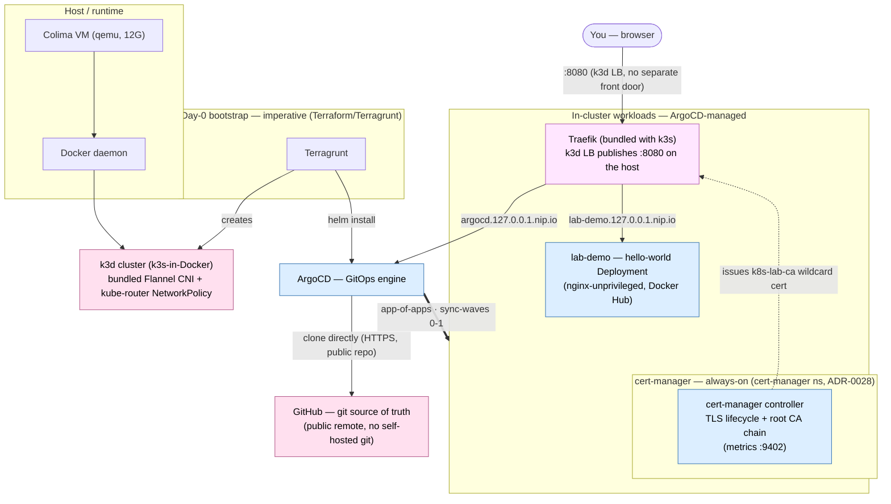

# Dependency & integration tree

How every piece of the lab depends on and integrates with every other piece.
Derived from the GitOps source of truth (sync-wave annotations, `ExternalSecret`
`remoteRef`s, `IngressRoute`s, the bootstrap scripts and `make up`), so it matches what
ArgoCD reconciles into the cluster. Two views: the **runtime integration graph** and
the **day-0 bootstrap chain**.

As of 2026-09-07 this lab is down to exactly 4 always-on namespaces, no on-demand
components, and no off-cluster services except Colima/Docker itself — a large,
deliberate simplification (Cilium, Garage, Forgejo, GitLab, Harbor, the DR front
door, capstone, Kyverno, Argo Rollouts, Velero, Trivy Operator, Kargo, ACK, moto,
KRO, Vault, and External Secrets Operator were all removed, no replacement,
alongside the observability stack removed the day before, ADR-0041). This file
describes only what's actually live today; see each component's own ADR Status
for what used to be here and why it's gone.

## Integration graph (who talks to whom)



## Day-0 bootstrap chain (`make up` — the only imperative steps)

Everything below step 5 is reconciled by ArgoCD straight from GitHub (no
self-hosted git source any more); steps 1–5 are the non-GitOps seam (you can't
GitOps the GitOps engine into being).

```
make up
└─ 1 colima-up            Colima VM (Docker runtime)
   └─ 2 cluster-up            k3d cluster (bundled Flannel + kube-router)  [Terragrunt]
      └─ 3 coredns-host-alias     host.k3d.internal -> docker gateway     [scripts/coredns-host-alias.sh]
         └─ 4 argocd                 ArgoCD (GitOps engine)               [Terraform/Helm]
            └─ 5 root-app               app-of-apps planted               [kubectl apply]
               └─ 6 coredns-nip-io-rewrite  *.127.0.0.1.nip.io -> Traefik  [scripts/coredns-host-alias.sh]
```

> **Step 3's continued necessity is unconfirmed.** `host.k3d.internal` was
> originally load-bearing for ArgoCD's Forgejo repoURL; Forgejo is gone
> (ADR-0035) and ArgoCD now syncs from a public GitHub `repoURL` instead. A
> repo-wide grep finds zero remaining consumers, but removing this step is a
> live-cluster-verified decision this remote executor can't make on its own
> (it never runs `make up`) — tracked in
> [#1517](https://github.com/tooming/k8s-anywhere/issues/1517).

> **No off-cluster services left.** Cilium, Garage (in-cluster + the off-cluster
> tfstate backend), Forgejo, and the DR front door were each an off-cluster or
> pre-ArgoCD bootstrap dependency in this lab's earlier, larger shape — all were
> removed entirely 2026-09-07, no replacement. `make up` now only ever talks to
> Colima/Docker, k3d/Terraform, and ArgoCD/GitHub — no docker-compose stack, no
> second Terraform state backend, and no CNI install step before ArgoCD.

## ArgoCD apply order (sync-waves, from `gitops/platform/`)

| Wave | Apps | Why this wave |
|------|------|---------------|
| 0 | demo, cert-manager-extras, argocd-extras | Traefik itself needs no ArgoCD Application (bundled with k3s, ADR-0040); demo (no wave annotation, auto-synced); cert-manager-extras (namespace PSA restricted labels before the Helm release — ADR-0028); argocd-extras (SSA-patches full PSA `restricted` labels onto the Terraform-created `argocd` namespace, RFC #205 — ADR-0017 §Staged rollout Phase 2) |
| 1 | lab-gateway, cert-manager | shared Gateway namespace scaffolding (no separate Gateway API CRDs any more, Traefik's own `IngressRoute` CRD is bundled); cert-manager TLS certificate lifecycle manager + CRDs (ADR-0028) |
| — | networkpolicy, governance ApplicationSets (wave 3, generated Applications at wave 4) | Plant one per-namespace NetworkPolicy + LimitRange Application per always-on namespace — `argocd`, `cert-manager`, `lab-demo`, `lab-gateway` |
| — | cert-manager-root-ca (wave 5), lab-gateway-certificate (wave 6) | Self-signed root CA chain, then the wildcard `*.127.0.0.1.nip.io` Certificate for Traefik's HTTPS listener |

> Sync-waves are ArgoCD's **apply** order — the whole always-on stack now fits in
> two waves (0-1) plus the generated NetworkPolicy/governance fan-out, no
> runtime secret-bootstrap dependency to sequence around any more.

## Integration edges, grounded

| Edge | Type | Source of truth |
|------|------|-----------------|
| ArgoCD → GitHub | HTTPS clone, public repo, no deploy key needed | Terraform `argocd` module / root Application `repoURL` |
| Host :8080 → Traefik → UIs | k3d's own load balancer publishes Traefik's `web` entrypoint directly on the host — no separate front-door process (removed entirely 2026-09-07, no replacement) | `infra/modules/k3d-cluster/variables.tf` (`http_port`), per-app `IngressRoute`s |
| cert-manager → Traefik | issues `k8s-lab-ca` wildcard cert, terminated by Traefik's `TLSStore` | `gitops/network/certificates/wildcard-certificate.yaml` |

## Notes

- **Front door removed 2026-09-07, no replacement.** The off-cluster nginx proxy
  that used to sit in front of Traefik on `:8000` (and the blue/green DR drill it
  enabled) is gone entirely. Every UI is now reached directly through k3d's own
  load balancer on **`:8080`** — the port `infra/modules/k3d-cluster/variables.tf`'s
  `http_port` publishes on the host. There is no longer a stable port that
  survives a cluster recreate independent of the k3d LB itself; recreating the
  cluster is the only "DR" story left (see [docs/DR.md](DR.md)).
- **cert-manager** (`gitops/platform/cert-manager.yaml` + `gitops/platform/cert-manager-extras.yaml`) is **always-on / auto-synced** — TLS certificate lifecycle manager (chart `cert-manager` v1.21.1 from `https://charts.jetstack.io`, namespace `cert-manager`). ADR-0028. Single-replica per component (ADR-0005 lab trade-off); controller/webhook/cainjector all default to the full PSS `restricted` profile with no chart override. `cert-manager-extras` (wave 0) pre-creates the namespace with PSA `restricted` labels. The `cert-manager` Helm Application (wave 1) ships the engine + CRDs (`ServerSideApply=true`, its CRDs are over the client-side-apply annotation cap). `cert-manager-networkpolicy` applies the default-deny overlay (ADR-0016). `cert-manager-root-ca` (wave 5) bootstraps a self-signed root CA via the standard two-`ClusterIssuer` chain (`selfsigned-bootstrap` → root `Certificate` → `k8s-lab-ca`) — chosen over public ACME because neither backend (localhost or the Oracle cloud instance) is internet-reachable in a way real ACME could use (ADR-0026). The shared `TLSStore` (`gitops/network/traefik-tls-store.yaml`, ADR-0040) terminates TLS with the wildcard `*.127.0.0.1.nip.io` Certificate, delivered by the auto-synced `lab-gateway-certificate` Application at wave 6. Every `IngressRoute` opts in with an empty `tls: {}` stanza.
- **lab-demo namespace PSA restricted + NetworkPolicy** (`gitops/apps/demo/namespace.yaml` + `gitops/apps/demo/networkpolicy/`) — PSA `restricted` labels and default-deny NetworkPolicy floor for the `lab-demo` namespace (ADR-0016 §4 fan-out + ADR-0017 §Per-namespace profile). Flipped from `baseline` 2026-09-08 when the Deployment's image was swapped from the root-running `jaegertracing/example-hotrod` to `nginx-unprivileged` (non-root by default). No ingress allow needed beyond the baseline plus Traefik's own route. Namespace manifest is picked up by the existing `demo` ArgoCD Application (`gitops/platform/demo.yaml`, wave 0).
- **argocd namespace network policy** (`gitops/argocd/networkpolicy/`) — default-deny-all + allow-dns-and-apiserver baseline policies applied to the `argocd` namespace (ADR-0016 §4 fan-out). Explicit allow policies permit: ingress from Traefik's data-plane pods in `kube-system` to `argocd-server` on TCP 8080 (for the `argocd.127.0.0.1.nip.io` IngressRoute); broad intra-namespace allow-all covering all ArgoCD component-to-component flows (`allow-argocd-intra-namespace.yaml`); egress from `argocd-repo-server` to public Helm/OCI chart registries on TCP 443 (`allow-argocd-repo-server-egress-charts.yaml`) and to GitHub itself for the git clone. Deployed by the auto-synced `argocd-networkpolicy` Application (via `networkpolicy-appset.yaml`, wave 4).
- **argocd namespace PSS Phase 1 + Phase 2** (ADR-0017 §Staged rollout, RFC #205) — `gitops/argocd/namespace.yaml` carries all four PSA labels at `restricted`. Delivered by the auto-synced `argocd-extras` ArgoCD Application (`gitops/platform/argocd-extras.yaml`, sync-wave 0, `ServerSideApply=true`, `CreateNamespace=false`).
- **lab-gateway namespace network policy** (`gitops/network/networkpolicy/`) — default-deny-all + allow-dns-and-apiserver baseline policies applied to the `lab-gateway` namespace (ADR-0016 §4 fan-out; the Gateway listener namespace). No per-workload allow rules are needed: the namespace holds only the Traefik `TLSStore` CR (ADR-0040) — no pods run in `lab-gateway` itself (Traefik itself runs in `kube-system`, bundled with k3s). Deployed by the auto-synced `lab-gateway-networkpolicy` Application (via `networkpolicy-appset.yaml`, wave 4).
- Storage backups, true HA: out of scope (single host, no in-cluster storage layer left at all). See [docs/DR.md](DR.md).
