# Dependency & integration tree

How every piece of the lab depends on and integrates with every other piece.
Derived from the GitOps source of truth (sync-wave annotations, `ExternalSecret`
`remoteRef`s, `HTTPRoute`s, the bootstrap scripts and `make up`), so it matches what
ArgoCD reconciles into the cluster. Two views: the **runtime integration graph** and
the **day-0 bootstrap chain**.

## Integration graph (who talks to whom)

```mermaid
graph TD
  classDef boot fill:#ffe0ef,stroke:#b3598a,color:#000
  classDef gitops fill:#dceeff,stroke:#3b78b3,color:#000
  classDef sec fill:#fff6cc,stroke:#b39b00,color:#000
  classDef store fill:#dcf5dc,stroke:#3b9b3b,color:#000
  classDef obs fill:#e6e6ff,stroke:#5b5bc0,color:#000
  classDef ing fill:#ffe6ff,stroke:#b35bb3,color:#000
  classDef cloud fill:#e0f7f7,stroke:#3bb3b3,color:#000
  classDef ondemand fill:#eeeeee,stroke:#999,color:#555
  classDef data fill:#ffe9d6,stroke:#cc7a30,color:#000

  user(["You — browser"])
  frontdoor["Front door — nginx :8000<br/>(off-cluster docker, stable entry)"]:::ing

  subgraph HOST["Host / runtime"]
    colima["Colima VM (vz, 12G)"]
    dockerd["Docker daemon"]
    colima --> dockerd
  end

  subgraph BOOT["Day-0 bootstrap — imperative (Terraform/Terragrunt + scripts)"]
    tg["Terragrunt"]
    scripts["scripts: gitlab-pat,<br/>vault-bootstrap, garage-bootstrap"]
  end

  gitlab["GitLab omnibus :8929<br/>git source of truth"]:::boot
  k3d["k3d cluster (k3s-in-Docker)"]:::boot
  argocd["ArgoCD — GitOps engine"]:::gitops

  dockerd --> k3d
  dockerd --> gitlab
  tg -->|creates| k3d
  tg -->|helm install| argocd
  tg -->|"project + repo deploy-token"| gitlab
  argocd -->|"clone (repo secret)"| gitlab
  scripts -->|init/unseal/seed| vault
  scripts -->|layout/keys/buckets| garage
  argocd ==>|"app-of-apps · sync-waves 0-5"| AOA

  subgraph AOA["In-cluster workloads — ArgoCD-managed"]
    subgraph SEC["Secrets"]
      vault["Vault (KV v2)"]:::sec
      eso["External Secrets Operator<br/>ClusterSecretStore 'vault'"]:::sec
    end
    subgraph STORE["Storage"]
      garage["Garage S3 :3900<br/>buckets: mimir, mimir-ruler,<br/>loki, tempo, pyroscope"]:::store
      s3man["s3manager (bucket UI)"]:::store
    end
    subgraph OBS["Observability — LGTMP"]
      nodeexp["node-exporter"]:::obs
      ksm["kube-state-metrics"]:::obs
      alloy["Alloy (collector)"]:::obs
      mimir["Mimir (metrics)"]:::obs
      loki["Loki (logs)"]:::obs
      tempo["Tempo (traces)"]:::obs
      pyro["Pyroscope (profiles)"]:::obs
      grafana["Grafana"]:::obs
    end
    subgraph CLOUD["Cloud / platform-eng"]
      moto["moto — AWS mock :5000"]:::cloud
      ack["ACK (S3 controller)"]:::cloud
      kro["KRO — S3BucketClaim RGD"]:::cloud
    end
    subgraph TIDB["TiDB — on-demand (manual sync only)"]
      tidbop["TiDB Operator<br/>(tidb-admin ns)"]:::ondemand
      tidbcluster["TiDB Cluster<br/>1×PD + 1×TiKV + 1×TiDB<br/>(tidb ns)"]:::ondemand
      tidbdemo["TiDB Demo App<br/>(tidb ns)"]:::ondemand
    end
    subgraph ARTIF["Artifactory — on-demand (manual sync only)"]
      artifactory["Artifactory OSS<br/>artifact registry + Docker registry<br/>(artifactory ns)"]:::ondemand
    end
    subgraph CAPSTONE["Capstone — build pipeline (steps 1–4 done; step 5 pending)"]
      capstoneci["GitLab CI<br/>build-and-push pipeline<br/>(.gitlab-ci.yml)"]:::ondemand
      capstoneapp["capstone app<br/>Deployment + Service<br/>(capstone ns)"]:::gitops
    end
    subgraph CILIUM["Cilium CNI — bootstrap step (before ArgoCD on fresh clusters)"]
      ciliumagent["cilium-agent<br/>eBPF CNI DaemonSet<br/>(kube-system ns)"]:::ondemand
      ciliumop["cilium-operator<br/>Deployment (~70 MB)"]:::ondemand
    end
    subgraph ISTIO["Istio ambient — on-demand (manual sync only)"]
      istiobase["istio-base<br/>CRDs + RBAC<br/>(istio-system ns)"]:::ondemand
      istiocni["istio-cni<br/>node CNI plugin<br/>(ambient mode)"]:::ondemand
      istiod["istiod<br/>control plane<br/>(ambient profile)"]:::ondemand
      ztunnel["ztunnel<br/>per-node L4 proxy<br/>(DaemonSet)"]:::ondemand
      kiali["Kiali<br/>service mesh UI<br/>(istio-system ns)"]:::ondemand
    end
    subgraph LONGHORN["Longhorn — on-demand (manual sync only)"]
      longhornmgr["longhorn-manager<br/>DaemonSet + CSI driver<br/>(longhorn-system ns)"]:::ondemand
      longhornui["longhorn-ui<br/>volume/snapshot dashboard"]:::ondemand
    end
    subgraph INKLESS["Inkless — on-demand (manual sync only)"]
      inklessbroker["inkless-broker<br/>Aiven Inkless (KIP-1150)<br/>(inkless ns)"]:::ondemand
      inklesspg["inkless-postgres<br/>batch coordinator<br/>(inkless ns)"]:::ondemand
    end
    subgraph DATA["Data layer — always-on (data ns)"]
      rabbitmq["RabbitMQ<br/>broker + mgmt UI + prometheus"]:::data
      redis["Valkey<br/>cache/KV + redis_exporter"]:::data
      datademo["data-demo<br/>(traffic generators)"]:::data
    end
    envoy["Envoy Gateway"]:::ing
    demo["demo / hello<br/>(HotROD — OTel trace producer)"]
  end

  %% --- secret chain (ExternalSecret <- Vault path) ---
  vault -->|"k8s auth, role eso"| eso
  eso -->|"garage-secrets ← garage/server"| garage
  eso -->|"garage-s3 ← garage/s3"| mimir
  eso -->|garage-s3| loki
  eso -->|garage-s3| tempo
  eso -->|garage-s3| pyro
  eso -->|garage-s3| s3man
  eso -->|"ack-aws-creds ← aws/moto"| ack
  eso -->|"grafana-admin ← grafana/admin"| grafana
  eso -->|"tidb-demo-creds ← tidb/demo"| tidbdemo
  eso -->|"rabbitmq-creds ← rabbitmq/default"| rabbitmq
  eso -->|"valkey-creds ← valkey/default"| redis
  eso -->|"data-demo-creds ← rabbitmq/default + valkey/default"| datademo
  eso -.->|"artifactory-registry ← artifactory/registry (capstone ns)"| capstoneci

  %% --- observability data flow ---
  nodeexp -->|scrape| alloy
  ksm -->|scrape| alloy
  alloy -->|"metrics (X-Scope-OrgID lab)"| mimir
  alloy -->|logs| loki
  alloy -->|profiles| pyro
  demo -->|"OTLP :4318"| tempo
  mimir -->|S3| garage
  loki -->|S3| garage
  tempo -->|S3| garage
  pyro -->|S3| garage
  mimir -->|datasource| grafana
  loki -->|datasource| grafana
  tempo -->|datasource| grafana
  pyro -->|datasource| grafana

  %% --- cloud / platform-eng ---
  kro -->|composes| ack
  ack -->|"S3 API :5000"| moto

  %% --- TiDB on-demand chain ---
  tidbop -.->|"manages CRDs"| tidbcluster
  tidbcluster -.->|"DB endpoint"| tidbdemo

  %% --- Artifactory on-demand + capstone CI pipeline ---
  envoy -.->|"artifactory.127.0.0.1.nip.io (on-demand)"| artifactory
  gitlab -.->|"capstone CI build (step 1)"| capstoneci
  capstoneci -.->|"docker push hello:SHA (on-demand)"| artifactory
  artifactory -.->|"image pull (step 2)"| capstoneapp
  envoy -->|"capstone.127.0.0.1.nip.io (step 3)"| capstoneapp
  capstoneapp -.->|"OTLP :4318 (step 4)"| tempo
  mimir -.->|"capstone pod metrics (step 4)"| grafana
  loki -.->|"capstone logs (step 4)"| grafana

  %% --- Cilium CNI bootstrap ---
  ciliumagent -.->|"eBPF pod networking"| ciliumop

  %% --- Istio ambient on-demand chain ---
  istiobase -.->|"CRDs"| istiocni
  istiobase -.->|"CRDs"| istiod
  istiocni -.->|"node capture"| ztunnel
  istiod -.->|"control plane"| ztunnel
  istiod -.->|"mesh config"| kiali
  envoy -.->|"kiali.127.0.0.1.nip.io (on-demand)"| kiali

  %% --- Longhorn on-demand ---
  longhornmgr -.->|"manages volumes"| longhornui
  envoy -.->|"longhorn.127.0.0.1.nip.io (on-demand)"| longhornui

  %% --- Inkless on-demand ---
  inklessbroker -.->|"JDBC batch coord"| inklesspg
  inklessbroker -.->|"S3 PUT/GET records"| garage
  inklessbroker -.->|"scrape :9308 (kafka-exporter)"| alloy

  %% --- data layer (always-on) ---
  rabbitmq -->|"scrape :15692"| alloy
  redis -->|"scrape :9121"| alloy
  datademo -->|"AMQP publish/consume"| rabbitmq
  datademo -->|"SET/GET/INCR"| redis

  %% --- Envoy Gateway observability ---
  envoy -->|"scrape controller :19001"| alloy
  envoy -->|"scrape proxy :19000/stats/prometheus"| alloy

  %% --- Garage admin metrics ---
  garage -->|"scrape :3903/metrics"| alloy

  %% --- ingress (north-south) ---
  user --> frontdoor
  frontdoor --> envoy
  envoy -->|argocd.127.0.0.1.nip.io| argocd
  envoy -->|localhost| grafana
  envoy -->|vault.127.0.0.1.nip.io| vault
  envoy -->|s3.127.0.0.1.nip.io| s3man
  envoy -->|moto.127.0.0.1.nip.io| moto
  envoy -.->|"tidb-demo.127.0.0.1.nip.io (on-demand)"| tidbdemo
  envoy -->|rabbitmq.127.0.0.1.nip.io| rabbitmq
```



## Day-0 bootstrap chain (`make up` — the only imperative steps)

Everything below step 6 is reconciled by ArgoCD from GitLab; steps 1–8 are the
non-GitOps seam (you can't GitOps the GitOps engine or its git source into being).

```
make up
└─ 1 colima-up          Colima VM (Docker runtime)
   └─ 2 tfstate-up       off-cluster Garage for TF state              [docker compose]
      └─ 3 cluster-up       k3d cluster                               [Terragrunt → s3 backend]
         └─ 4 argocd        ArgoCD (GitOps engine)                    [Terraform/Helm]
            └─ 5 gitlab-up  GitLab omnibus (git source)               [docker compose]
               └─ 6 gitlab-configure  project + ArgoCD repo deploy-token + git push   [Terraform + git]
                  └─ 7 root-app       app-of-apps planted             [kubectl apply]
                     ├─ 8 vault-bootstrap   init/unseal; seed secret/garage/server,
                     │                      aws/moto, grafana/admin, tidb/demo,
                     │                      rabbitmq/default, valkey/default;
                     │                      k8s auth + eso role; kick ESO
                     └─ 9 garage-bootstrap  layout + S3 key + buckets → writes vault:garage/s3
                        └─ ESO syncs Vault→Secrets ⇒ Garage, Mimir, Loki, Tempo,
                           Pyroscope, ACK, Grafana converge on their own
```

> **Why a second, off-cluster Garage?** The in-cluster Garage is created *by* the
> Terraform in steps 3–6, so it can't also be that Terraform's state backend without a
> bootstrap loop. The state Garage (step 2) is a *separate instance* that comes up first
> and lives off-cluster (like GitLab and the front door), breaking the loop. Same engine,
> different purpose. See [docs/platform-products.md](platform-products.md) for the
> build-vs-product distinction.

## ArgoCD apply order (sync-waves, from `gitops/platform/`)

| Wave | Apps | Why this wave |
|------|------|---------------|
| 0 | envoy-gateway, demo | Gateway API CRDs + controller; demo (no wave annotation, auto-synced) |
| 1 | vault, external-secrets, garage, mimir, kube-state-metrics, moto, lab-gateway | secret engine + ESO controller + storage + metrics store; shared Gateway (after Gateway API CRDs) |
| 2 | alloy, grafana, loki, tempo, pyroscope, node-exporter, external-secrets-config, vault-extras | collectors + stores + UI; ClusterSecretStore + ESO bindings; Vault add-ons (all after wave 1 deps) |
| 3 | ack-s3, kro, s3manager, rabbitmq, valkey | controllers/abstractions + bucket UI; data layer (after the ClusterSecretStore in wave 2) |
| 4 | ack-resources, data-demo, capstone-networkpolicy, data-networkpolicy, observability-networkpolicy, vault-networkpolicy, storage-networkpolicy, argocd-networkpolicy | ACK `Bucket` CRs (need the controller); data-demo traffic generators (need rabbitmq + valkey); NetworkPolicy fan-out overlays (need namespaces created by waves 1–3) |
| 5 | kro-resources | KRO instances (need the RGD + ACK) |
| — | tidb-operator *(on-demand)* | CRD controller for TiDB; discovered by ArgoCD but **manual-sync only** — use `make tidb-operator-up` |
| — | tidb-cluster *(on-demand)* | `TidbCluster` CR (1×PD + 1×TiKV + 1×TiDB); manual-sync only — use `make tidb-up` (requires tidb-operator) |
| — | tidb-demo *(on-demand)* | Demo app reading TiDB creds from Vault via ExternalSecret; manual-sync only — use `make tidb-demo-up` |
| — | artifactory *(on-demand)* | JFrog Artifactory OSS artifact + Docker registry (chart `jfrog/artifactory-oss` from `charts.jfrog.io`); manual-sync only — use `make artifactory-up` |
| — | artifactory-extras *(on-demand)* | Envoy HTTPRoute for `artifactory.127.0.0.1.nip.io`; paired with the artifactory Application — use `make artifactory-up` |
| — | cilium *(bootstrap — helm direct, before ArgoCD)* | Cilium CNI replacing k3s-bundled Flannel; eBPF kube-proxy replacement (chart `cilium/cilium` v1.16.6 from `https://helm.cilium.io`, namespace `kube-system`; `kubeProxyReplacement: true`, Hubble disabled for budget). Run `make cilium-up` immediately after `make cluster-up` — pod networking requires Cilium before ArgoCD or any workload can start (ADR-0014) |
| — | istio-base *(on-demand, step 1)* | Istio CRDs + cluster-scoped RBAC (chart `istio/base` from `istio-release.storage.googleapis.com/charts`); manual-sync only — use `make istio-up` |
| — | istio-cni *(on-demand, step 2)* | Istio CNI node plugin, ambient profile (chart `istio/cni`); must precede istiod — use `make istio-up` |
| — | istiod *(on-demand, step 3)* | Istio control plane, ambient profile (chart `istio/istiod`); no sidecar injection (ADR-0012) — use `make istio-up` |
| — | ztunnel *(on-demand, step 4)* | Per-node L4 proxy DaemonSet implementing ambient mesh data plane (chart `istio/ztunnel`) — use `make istio-up` |
| — | kiali *(on-demand)* | Service mesh observability UI (chart `kiali-server` from `https://kiali.org/helm-charts`, v1.89.0); anonymous auth; connects to Mimir Prometheus API; Envoy HTTPRoute `kiali.127.0.0.1.nip.io` — use `make kiali-up` (requires `istio-up`) or `make mesh-up` |
| — | kiali-extras *(on-demand)* | Envoy HTTPRoute for `kiali.127.0.0.1.nip.io`; paired with the kiali Application — use `make kiali-up` |
| — | longhorn *(on-demand)* | CNCF distributed block storage + CSI driver (chart `longhorn/longhorn` v1.7.2 from `https://charts.longhorn.io`, namespace `longhorn-system`; replica count 1 for single-node lab); manual-sync only — use `make longhorn-up` |
| — | longhorn-extras *(on-demand)* | Envoy HTTPRoute for `longhorn.127.0.0.1.nip.io`; paired with the longhorn Application — use `make longhorn-up` |
| — | inkless *(on-demand)* | Aiven Inkless (KIP-1150 diskless Kafka) + PostgreSQL batch coordinator; manual-sync only — use `make inkless-up`; S3 backend is Garage (bucket `inkless`, key `inkless-key`) |

> Sync-waves are ArgoCD's **apply** order. The **runtime** secret dependency
> (Vault must be *bootstrapped* before ESO can sync) is enforced by the day-0
> chain above, not by waves — which is why `vault-bootstrap` kicks ESO.

## Integration edges, grounded

| Edge | Type | Source of truth |
|------|------|-----------------|
| ArgoCD → GitLab | clone via `repo-gitlab-gitops` secret | Terraform `gitlab-config` |
| Vault → ESO | k8s auth, role `eso`, policy `eso-read` | `scripts/vault-bootstrap.sh` |
| ESO → garage-secrets | `← vault:garage/server` | `gitops/secrets/garage-externalsecrets.yaml` |
| ESO → garage-s3 (Mimir/Loki/Tempo/Pyroscope/storage) | `← vault:garage/s3` | `gitops/secrets/` |
| ESO → ack-aws-creds | `← vault:aws/moto` | `gitops/secrets/ack-creds.yaml` |
| ESO → grafana-admin | `← vault:grafana/admin` (admin user + password) | `gitops/secrets/grafana-admin-externalsecret.yaml` |
| ESO → tidb-demo-creds *(on-demand)* | `← vault:tidb/demo` (username + password) | `gitops/tidb-demo/externalsecret.yaml` |
| Mimir/Loki/Tempo/Pyroscope → Garage | S3 backend `garage.storage.svc:3900` | each component's config |
| Alloy → Mimir/Loki/Pyroscope | remote_write / push | `gitops/observability/alloy` |
| hello (HotROD) → Tempo | OTLP HTTP `:4318` (`OTEL_EXPORTER_OTLP_ENDPOINT`) | `gitops/apps/demo/deployment.yaml` |
| ACK → moto | S3 API `moto.moto.svc:5000` | `gitops/ack`, ACK chart values |
| KRO → ACK | `S3BucketClaim` RGD composes a `Bucket` | `gitops/kro` |
| Front door :8000 → Envoy → UIs | `HTTPRoute` host-routing | `gitops/network`, per-app routes |
| Envoy → tidb-demo.127.0.0.1.nip.io *(on-demand)* | HTTPRoute | `gitops/tidb-demo/route.yaml` |
| ESO → rabbitmq-creds | `← vault:rabbitmq/default` (username + password) | `gitops/data/rabbitmq/externalsecret.yaml` |
| ESO → valkey-creds | `← vault:valkey/default` (password) | `gitops/data/valkey/externalsecret.yaml` |
| ESO → data-demo-creds | `← vault:rabbitmq/default + valkey/default` | `gitops/data/demo/externalsecret.yaml` |
| Alloy → RabbitMQ / Valkey | scrape `:15692` / `:9121` → Mimir | `gitops/platform/observability-alloy.yaml` |
| data-demo → RabbitMQ / Valkey | AMQP publish/consume · Valkey SET/GET/INCR | `gitops/data/demo/` |
| Envoy → rabbitmq.127.0.0.1.nip.io | HTTPRoute (management UI) | `gitops/data/rabbitmq/route.yaml` |
| Envoy → artifactory.127.0.0.1.nip.io *(on-demand)* | HTTPRoute | `gitops/artifactory/route.yaml` |
| Envoy → kiali.127.0.0.1.nip.io *(on-demand)* | HTTPRoute | `gitops/kiali/route.yaml` |
| istiod → Kiali *(on-demand)* | mesh config (xDS endpoint) | `gitops/platform/kiali.yaml` values |
| Envoy → longhorn.127.0.0.1.nip.io *(on-demand)* | HTTPRoute | `gitops/longhorn/route.yaml` |
| ESO → artifactory-registry *(capstone)* | `← vault:artifactory/registry` (username + password) | `gitops/secrets/artifactory-registry-externalsecret.yaml` |
| GitLab CI → Artifactory *(capstone step 1)* | docker push `hello:SHA` via `.gitlab-ci.yml` | `.gitlab-ci.yml` |
| Artifactory → capstone app *(capstone step 2)* | image pull `docker-local/hello:latest` via `imagePullSecret` | `gitops/apps/capstone/deployment.yaml` |
| Envoy → capstone.127.0.0.1.nip.io *(capstone step 3)* | HTTPRoute | `gitops/apps/capstone/route.yaml` |
| capstone app → Tempo *(capstone step 4)* | OTLP HTTP `:4318` (`OTEL_EXPORTER_OTLP_ENDPOINT`) | `gitops/apps/capstone/deployment.yaml` |
| Grafana dashboard — Lab — Capstone *(capstone step 4)* | Mimir metrics + Loki logs + Tempo traces | `grafana/dashboards/lab-capstone.json` |
| Grafana dashboard — Lab — ArgoCD (GitOps) | ArgoCD metrics (app info, sync rate, reconcile heatmap, git latency, AppSet) + KSM/cAdvisor pod stats | `grafana/dashboards/lab-argocd.json` |
| Alloy → Envoy Gateway controller | scrape `:19001/metrics` → Mimir | `gitops/platform/observability-alloy.yaml` |
| Alloy → Envoy proxy data plane | pod discovery, scrape `:19000/stats/prometheus` → Mimir | `gitops/platform/observability-alloy.yaml` |
| Grafana dashboard — Lab — Envoy Gateway (Ingress) | Envoy proxy request rate, latency p50/p95/p99, 5xx ratio, upstream cluster health, active connections + controller-runtime reconcile metrics + KSM/cAdvisor pod stats | `grafana/dashboards/lab-envoy.json` |
| Alloy → Garage admin metrics | scrape `:3903/metrics` → Mimir | `gitops/platform/observability-alloy.yaml` |
| Grafana dashboard — Lab — Garage S3 (Object Storage) | API request rate by handler, error rate, block resync queue + rate, storage bytes, bucket/object counts + KSM/cAdvisor pod stats | `grafana/dashboards/lab-garage.json` |
| Alloy → Inkless exporter *(on-demand)* | scrape `inkless.inkless.svc:9308/metrics` → Mimir | `gitops/platform/observability-alloy.yaml` |
| Grafana dashboard — Lab — Inkless (Diskless Kafka) *(on-demand)* | kafka-exporter broker/topic/lag metrics + KSM/cAdvisor pod stats | `grafana/dashboards/lab-inkless.json` |

## Notes
- **Front door** (`:8000`, nginx docker container) is off-cluster and **not**
  GitOps-managed — the stable entry that survives blue/green; it's the front-LB
  SPOF in [ADR-0005](decisions/adr-0005-spof-recreate-over-ha.md).
- **Cilium** (`gitops/platform/cilium.yaml`) is the cluster's **CNI and kube-proxy replacement** (ADR-0014). Non-auto-synced because Cilium must be installed **before** ArgoCD on fresh clusters — `make cilium-up` runs `helm upgrade --install` directly (day-0 bootstrap seam) immediately after `make cluster-up`, before `make argocd`. Flannel is disabled (`disable_default_cni = true` in `infra/live/local/cluster/terragrunt.hcl`). Chart `cilium/cilium` v1.16.6 from `https://helm.cilium.io`, namespace `kube-system`; `kubeProxyReplacement: true`; Hubble disabled (~320 MB net addition; replaces Flannel ~80 MB). Once ArgoCD is running it adopts the Helm release. Use `make cilium-down` only during full cluster teardown.
- **GitLab** is also off-cluster (docker), the git source ArgoCD reads from.
- **Tempo** receives traces from the `hello` demo app (HotROD) via OTLP HTTP `:4318`. HotROD runs in `lab-demo` namespace and exports to `tempo.observability.svc.cluster.local:4318` via the standard `OTEL_EXPORTER_OTLP_ENDPOINT` env var. The "Lab — Traces" dashboard shows live span data.
- **TiDB Operator** (`gitops/platform/tidb-operator.yaml`) is on-demand / manual-sync — ArgoCD discovers the Application but does not auto-deploy the operator. Use `make tidb-operator-up` / `make tidb-operator-down`. Installs into namespace `tidb-admin`.
- **TiDB Cluster** (`gitops/platform/tidb-cluster.yaml`) is on-demand / manual-sync — deploys a minimal `TidbCluster` CR (1×PD + 1×TiKV + 1×TiDB, ~1.5 GB) into namespace `tidb`. Use `make tidb-up` / `make tidb-down`. Requires TiDB Operator running first. ADR-0003 note: production topology uses ≥3 PD + ≥3 TiKV + 2 TiDB; single replicas are the ADR-0005 lab trade-off.
- **TiDB Demo App** (`gitops/platform/tidb-demo.yaml`) is on-demand / manual-sync — deploys an nginx-based demo workload (namespace `tidb`) that reads TiDB credentials from Vault via `ExternalSecret tidb-demo-creds`. Demonstrates the Vault → ESO → Secret → Pod injection flow (learning-path step 4). HTTPRoute: `tidb-demo.127.0.0.1.nip.io`. Dashboard: "Lab — TiDB Demo App". Use `make tidb-demo-up` / `make tidb-demo-down`.
- **RabbitMQ** (`gitops/platform/rabbitmq.yaml`) is **always-on / auto-synced** — single-node broker (namespace `data`) with the management UI (`rabbitmq.127.0.0.1.nip.io`) and the `rabbitmq_prometheus` plugin (`:15692`, scraped by Alloy). Default user from Vault via `ExternalSecret rabbitmq-creds`. Dashboard: "Lab — RabbitMQ". ADR-0009. ADR-0003/0005 note: production runs a clustered broker with quorum queues; the single node is the single-host lab trade-off.
- **Valkey** (`gitops/platform/valkey.yaml`) is **always-on / auto-synced** — single-node cache/KV (namespace `data`) with auth via `--requirepass` (Vault → `ExternalSecret valkey-creds`) and a `redis_exporter` sidecar (`:9121`, scraped by Alloy). No web UI. Dashboard: "Lab — Valkey". ADR-0018. ADR-0003/0005 note: production uses Valkey Cluster; the single replica is the single-host lab trade-off.
- **data-demo** (`gitops/platform/data-demo.yaml`) is **always-on / auto-synced** — tiny generators (`valkey-load`, `rabbitmq-load`, namespace `data`) that exercise Valkey and RabbitMQ continuously so the dashboards show real traffic, not idle brokers. Credentials via `ExternalSecret data-demo-creds`.
- **Artifactory OSS** (`gitops/platform/artifactory.yaml` + `gitops/platform/artifactory-extras.yaml`) is **on-demand / manual-sync** — JFrog Artifactory OSS artifact registry (chart `jfrog/artifactory-oss` from `charts.jfrog.io`, namespace `artifactory`). JVM footprint (~1–2 GB) prevents auto-sync alongside the always-on stack (ADR-0011). HTTPRoute: `artifactory.127.0.0.1.nip.io`. Use `make artifactory-up` / `make artifactory-down`. The capstone pipeline (RFC #62) pushes images here. ADR-0003/0005 note: production runs clustered Artifactory HA; single node is the single-host lab trade-off.
- **Istio ambient mesh** (`gitops/platform/istio-base.yaml`, `istio-cni.yaml`, `istiod.yaml`, `ztunnel.yaml`) is **on-demand / manual-sync** — Istio ambient mesh (no per-pod sidecars; ADR-0012). Four ArgoCD Applications in deployment order: `istio-base` (CRDs) → `istio-cni` (CNI plugin, ambient) → `istiod` (control plane, ambient profile) → `ztunnel` (per-node L4 proxy DaemonSet). Charts from `https://istio-release.storage.googleapis.com/charts`, version 1.24.3. Total footprint ~480 MB. Namespace `istio-system`. Use `make istio-up` / `make istio-down`. ADR-0008 note: ztunnel shares the same Envoy data plane as the north-south gateway.
- **Kiali** (`gitops/platform/kiali.yaml` + `gitops/platform/kiali-extras.yaml`) is **on-demand / manual-sync** — service mesh observability UI (chart `kiali-server` v1.89.0 from `https://kiali.org/helm-charts`, namespace `istio-system`). Connects to Mimir's Prometheus-compatible API (`X-Scope-OrgID: lab`) for real-time service graph and traffic metrics. Exposed via Envoy HTTPRoute `kiali.127.0.0.1.nip.io`. Use `make kiali-up` / `make kiali-down` (requires `istio-up` first). For convenience, `make mesh-up` / `make mesh-down` bring up/down Istio + Kiali together in the correct order. ADR-0012; footprint ~200 MB.
- **Longhorn** (`gitops/platform/longhorn.yaml` + `gitops/platform/longhorn-extras.yaml`) is **on-demand / manual-sync** — CNCF distributed block storage + CSI driver (chart `longhorn/longhorn` v1.7.2 from `https://charts.longhorn.io`, namespace `longhorn-system`). Runs alongside `local-path` (the default provisioner) — adds a custom `StorageClass`, snapshot API, and volume UI; it does not replace `local-path` (ADR-0013). Default replica count: 1 (single-node lab, ADR-0005). Footprint ~350–400 MB; on-demand to stay within the 12 GB budget. Exposed via Envoy HTTPRoute `longhorn.127.0.0.1.nip.io`. Use `make longhorn-up` / `make longhorn-down`.
- **Capstone pipeline (steps 1–4 done)** — Step 1: `.gitlab-ci.yml` builds `gitops/apps/demo/Dockerfile` (HotROD wrapper) and pushes `docker-local/hello:$CI_COMMIT_SHORT_SHA` to Artifactory; credentials from Vault via masked CI vars. Step 2: `gitops/platform/capstone.yaml` (auto-synced ArgoCD Application) deploys the pipeline-built image from Artifactory to namespace `capstone`, using `imagePullSecret artifactory-registry` (ESO ExternalSecret). Step 3: `gitops/apps/capstone/route.yaml` exposes the app at `capstone.127.0.0.1.nip.io` via Envoy HTTPRoute (Gateway API). Step 4: `grafana/dashboards/lab-capstone.json` — "Lab — Capstone" dashboard with real pod/container metrics (Mimir/KSM/cAdvisor), Loki logs filtered to namespace `capstone`, and Tempo traces from the capstone app's OTLP instrumentation (ADR-0004: all data from real metrics). Step 5 (Vault secret + ExternalSecret for capstone app config) is still pending.
- **ArgoCD dashboard** (`grafana/dashboards/lab-argocd.json`) — "Lab — ArgoCD (GitOps)" covers the GitOps reconcile loop learning objective: per-app sync/health state table (`argocd_app_info`), sync attempt rate by phase (`argocd_app_sync_total`), reconcile duration heatmap (`argocd_app_reconcile_duration_seconds_bucket`), repo-server git request latency (`argocd_git_request_duration_seconds_bucket`), ApplicationSet controller reconcile rate, and pod/container resource stats from KSM/cAdvisor. All four ArgoCD scrape targets are already configured in `observability-alloy.yaml` (no Alloy config change needed).
- **Envoy Gateway dashboard** (`grafana/dashboards/lab-envoy.json`) — "Lab — Envoy Gateway (Ingress)" covers the north-south ingress (ADR-0008) and Gateway API learning objectives. Two new Alloy scrape jobs: `envoy-gateway-controller` (controller-runtime reconcile metrics at `envoy-gateway.envoy-gateway-system.svc:19001`) and `envoy-proxy` (Envoy data-plane `/stats/prometheus` at `:19000`, discovered via pod labels in `envoy-gateway-system` namespace). Panels: per-listener request rate, p50/p95/p99 latency (histogram), 5xx error ratio, upstream cluster active connections, controller reconcile rate + errors, and memory by container from cAdvisor. All data from real metrics (ADR-0004).
- **Garage S3 dashboard** (`grafana/dashboards/lab-garage.json`) — "Lab — Garage S3 (Object Storage)" covers the S3-compatible-storage CHARTER learning objective (ADR-0002). One new Alloy scrape job: `garage` (Garage admin metrics at `garage.storage.svc.cluster.local:3903/metrics`). Panels: pod running + memory + restarts + ArgoCD sync state (KSM/cAdvisor); bucket count (`garage_bucket_count`) + total objects (`garage_object_count`) + storage used GiB (`garage_storage_bytes`) + block resync queue (`garage_block_resync_queue_length`); S3 API request rate by handler (`garage_s3_api_request_total`); S3 API error rate (`garage_s3_api_error_total`); block resync rate by status (`garage_block_resync_total`); storage bytes over time. All data from real metrics (ADR-0004).
- **Inkless dashboard** (`grafana/dashboards/lab-inkless.json`) — "Lab — Inkless (Diskless Kafka)" now combines pod health/resource panels (KSM/cAdvisor) with real broker/topic/consumer-lag metrics from a `kafka-exporter` sidecar (`:9308`) scraped by Alloy as job `inkless`. It is on-demand like the Inkless app itself.
- **data namespace network policy** (`gitops/data/networkpolicy/`) — default-deny-all + allow-dns-and-apiserver baseline policies applied to the `data` namespace (ADR-0016 pilot). Explicit allow policies permit: ingress to RabbitMQ on AMQP (5672), management (15672), and metrics (15692); ingress to Valkey on 6379 and redis_exporter on 9121; egress from data-demo generators to RabbitMQ management (15672) and Valkey (6379). Fan-out to remaining namespaces follows per ADR-0016.
- **capstone namespace network policy** (`gitops/apps/capstone/networkpolicy/`) — default-deny-all + allow-dns-and-apiserver baseline policies applied to the `capstone` namespace (ADR-0016 §4 fan-out; closes the capstone pilot loop). Explicit allow policies permit: ingress from Envoy Gateway proxy pods in `envoy-gateway-system` (TCP 8080, for the capstone HTTPRoute); egress to Tempo pods in `observability` (TCP 4318 OTLP HTTP, for the capstone app's `OTEL_EXPORTER_OTLP_ENDPOINT`). Deployed by the auto-synced `capstone-networkpolicy` ArgoCD Application (`gitops/platform/capstone-networkpolicy.yaml`, wave 4).
- **observability namespace network policy** (`gitops/observability/networkpolicy/`) — default-deny-all + allow-dns-and-apiserver baseline policies applied to the `observability` namespace (ADR-0016 §4 fan-out; covers the LGTMP stack). Explicit allow policies permit: all intra-namespace traffic (Alloy → Mimir/Loki/Pyroscope writes, Grafana → backends, KSM + LGTMP self-scrapes); ingress to Grafana pods from Envoy Gateway proxy pods (TCP 3000); ingress to Tempo pods on TCP 4318 (OTLP HTTP from `capstone` and `lab-demo` trace producers); Alloy egress to ArgoCD (TCP 8080/8082/8083/8084), data (TCP 15692/9121), envoy-gateway-system (TCP 19000/19001), inkless (TCP 9308, on-demand), and cluster nodes (TCP 10250 kubelet/cAdvisor); all observability pods egress to storage namespace on TCP 3900 (Garage S3 backend writes) and TCP 3903 (Garage admin metrics scrape). Deployed by the auto-synced `observability-networkpolicy` ArgoCD Application (`gitops/platform/observability-networkpolicy.yaml`, wave 4).
- **vault namespace network policy** (`gitops/vault/networkpolicy/`) — default-deny-all + allow-dns-and-apiserver baseline policies applied to the `vault` namespace (ADR-0016 §4 fan-out; protects the secrets plane). Explicit allow policies permit: ingress from ESO controller pods in `external-secrets` (TCP 8200, for k8s auth and KV secret reads — `allow-vault-from-eso.yaml`); ingress from Envoy Gateway proxy pods in `envoy-gateway-system` (TCP 8200, for the `vault.127.0.0.1.nip.io` HTTPRoute — `allow-vault-from-gateway.yaml`). The allow-dns-and-apiserver baseline already covers Vault's k8s-auth call to the k3s API server. Deployed by the auto-synced `vault-networkpolicy` ArgoCD Application (`gitops/platform/vault-networkpolicy.yaml`, wave 4).
- **storage namespace network policy** (`gitops/storage/networkpolicy/`) — default-deny-all + allow-dns-and-apiserver baseline policies applied to the `storage` namespace (ADR-0016 §4 fan-out; Garage is the S3 backplane for the entire LGTMP observability stack and Inkless). Explicit allow policies permit: ingress from any pod in `observability` to Garage on TCP 3900 (S3 API writes from Mimir/Loki/Tempo/Pyroscope) and TCP 3903 (Alloy admin metrics scrape — `allow-garage-s3-from-observability.yaml`); ingress from Inkless broker pods (`app: inkless`) in the `inkless` namespace on TCP 3900 (diskless Kafka log-segment S3 writes — `allow-garage-s3-from-inkless.yaml`). No egress allows needed beyond the baseline — Garage does not initiate connections to other namespaces. Deployed by the auto-synced `storage-networkpolicy` ArgoCD Application (`gitops/platform/storage-networkpolicy.yaml`, wave 4).
- **argocd namespace network policy** (`gitops/argocd/networkpolicy/`) — default-deny-all + allow-dns-and-apiserver baseline policies applied to the `argocd` namespace (ADR-0016 §4 fan-out; ArgoCD is the GitOps reconcile plane — the highest blast-radius non-secrets namespace). Explicit allow policies permit: ingress from Envoy Gateway proxy pods in `envoy-gateway-system` to `argocd-server` on TCP 8080 (for the `argocd.127.0.0.1.nip.io` HTTPRoute — `allow-argocd-server-from-gateway.yaml`); ingress from Alloy pods in `observability` on metrics ports 8080/8082/8083/8084 (for the four ArgoCD `*-metrics` scrape targets already configured in `observability-alloy.yaml` — `allow-argocd-from-alloy.yaml`); broad intra-namespace allow-all covering all ArgoCD component-to-component flows (controller ↔ repo-server gRPC 8081, controller/server ↔ argocd-cache 6379, appset ↔ server 7000 — `allow-argocd-intra-namespace.yaml`); egress from `argocd-repo-server` to GitLab on the Docker host TCP 8929 for git clone/fetch (ipBlock `0.0.0.0/0` on port 8929, same pragmatic pattern as Alloy's kubelet CIDR — `allow-argocd-repo-server-egress-gitlab.yaml`). Deployed by the auto-synced `argocd-networkpolicy` ArgoCD Application (`gitops/platform/argocd-networkpolicy.yaml`, wave 4).
- Storage backups, true HA: out of scope (single host). See `docs/DR.md`.
