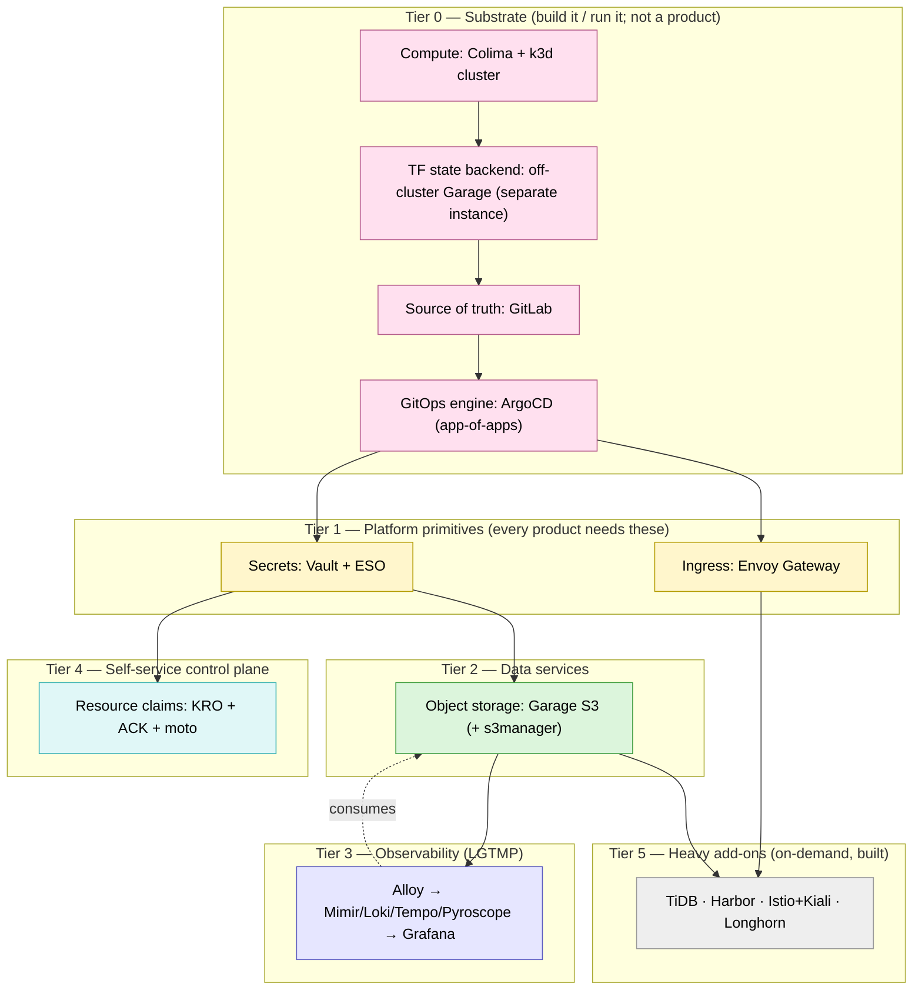

# Platform products & operating model

A product view of the lab: what capabilities a platform like this provides to the
rest of the company, what each one depends on, the order you'd build them, and how to
split the **planned** (build / roadmap) work from the **operational** (run / unplanned)
work once they exist.

This is the org/product companion to [dependency-tree.md](dependency-tree.md) (the
runtime + bootstrap graph) and [00-architecture.md](00-architecture.md) (roles).
Everything below maps to components that exist in this repo today, including the
heavy add-ons named in the README — all now built and on-demand, not planned.

---

## The lens: platform-as-a-product

A platform is not a pile of tools — it's a set of **products** offered to internal
customers (app teams) so they can self-serve instead of filing tickets. A product, to
qualify here, needs four things:

| Property | Meaning | Example in this lab |
|----------|---------|---------------------|
| **A consumer-facing contract** | a stable API/CRD or documented interface the customer uses, *not* the implementation | `kind: S3BucketClaim`, `kind: HTTPRoute`, `kind: ExternalSecret` |
| **Self-service** | the customer gets it via git/API, no human in the loop | open a PR adding the resource → ArgoCD reconciles it |
| **An owner** | a team accountable for its SLO and its runbook | platform domain squads (below) |
| **A hidden implementation** | the customer doesn't need to know what's behind the contract | "S3 bucket" hides ACK→moto (or Garage); "secret" hides Vault |

The distinction that matters: **substrate is built and run by the platform but is not
itself a product** (app teams never touch k3d or the Terraform state backend), whereas
**a product is the thing you put a self-service contract in front of**.

The off-cluster Garage we just added is a perfect illustration: it backs Terraform
state, it's pure **substrate / build-time plumbing**, and even though it's the *same
engine* as the in-cluster Garage **object-storage product**, it's a deliberately
*separate instance* with a different purpose — never offered to teams. Keeping the two
apart is both a loop-breaker (see dependency-tree.md) and a clean product boundary:
"same tech, different role" is exactly the build-vs-product distinction.

---

## Layered dependency tree (priority = bottom-up)

You build (and recover) bottom-up; nothing in a higher tier works until its tier is up.
This is the priority order: **Tier 0 is most critical** — without it there is no
platform at all — and criticality decreases as you go up.



| Tier | What | Build priority | Why this order |
|------|------|----------------|----------------|
| **0 Substrate** | Compute (Colima/k3d), TF state (off-cluster Garage), SCM (GitLab), GitOps (ArgoCD) | **P0** | Nothing exists without compute + a state store + a git source + a reconciler. This is the day-0 imperative seam. |
| **1 Primitives** | Secrets (Vault+ESO), Ingress (Envoy Gateway) | **P0** | Every product needs to hold credentials and be reachable. Provisioned first by ArgoCD (sync-waves 0–1). |
| **2 Data** | Object storage (Garage) | **P1** | Stateful backends for observability and apps. |
| **3 Observability** | LGTMP + Grafana | **P1** | You can ship without it, but you can't *operate* without it. Depends on object storage. |
| **4 Self-service** | KRO + ACK + moto claims | **P2** | The "internal API" layer that turns primitives into one-line self-service. |
| **5 Heavy** | TiDB, Harbor, Istio mesh, Longhorn | **P3** | On-demand, capacity-gated (the 16 GB reality); pulled in per customer need — all four are built (`make <name>-up`), not just planned. |

---

## Product catalog

Grouped by **capability domain** — the natural unit for assigning an owning squad.
"Maturity" reflects how self-service it is *today* in this repo.

### A. Delivery & control plane
The paved road for shipping. Substrate that's also offered as a "deploy here" product.

| Product | Consumer contract (self-service) | Backed by | Depends on | Maturity |
|---------|----------------------------------|-----------|------------|----------|
| **Continuous Delivery** | add an ArgoCD `Application` / app-of-apps entry via git PR | ArgoCD | GitLab, cluster | ✅ self-service (PR → sync) |
| **Cluster / environment** | (platform-provisioned) | k3d + Terraform/Terragrunt | off-cluster Garage (state), Colima | 🛠 platform-only (no tenant API yet) |

### B. Security & secrets
| Product | Consumer contract | Backed by | Depends on | Maturity |
|---------|-------------------|-----------|------------|----------|
| **Secrets** | `kind: ExternalSecret` referencing a Vault path → a k8s `Secret` appears | Vault (KV v2) + External Secrets Operator | ArgoCD | ✅ self-service (team adds ExternalSecret; platform owns Vault paths/policy) |

### C. Connectivity / ingress
| Product | Consumer contract | Backed by | Depends on | Maturity |
|---------|-------------------|-----------|------------|----------|
| **Ingress / north-south routing** | `kind: HTTPRoute` (Gateway API) on the shared gateway | Envoy Gateway (+ off-cluster front door) | ArgoCD | ✅ self-service |
| **Service mesh (east-west)** | sidecarless `PeerAuthentication`/traffic policy + Kiali topology (`make istio-up`) | Istio ambient + Kiali | ingress | 🟡 on-demand (heavy) |

### D. Data & storage
| Product | Consumer contract | Backed by | Depends on | Maturity |
|---------|-------------------|-----------|------------|----------|
| **Object storage (S3)** | a bucket + credentials (today provisioned by `garage-bootstrap`; browse via s3manager) | Garage S3 | Secrets | 🟡 platform-provisioned (self-service path = Cloud Resources below) |
| **Relational database** | a TiDB cluster via `make tidb-up`; no DB-claim CRD yet — direct `kubectl`/GitOps access | TiDB | storage | 🟡 on-demand (heavy) |
| **Artifact registry** | push/pull endpoint + repo via `make harbor-up` | Harbor | storage | 🟡 on-demand (heavy) |
| **Block storage / PVs** | a `longhorn` StorageClass via `make longhorn-up` | Longhorn | compute | 🟡 on-demand (heavy) |

### E. Observability
| Product | Consumer contract | Backed by | Depends on | Maturity |
|---------|-------------------|-----------|------------|----------|
| **Metrics / Logs / Traces / Profiles** | emit to Alloy (auto-collected) or push; query in Grafana; dashboards-as-code | Alloy, Mimir, Loki, Tempo, Pyroscope, Grafana, KSM, node-exporter | Object storage, Secrets | 🟡 mostly automatic; dashboard self-service via git |

### F. Developer self-service / abstractions
The "internal API" layer — the clearest *product* in the lab.

| Product | Consumer contract | Backed by | Depends on | Maturity |
|---------|-------------------|-----------|------------|----------|
| **Cloud Resources Service** | `kind: S3BucketClaim` (one object → a bucket + an ownership catalog entry) | KRO `ResourceGraphDefinition` → ACK `Bucket` → moto | Secrets, ArgoCD | ✅ self-service (the model abstraction; extend the RGD for more resource types) |

> The `S3BucketClaim` (`gitops/kro/rgd-s3bucketclaim.yaml`) is the template for *every*
> future self-service product: define a high-level CRD, compose the real resources
> behind it, surface status, and record ownership. This is how you scale from
> "platform provisions it" → "teams claim it."

---

## Operating model: planned vs operational work

Each product, once live, generates two distinct streams of work. Organize the team
around keeping them separate so roadmap doesn't get eaten by firefighting.

### Build (planned / roadmap)
Discrete, schedulable, value-adding. Tracked as epics per product.
- New products & new self-service contracts (e.g. extend KRO RGDs to DB/cache claims).
- New product versions / upgrades (ArgoCD chart bumps, k8s version, Garage v2→vN).
- Capacity & cost work (the "16 GB reality" — what heavy profiles fit).
- Paved-road improvements (templates, golden paths, docs).

### Run (operational / unplanned)
Reactive, interrupt-driven, keeps-the-lights-on (KTLO / toil). Should be **measured and
budgeted** so it doesn't silently consume the team.
- Incidents & on-call; **DR drills** (`make dr-verify`, `make dr-test`, blue/green).
- Secret rotation, cert renewal, token expiry.
- ArgoCD drift / failed syncs, ESO sync failures.
- Capacity firefighting, noisy-neighbor evictions.
- Request-queue items that aren't yet self-service (every one is a roadmap signal:
  *if you're handling it manually, it's a missing product feature*).

### A simple intake & capacity model
- **Two queues:** a roadmap board (build) and an ops queue (run + incidents).
- **Capacity guardrail:** cap unplanned work (e.g. ≤40% of a sprint). When run work
  blows the cap, that's the trigger to invest build capacity into automating it away.
- **You-build-it-you-run-it per domain:** the squad that owns a product owns its SLO,
  runbook, and on-call for it.
- **DR as a recurring planned ritual**, not a reaction — the lab already encodes this
  (`docs/DR.md`, self-verifying drills). Recovery is *exercised*, not assumed.

### Maturity ladder (drives the roadmap)
For each product, push it up this ladder; the rung tells you the next planned investment:

```
1. Manual        platform does it by hand on request   (pure toil)
2. Scripted      a runbook/script does it              (garage-bootstrap.sh)
3. Provisioned   platform applies it via GitOps        (Garage buckets today)
4. Self-service  customer claims it via a contract     (S3BucketClaim, HTTPRoute, ExternalSecret)
5. Governed      self-service + quotas/policy/cost      (target state)
```

---

## How to organize the team (capability domains → squads)

The six domains in the catalog are the natural workstream/squad boundaries. Even with
one team, treating them as distinct product lines keeps ownership and the roadmap clear:

| Domain | Owns (products) | Substrate it also runs |
|--------|-----------------|------------------------|
| **Platform core / paved road** | Continuous Delivery, Cluster/env | k3d, Terraform/Terragrunt, **off-cluster Garage (state)**, GitLab, ArgoCD |
| **Security & secrets** | Secrets | Vault, ESO |
| **Connectivity** | Ingress, (mesh) | Envoy Gateway, front door |
| **Data & storage** | Object storage, (DB/registry/PV) | Garage, (Longhorn/TiDB/Harbor) |
| **Observability** | Metrics/Logs/Traces/Profiles | LGTMP, Grafana |
| **Developer self-service** | Cloud Resources Service | KRO, ACK, moto |

### First steps to a self-service offering for the company
1. **Publish the catalog** (this doc) — name the products and their contracts so teams
   know what they can self-serve.
2. **Standardize the contract surface** — every product is a k8s CRD/resource consumed
   via git PR (already true for CD, Secrets, Ingress, Cloud Resources).
3. **Climb the maturity ladder** — convert the remaining "provisioned" products
   (Object storage) to claim-based self-service by extending the KRO RGD pattern.
4. **Add governance** — quotas, ownership catalog (the `*-catalog` ConfigMap pattern is
   already there), and cost visibility via the observability stack.

---

## Operational note on the change that prompted this doc

Adding the off-cluster state Garage shifts a few flows:
- `make tfstate-up` now precedes `cluster-up` in `make up` (it starts the container,
  waits for health, then runs `scripts/tfstate-bootstrap.sh` to assign layout, import
  the fixed key, and create the `tfstate` bucket); `make down` stops it *after* the
  cluster destroy (the destroy reads state from it).
- Any flow that runs `terragrunt` (the **DR scripts** — `dr-destroy`, `dr-test`,
  `dr-bluegreen`) now requires this Garage to be up and the `AWS_*` env vars exported.
  The Makefile exports the lab-default creds; verify the DR scripts bring `tfstate-up`
  along before wider rollout (a likely small follow-up).
- Engine choice follows [ADR-0002](decisions/adr-0002-garage-not-minio.md) — Garage,
  not MinIO (MinIO's OSS offering is considered dead). The state store reuses the same
  blessed engine as the object-storage product, just a separate off-cluster instance.
- It's substrate, single-host, throwaway-lab grade: no HA — consistent with
  [ADR-0005](decisions/adr-0005-spof-recreate-over-ha.md).
