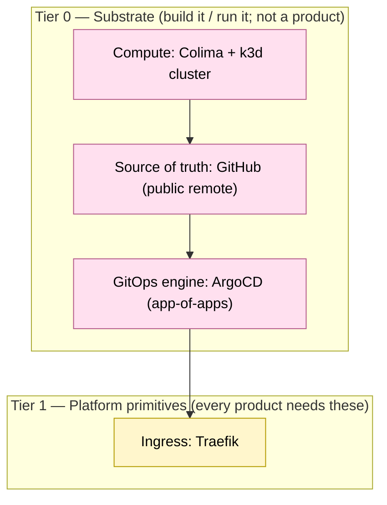

# Platform products & operating model

A product view of the lab: what capabilities a platform like this provides to the
rest of the company, what each one depends on, the order you'd build them, and how to
split the **planned** (build / roadmap) work from the **operational** (run / unplanned)
work once they exist.

This is the org/product companion to [dependency-tree.md](dependency-tree.md) (the
runtime + bootstrap graph) and [00-architecture.md](00-architecture.md) (roles).

**A large simplification landed 2026-09-06/2026-09-07** (see README.md's own note and
each removed component's ADR Status). This lab is now down to 4 always-on namespaces
(`argocd`, `cert-manager`, `lab-gateway`, `lab-demo`) and nothing on-demand — most of
the products, tiers, and domains this doc used to catalog no longer exist, no
replacement. This rewrite describes only what's actually live today; it does not
restate the removal history component-by-component the way earlier revisions of this
file did — see `docs/decisions/` for that.

---

## The lens: platform-as-a-product

A platform is not a pile of tools — it's a set of **products** offered to internal
customers (app teams) so they can self-serve instead of filing tickets. A product, to
qualify here, needs four things:

| Property | Meaning | Example in this lab |
|----------|---------|---------------------|
| **A consumer-facing contract** | a stable API/CRD or documented interface the customer uses, *not* the implementation | `kind: Application`, `kind: Certificate`, `kind: IngressRoute` |
| **Self-service** | the customer gets it via git/API, no human in the loop | open a PR adding the resource → ArgoCD reconciles it |
| **An owner** | a team accountable for its SLO and its runbook | platform domain squads (below) |
| **A hidden implementation** | the customer doesn't need to know what's behind the contract | "route" hides Traefik; "certificate" hides cert-manager's root CA chain |

The distinction that matters: **substrate is built and run by the platform but is not
itself a product** (app teams never touch k3d or Terraform), whereas **a product is
the thing you put a self-service contract in front of**.

---

## Layered dependency tree (priority = bottom-up)

You build (and recover) bottom-up; nothing in a higher tier works until its tier is up.
This is the priority order: **Tier 0 is most critical** — without it there is no
platform at all — and criticality decreases as you go up. There are only two tiers
left; every tier that used to sit above Tier 1 (Data, Observability, Self-service,
Heavy add-ons) was removed entirely 2026-09-06/2026-09-07, no replacement — see
`docs/decisions/` for each component's own removal record. Tier numbers are not
renumbered after a removal, matching how this repo never reuses/renumbers a retired
ADR or CHARTER Objective number either.



| Tier | What | Build priority | Why this order |
|------|------|----------------|----------------|
| **0 Substrate** | Compute (Colima/k3d), SCM (GitHub), GitOps (ArgoCD) | **P0** | Nothing exists without compute + a git source + a reconciler. This is the day-0 imperative seam — no separate Terraform state backend any more (ADR-0007 superseded, plain local file). |
| **1 Primitives** | Ingress (Traefik) | **P0** | Every product needs to be reachable. Provisioned first by ArgoCD (sync-wave 1). Secrets (Vault+ESO) retired 2026-09-07 (ADR-0042) — no replacement; no credential currently flowing through the lab needs an external secrets store any more. |
| **2 Data** | Retired 2026-09-07 (ADR-0002/ADR-0007/ADR-0039) | — | Was "Object storage (Garage)" — removed entirely, no replacement. |
| **3 Observability** | Retired 2026-09-06 (ADR-0041) | — | Was "LGTMP + Grafana" — removed entirely, no replacement. |
| **4 Self-service** | Retired 2026-09-07 (ADR-0038) | — | Was "KRO + ACK + moto claims" — removed entirely, no replacement. |
| **5 Heavy** | Retired 2026-09-07 (ADR-0024/ADR-0023) | — | Was "Harbor, Kargo" (and TiDB/Istio mesh/Longhorn before them, ADR-0031/ADR-0032/ADR-0012/ADR-0013, 2026-09-06) — removed entirely, no replacement. No heavy on-demand tier exists any more. |

---

## Product catalog

Grouped by **capability domain** — the natural unit for assigning an owning squad.
"Maturity" reflects how self-service it is *today* in this repo. Only two domains
still have a live product to catalog.

### A. Delivery & control plane
The paved road for shipping. Substrate that's also offered as a "deploy here" product.

| Product | Consumer contract (self-service) | Backed by | Depends on | Maturity |
|---------|----------------------------------|-----------|------------|----------|
| **Continuous Delivery** | add an ArgoCD `Application` / app-of-apps entry via git PR | ArgoCD | GitHub, cluster | ✅ self-service (PR → sync) |
| **Cluster / environment** | (platform-provisioned) | k3d + Terraform/Terragrunt | Colima | 🛠 platform-only (no tenant API yet) |

### B. Security & secrets — retired 2026-09-07 (ADR-0042)

This domain used to offer **Secrets** (`kind: ExternalSecret` referencing a Vault
path → a k8s `Secret` appears, backed by Vault KV v2 + External Secrets Operator,
self-service — team adds an `ExternalSecret`, platform owns Vault paths/policy).
Both components were removed entirely with no replacement, per explicit
maintainer direction — by the time they were cut, zero `ExternalSecret`
resources remained anywhere in the repo. There is no secrets product to catalog
here any more; every credential the remaining always-on stack needs (ArgoCD's
admin password, every TLS certificate) is natively generated in-cluster.

### C. Connectivity / ingress
| Product | Consumer contract | Backed by | Depends on | Maturity |
|---------|-------------------|-----------|------------|----------|
| **Ingress / north-south routing** | `kind: IngressRoute` (Traefik CRD) on the shared TLSStore | Traefik, bundled with k3s — the sole entry point (the off-cluster DR front door that used to sit in front of it, and the blue/green cluster pair it fronted, were removed entirely 2026-09-07, no replacement) | k3s | ✅ self-service |

(**Service mesh (east-west)** — sidecarless `PeerAuthentication`/traffic policy + Kiali
topology via Istio ambient mesh + Kiali — was built and demonstrated as an on-demand
product here, then removed entirely 2026-09-06, maintainer decision, no replacement.
See ADR-0012.)

### D. Data & storage — retired 2026-09-07 (ADR-0002/ADR-0007/ADR-0039)

This domain used to offer **Object storage (S3)** (a Garage bucket + credentials,
browsable via s3manager) and **Artifact registry** (Harbor, on-demand). Both, and the
storage engine behind them, were removed entirely with no replacement. (**Relational
database** — TiDB — and **Block storage / PVs** — Longhorn — were removed the same way
2026-09-06, ADR-0031/ADR-0032 and ADR-0013.) There is no data/storage product to
catalog here any more.

### E. Observability — retired 2026-09-06 (ADR-0041)

This domain used to offer Metrics/Logs/Traces/Profiles (Alloy → Mimir/Loki/Tempo/
Pyroscope → Grafana, plus kube-state-metrics/node-exporter as scrape targets) as a
self-service product. The whole stack was removed with no replacement — there is
no observability product to catalog here any more.

### F. Developer self-service / abstractions — retired 2026-09-07 (ADR-0038)

This domain used to offer a **Cloud Resources Service** (`kind: S3BucketClaim` — one
object → a bucket + an ownership catalog entry, backed by KRO's
`ResourceGraphDefinition` composing an ACK `Bucket` against the moto AWS mock) as the
clearest self-service *product* in the lab — the model abstraction every future
claim-based product would extend. All three components (moto, ACK, KRO) were removed
entirely with no replacement (ACK/moto: maintainer decision; KRO: orphaned dependent
once ACK was gone) — there is no self-service claims product to catalog here any more.

---

## Operating model: planned vs operational work

Each product, once live, generates two distinct streams of work. Organize the team
around keeping them separate so roadmap doesn't get eaten by firefighting.

### Build (planned / roadmap)
Discrete, schedulable, value-adding. Tracked as epics per product.
- New products & new self-service contracts (the KRO-RGD-based claims layer this
  bullet used to name was removed 2026-09-07 with no replacement, ADR-0038 — a
  future self-service claims layer would need to pick its own tooling from scratch).
- New product versions / upgrades (ArgoCD chart bumps, k3s version).
- Paved-road improvements (templates, golden paths, docs).

### Run (operational / unplanned)
Reactive, interrupt-driven, keeps-the-lights-on (KTLO / toil). Should be **measured and
budgeted** so it doesn't silently consume the team.
- Incidents & on-call; **DR drills** (`make dr-verify`, `make dr-test`; the blue/green
  zero-downtime cutover drill was removed entirely 2026-09-07, no replacement — the
  only DR mechanism left is recreate-from-code, ADR-0005).
- Secret rotation, cert renewal, token expiry.
- ArgoCD drift / failed syncs.
- Request-queue items that aren't yet self-service (every one is a roadmap signal:
  *if you're handling it manually, it's a missing product feature*).

### A simple intake & capacity model
- **Two queues:** a roadmap board (build) and an ops queue (run + incidents).
- **Capacity guardrail:** cap unplanned work (e.g. ≤40% of a sprint). When run work
  blows the cap, that's the trigger to invest build capacity into automating it away.
- **You-build-it-you-run-it per domain:** the squad that owns a product owns its SLO,
  runbook, and on-call for it.
- **DR as a recurring planned ritual**, not a reaction — the lab already encodes this
  (`docs/DR.md`, self-verifying drills). Recovery is *exercised*, not assumed.

### Maturity ladder (drives the roadmap)
For each product, push it up this ladder; the rung tells you the next planned investment:

```
1. Manual        platform does it by hand on request   (pure toil)
2. Scripted      a runbook/script does it              (coredns-host-alias.sh)
3. Provisioned   platform applies it via GitOps        (ArgoCD Applications today)
4. Self-service  customer claims it via a contract     (Application, Certificate, IngressRoute)
5. Governed      self-service + quotas/policy/cost      (target state)
```

---

## How to organize the team (capability domains → squads)

Only two domains still have a live product to own — the others existed here until
their components were removed entirely, no replacement (see each domain's own section
above for the ADR):

| Domain | Owns (products) | Substrate it also runs |
|--------|-----------------|------------------------|
| **Platform core / paved road** | Continuous Delivery, Cluster/env | k3d, Terraform/Terragrunt, GitHub, ArgoCD |
| **Connectivity** | Ingress | Traefik |

(**Security & secrets** — Secrets, backed by Vault + ESO — existed here until
2026-09-07, ADR-0042. **Data & storage** — Object storage/registry, backed by
Garage/Harbor — existed here until 2026-09-07, ADR-0002/ADR-0007/ADR-0039/
ADR-0024. **Observability** — Metrics/Logs/Traces/Profiles, backed by LGTMP +
Grafana — existed here until 2026-09-06, ADR-0041. **Developer self-service** —
Cloud Resources Service, backed by KRO/ACK/moto — existed here until 2026-09-07,
ADR-0038. All four domains removed with no replacement.)

### First steps to a self-service offering for the company
1. **Publish the catalog** (this doc) — name the products and their contracts so teams
   know what they can self-serve.
2. **Standardize the contract surface** — every product is a k8s CRD/resource consumed
   via git PR (already true for CD, Secrets, Ingress).
3. **Climb the maturity ladder** — the KRO-RGD claim-based pattern this step used to
   point toward next was removed 2026-09-07 with no replacement (ADR-0038) — a future
   claims-based effort would need to pick its own tooling from scratch, same as the
   observability-metrics gap below.
4. **Add governance** — quotas, ownership catalog, cost visibility would previously
   have come from the observability stack, retired 2026-09-06 (ADR-0041) with no
   replacement — a future cost-visibility effort would need to pick its own tooling
   from scratch.
